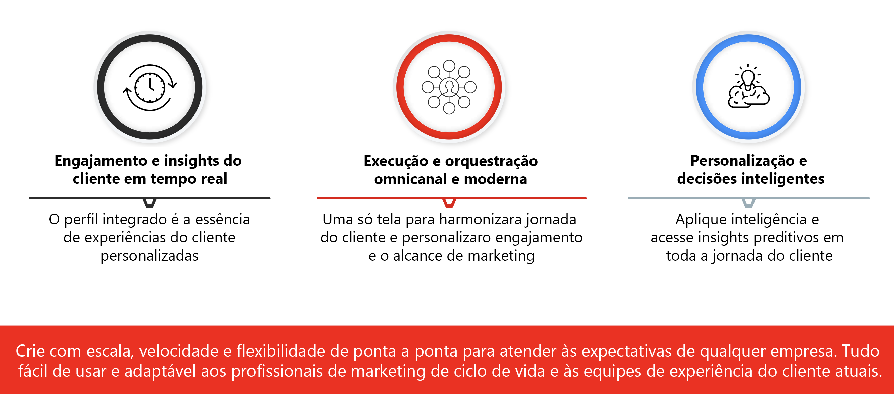

# Introdução ao Journey Optimizer {#ajo-gs}

Esta página apresenta o Adobe Journey Optimizer: para que ele serve, para quem ele foi desenvolvido, seus principais recursos e como ele se encaixa na arquitetura da Adobe Experience Platform. É o ponto de partida recomendado para novos usuários.

## O que é o [!DNL Adobe Journey Optimizer]?{#about-ajo}

O [!DNL Adobe Journey Optimizer] é um aplicativo corporativo para criar e fornecer experiências conectadas, contextuais e personalizadas ao cliente em todos os canais e pontos de contato. Ele está integrado nativamente na [!DNL Adobe Experience Platform] e utiliza um perfil do cliente em tempo real unificado, uma estrutura aberta de priorização de API, uma definição de ofertas centralizada e recursos de IA e aprendizado de máquina. O Journey Optimizer permite que as marcas orquestrem campanhas de marketing programadas e comunicações acionadas por eventos em tempo real — a partir de um único aplicativo, em grande escala. O resultado são experiências de marca significativas que aumentam a fidelização do cliente e o valor vitalício.

Este guia se aplica a profissionais de marketing, equipes de operações e administradores novatos no Journey Optimizer.

➡️ [Descubra o Journey Optimizer](https://experienceleague.adobe.com/docs/journey-optimizer-learn/tutorials/introduction-to-journey-optimizer/introduction.html?lang=pt-BR){target="_blank"} (vídeo)

<!--
 Use [!DNL Adobe Journey Optimizer] to build multi-step customer journeys that initiate a sequence of interactions, offers, and messages across channels in real time. This approach ensures customers are engaged at the optimal moments based on their actions and relevant business signals. Learn how to build journeys in [this section](../building-journeys/journey-gs.md).

You can also create audience-based campaigns to send messages.
-->

## Principais recursos {#key-capabilities}

O [!DNL Adobe Journey Optimizer] é um aplicativo ágil e escalonável para a criação e o fornecimento de experiências personalizadas, conectadas e oportunas ao cliente por meio de qualquer aplicativo, dispositivo ou canal.

Os principais recursos incluem:

### Insights do cliente e engajamento em tempo real

Um perfil integrado combina dados em tempo real de todas as fontes em todos os pontos de contato com o cliente, incluindo dados comportamentais, transacionais, financeiros e operacionais, para otimizar as experiências pessoais e contextuais dos clientes em seu próprio tempo. [Saiba mais sobre perfis e públicos-alvo](../audience/get-started-profiles.md)

### Orquestração e execução omnicanais modernas

Uma única tela para harmonizar e otimizar a jornada do cliente para a primeira:1 interação com o cliente e o alcance de marketing, a fim de ajudar as marcas a entregar mais valor em todo o ciclo de vida do cliente. As jornadas do cliente criadas no [!DNL Adobe Journey Optimizer] podem ser dinâmicas e baseadas em eventos para ajudar as marcas a reagir a sinais em tempo real, bem como conectar essas interações com campanhas programadas, para que sejam tomadas as decisões corretas com respeito a quais comunicações devem ser enviadas a um cliente, quando e por quais canais. As ferramentas de criação de conteúdo incorporadas, incluindo um designer visual de arrastar e soltar, modelos reutilizáveis, fragmentos de conteúdo e um editor de personalização, permitem que as equipes criem, personalizem e gerenciem mensagens para cada canal diretamente no mesmo fluxo de trabalho. [Crie a primeira jornada](../building-journeys/journey-gs.md) | [Projete o conteúdo](../../rp_landing_pages/content-management-landing-page.md)

### Tomada de decisões inteligente e personalização

As marcas podem aplicar a tomada de decisões centralizada e incorporar inteligência artificial e aprendizado de máquina para configurar insights preditivos em toda a experiência do cliente, facilitando a automação de decisões e a otimização da experiência em grande escala. O serviço de decisão possibilita ofertas centralizadas em canais em escala por meio do [!DNL Adobe Journey Optimizer]. [Explore a definição de ofertas](../offers/get-started/starting-offer-decisioning.md) | [Descubra recursos de IA](ai-features.md)

## Casos de uso {#use-cases}

Estes exemplos ilustram como os recursos do Journey Optimizer trabalham em conjunto em diferentes funções, setores e canais.

### Recuperação de remessa atrasada {#uc-delayed-shipment}

**Função:** profissional de marketing | **Recurso principal:** [perfil unificado + exclusão de público-alvo](../audience/get-started-profiles.md)

Normalmente, uma loja de roupas envia pesquisas de satisfação pós-compra a todos os clientes que compraram produtos na última semana. Devido às intempéries, alguns carregamentos sofreram atrasos. Ao ver quais clientes não receberam suas remessas, a loja de roupas pode excluir essas pessoas do envio agendado da pesquisa de satisfação do cliente e, em vez disso, enviar um email personalizado pedindo desculpas pelo atraso e oferecendo um código de desconto com recomendações de produto baseadas em suas compras anteriores.

[Introdução às campanhas](../campaigns/get-started-with-campaigns.md)

### Engajamento na loja em tempo real {#uc-instore}

**Função:** profissional de marketing | **Recurso principal:** [Acionamento de geofence + push](../push/get-started-push.md)

O mesmo varejista pode interagir em tempo real com um cliente fiel que chega ao estacionamento da loja, enviando uma notificação por push sobre um suéter que voltou ao estoque no tamanho desejado.

[Introdução às notificações por push](../push/get-started-push.md)

### Recuperação de abandono de carrinho {#uc-cart}

**Função:** profissional de marketing | **Recurso principal:** [jornada de várias etapas acionada por eventos](../building-journeys/journey-gs.md)

Quando um cliente adiciona itens a um carrinho online, mas sai sem concluir a compra, o Journey Optimizer detecta o evento em tempo real e inicia uma jornada de recuperação automaticamente. O cliente recebe um email personalizado lembrando sobre os itens deixados para trás. Se ele não clicar no dentro de 24 horas, uma notificação por push de acompanhamento será enviada, personalizada com base no histórico de navegação e no status de fidelidade.

[Crie a primeira jornada](../building-journeys/journey-gs.md)

### Série de boas-vindas do serviço de streaming {#uc-welcome}

**Função:** profissional de marketing | **Recurso principal:** [jornada de boas-vindas acionada por evento](../building-journeys/journey-gs.md)

Quando um cliente assina um serviço de streaming, o Journey Optimizer detecta o evento de inscrição e inicia imediatamente uma jornada de boas-vindas de várias etapas. O cliente recebe um email de boas-vindas incentivando-o a abrir o aplicativo pela primeira vez. Se nenhuma atividade de logon for detectada em 48 horas, uma notificação por push de acompanhamento é enviada com recomendações de conteúdo personalizadas com base em seus interesses declarados durante a inscrição, transformando um assinante passivo em um usuário ativo e engajado desde o primeiro dia.

[Crie a primeira jornada](../building-journeys/journey-gs.md)

### Lembrete de reserva com instruções {#uc-reservation}

**Função:** profissional de marketing | **Recurso principal:** [mensagens agendadas + com reconhecimento de local](../campaigns/get-started-with-campaigns.md)

Uma marca de hospitalidade envia a cada hóspede um lembrete oportuno uma hora antes de sua reserva. A notificação inclui o nome do hóspede, o horário da reserva e as indicações de como chegar ao local com base na localização, tudo isso reunido automaticamente a partir do perfil do cliente e dos dados da reserva, sem qualquer intervenção manual da equipe de marketing.

[Introdução às campanhas](../campaigns/get-started-with-campaigns.md)

### Notificação proativa de interrupção de serviço {#uc-outage}

**Função:** operações | **Recurso principal:** [seleção automática de público-alvo em grande escala](../audience/about-audiences.md)

Quando ocorre uma interrupção do serviço, o Journey Optimizer identifica automaticamente os clientes afetados com base nos dados da conta e nos padrões de uso. Esses clientes recebem uma notificação proativa confirmando o problema e descrevendo as próximas etapas, transformando uma experiência potencialmente negativa em um momento de transparência e confiança, entregue em grande escala.

[Crie a primeira jornada](../building-journeys/journey-gs.md)

### Campanha promocional viabilizada por IA {#uc-ai-campaign}

**Função:** profissional de marketing | **Recurso principal:** [geração de conteúdo de IA + experimentação](ai-features.md)

Um planejamento de marca de varejo em um lançamento de produto usa o Assistente de IA do Journey Optimizer para gerar variações de linha de assunto e texto em minutos, orientadas por um prompt de linguagem natural e suas diretrizes de marca carregadas. A experimentação de conteúdo integrada identifica automaticamente a variante com melhor desempenho entre uma amostra de público-alvo inicial. A mensagem vencedora é implantada nos destinatários restantes, maximizando o engajamento sem esforço adicional de redação.

[Explorar recursos inteligentes e de IA](ai-features.md) | [Saiba mais sobre a experimentação de conteúdo](../content-management/experiment-accelerator-gs.md)

### Alertas de manutenção por meio de aplicativo móvel {#uc-maintenance}

**Função:** operações | **Recurso principal:** [orquestração de jornadas que não são de marketing](../building-journeys/journey-gs.md)

Profissionais que não atuam no marketing, como equipes de operações e suporte ao cliente, podem usar o [!DNL Adobe Journey Optimizer] para gerenciar notificações operacionais ou monitorar processos de integração. Por exemplo, um parque de diversões onde os visitantes baixam um aplicativo móvel como parte da experiência: a equipe de manutenção pode usar o Journey Optimizer para notificar os visitantes sobre as atrações que estão fechadas atualmente devido à manutenção.

[Crie a primeira jornada](../building-journeys/journey-gs.md)

## Disponibilidade e licenciamento {#availability}

Esta documentação abrange a versão atual do Journey Optimizer e aplica-se a usuários B2C e B2B Edition, salvo indicação em contrário. Os componentes e recursos disponíveis no ambiente dependem de suas [permissões](../administration/permissions.md) e do seu [pacote de licenciamento](https://helpx.adobe.com/legal/product-descriptions/adobe-journey-optimizer.html){target="_blank"}. Em caso de dúvida, entre em contato com o(a) gerente de sucesso do cliente da Adobe ou com o(a) representante da Adobe.

As diretrizes e procedimentos gerais de privacidade da Adobe Experience Cloud se aplicam ao [!DNL Journey Optimizer]. [Saiba mais sobre a privacidade da Adobe Experience Cloud](https://www.adobe.com/br/privacy/experience-cloud.html){target="_blank"}.

## Arquitetura {#architecture}

O Journey Optimizer está integrado nativamente na Adobe Experience Platform e compartilha sua base de dados, seu gráfico de identidade e seus serviços de governança. Para obter uma apresentação detalhada sobre como esses sistemas funcionam juntos, consulte [Noções básicas sobre o Journey Optimizer](understanding-ajo.md).

## Recursos relacionados {#related-resources}

* [Etapas principais para iniciar](quick-start.md): guias de início rápido baseados em função para administradores, profissionais de marketing e engenheiros de dados.
* [Introdução ao gerenciamento de dados](../data/gs-data.md): saiba como os dados são ingeridos, unificados e ativados no Journey Optimizer.
* [Crie jornadas e envie mensagens](../building-journeys/journey-gs.md): crie sua primeira jornada de cliente e configure as ações do canal.
* [Relatórios em tempo real](../reports/live-report.md): monitore o desempenho da campanha e da jornada em tempo real.
* [Tutorial de Introdução ao Journey Optimizer](https://experienceleague.adobe.com/pt-br/docs/journey-optimizer-learn/tutorials/introduction-to-journey-optimizer/introduction){target="_blank"}: uma apresentação guiada em vídeo dos principais conceitos do Journey Optimizer.
* [Visão geral sobre a segurança do Journey Optimizer](https://www.adobe.com/content/dam/cc/en/security/pdfs/AJO_SecurityOverview.pdf) (PDF): arquitetura de segurança, proteção dos dados e detalhes de conformidade.
* [Descrição do Produto Journey Optimizer](https://helpx.adobe.com/legal/product-descriptions/adobe-journey-optimizer.html){target="_blank"}: termos oficiais de licenciamento e detalhamento dos recursos da edição.
