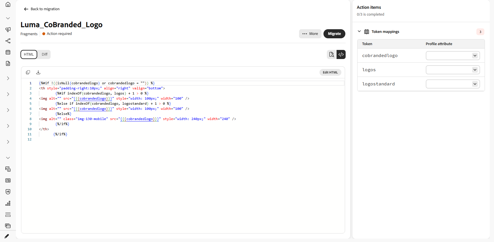

# Migrar conteúdo e jornadas {#migrate-content-and-journeys}

>[!AVAILABILITY]
>
>Esse recurso está disponível apenas para um conjunto de organizações (disponibilidade limitada). Para obter acesso, entre em contato com um representante da Adobe.

Se você estiver mudando de outra plataforma de marketing para o [!DNL Journey Optimizer], não é necessário começar do zero. O Journey Optimizer inclui um espaço de trabalho dedicado que importa o conteúdo e as jornadas de email existentes. Ele os converte em [!DNL Journey Optimizer] modelos de conteúdo e jornadas, para que você possa continuar de onde parou, em vez de reconstruir tudo do zero.

Para migrar seu conteúdo e jornadas para o Journey Optimizer, você precisa das seguintes permissões: Gerenciar campanhas, Gerenciar Jornadas, Gerenciar mensagens, Gerenciar segmentos, Gerenciar itens de biblioteca, Exibir e gerenciar sandboxes e Gerenciar a configuração de integração do AJO. [Saiba mais sobre funções e permissões](../administration/permissions.md)

Você pode acessar este espaço de trabalho diretamente na página inicial [!DNL Journey Optimizer].

## Configurar uma conexão {#set-up-a-connection}

>[!CONTEXTUALHELP]
>id="ajo_migration_connection_name"
>title="Nome da conexão"
>abstract="Um nome descritivo que identifica o sistema de origem (por exemplo, “Marketing-Automation-Prod”). Deve começar com uma letra e conter apenas caracteres alfanuméricos, sublinhados ou hifens (4 a 50 caracteres)."

>[!CONTEXTUALHELP]
>id="ajo_migration_base_api_url"
>title="URL base da API"
>abstract="O URL raiz da API, sem caminhos de recursos ou strings de consulta, por exemplo, https://api.exemplo.com."

>[!CONTEXTUALHELP]
>id="ajo_migration_authentication_method"
>title="Escolha um método de autenticação"
>abstract="A Chave de API envia uma única credencial com cada solicitação, enquanto o OAuth 2.0 usa um protocolo baseado em token mais adequado para APIs corporativas e de terceiros."

>[!CONTEXTUALHELP]
>id="ajo_migration_client_id"
>title="ID de cliente"
>abstract="O identificador público do aplicativo, emitido quando você se registra no servidor de autorização."

>[!CONTEXTUALHELP]
>id="ajo_migration_client_secret"
>title="Segredo do cliente"
>abstract="Uma credencial confidencial conhecida somente pelo aplicativo e pelo servidor de autorização. Nunca a exponha no código do lado do cliente."

>[!CONTEXTUALHELP]
>id="ajo_migration_token_url"
>title="URL do token"
>abstract="O ponto de acesso do servidor de autorização que emite tokens de acesso para o fluxo de credenciais do cliente, normalmente terminando em /oauth/token ou /token."

>[!NOTE]
>
>Uma conexão não é necessária se você fizer upload de arquivos ou capturas de tela do HTML em vez de importar por meio de uma API.

Para importar conteúdo ou jornadas por meio de uma API, primeiro conecte o [!DNL Journey Optimizer] à plataforma de origem:

1. No espaço de trabalho, selecione **[!UICONTROL Gerenciar conexões]**.

   

1. Clique em **[!UICONTROL Nova conexão]**.

   

1. Preencha os detalhes abaixo:

   * **[!UICONTROL Nome da Conexão]**: um nome que identifica o sistema de origem, como `Marketing-Automation-Prod`. Os nomes devem começar com uma letra e podem conter apenas letras, números, sublinhados ou hifens com comprimento entre 4 e 50 caracteres.
   * **[!UICONTROL URL da API Base]**: a URL raiz da API do sistema de origem, sem nenhum caminho de recurso ou cadeia de caracteres de consulta, como `https://api.example.com`.
   * **[!UICONTROL Descrição]**: contexto opcional para ajudar você e outros usuários a identificar a finalidade desta conexão.
   * **[!UICONTROL Método de Autenticação]**: como [!DNL Journey Optimizer] é autenticado no sistema de origem. Escolha **Chave de API** para enviar uma única credencial com cada solicitação. Escolha **OAuth 2.0** para usar um protocolo baseado em token que seja mais adequado para APIs corporativas e de terceiros.
   * **[!UICONTROL ID do Cliente]**: o identificador público atribuído ao seu aplicativo quando você o registrou no servidor de autorização. Necessário para conexões OAuth 2.0.
   * **[!UICONTROL Segredo do Cliente]**: a credencial confidencial associada à sua ID de cliente. Mantenha-o privado, pois ele é conhecido apenas pelo seu aplicativo e pelo servidor de autorização. Necessário para conexões OAuth 2.0.
   * **[!UICONTROL URL do token]**: o ponto de extremidade do servidor de autorização que emite tokens de acesso para o fluxo de credenciais do cliente, normalmente terminando em `/oauth/token` ou `/token`. Necessário para conexões OAuth 2.0.

     

1. Selecione **[!UICONTROL Criar]**.

1. Depois que a conexão for configurada, use o menu avançado para excluí-la ou para marcá-la como padrão para que seja pré-selecionada na próxima vez que você importar conteúdo ou jornadas.

   

## Importar conteúdo de email {#import-email-content}

Depois de ter uma origem para o conteúdo, um arquivo HTML ou uma conexão com a plataforma de origem, importe-o para o espaço de trabalho para convertê-lo em um modelo de conteúdo [!DNL Journey Optimizer].

1. Na guia **[!UICONTROL Conteúdo de email]**, escolha como deseja importar seu conteúdo de email:

   * **[!UICONTROL Carregar HTML]**: selecione um ou mais arquivos de email do HTML no computador.

   * **[!UICONTROL Procurar da conexão]**: procure e selecione emails diretamente da sua plataforma de marketing conectada, sem precisar exportar e carregar arquivos manualmente.

   

1. Para um upload do HTML, procure o arquivo ou arraste e solte-o na área de upload. Clique em **[!UICONTROL Carregar]** depois de concluído.

   Os arquivos devem estar no formato `.html` ou `.htm` e não devem ter mais de 10 MB.

   

1. Para importar da conexão, escolha na lista Emails e clique em **[!UICONTROL Importar]**.

1. Acesse o email importado e revise o HTML importado.

1. Adicione a **[!UICONTROL Linha de assunto]** e mapeie cada espaço reservado para personalização ao atributo de perfil correspondente.

   O espaço de trabalho converte automaticamente a sintaxe do script de origem para a sintaxe Handlebars. Para obter uma lista de operadores compatíveis, consulte [Operadores](https://experienceleague.adobe.com/pt-br/docs/journey-optimizer/using/content-management/personalization/functions/operators).

   

   >[!NOTE]
   >
   >Determinados tokens de data de origem são mapeados automaticamente e não são exibidos como espaços reservados de personalização para mapear. A descoberta e o mapeamento de tokens também foram aprimorados para oferecer maior precisão.

1. Se o email fizer referência a algum bloco de conteúdo, resolva-o como fragmentos. Consulte [Importar fragmentos](#import-fragments).

1. Selecione uma pasta para carregar as imagens do email para [!DNL Experience Manager Assets] e clique em **[!UICONTROL Carregar ativos]**.

   

1. Quando o email estiver pronto, selecione **[!UICONTROL Migrar]** e **Exibir email** para abrir o novo modelo de conteúdo.

   

Seu modelo de conteúdo agora está disponível no [!DNL Journey Optimizer] e pronto para uso em suas jornadas.

➡️ [Saiba mais sobre o Modelo de conteúdo](../content-management/use-content-templates.md)

## Importar fragmentos {#import-fragments}

Os fragmentos são blocos de construção reutilizáveis em um email, como cabeçalhos, rodapés ou blocos promocionais, que você cria uma vez e reutiliza em vários emails para oferecer consistência e criação mais rápida. Ao migrar um email, o [!DNL Journey Optimizer] identifica os blocos de conteúdo que referencia e os exibe como um item de ação, para que você possa migrá-los junto com o email.

1. Na guia **[!UICONTROL Fragmentos]**, escolha como deseja importar o fragmento:

   * **[!UICONTROL Carregar HTML]**: selecione um ou mais arquivos de fragmento do HTML no computador.

   * **[!UICONTROL Procurar da conexão]**: procure e selecione fragmentos diretamente da sua plataforma de marketing conectada, sem precisar exportar e carregar arquivos manualmente.

   

1. Você também pode importar fragmentos ao migrar um email. À medida que ele migra o email, o [!DNL Journey Optimizer] faz a varredura dele, identifica blocos de conteúdo referenciados e os exibe como itens de ação de fragmento no email, para que você possa resolvê-los sem sair do fluxo de migração de email.

   

1. Para importar da conexão, escolha na lista Fragmentos e clique em **[!UICONTROL Importar]**.

1. Abra o fragmento importado e resolva os itens de ação restantes, por exemplo, ativos ou atributos de perfil correspondentes.

   

1. Quando o fragmento estiver pronto, selecione **[!UICONTROL Migrar]** e **Exibir fragmento** para abri-lo.

## Importar jornadas {#import-journeys}

Recrie suas jornadas importando uma captura de tela do fluxo de jornada ou conectando-se à plataforma de origem. As jornadas são preparadas como rascunhos editáveis que você pode revisar em uma tela visual antes de serem migradas, para que você obtenha uma lista de verificação guiada de tudo o que precisa de sua entrada primeiro, em vez de migrar às cegas.

1. Na guia **[!UICONTROL Jornadas]**, escolha como deseja importar suas jornadas:

   * **[!UICONTROL Carregar capturas de tela]**: selecione uma ou mais capturas de tela do jornada no computador.

   * **[!UICONTROL Procurar da conexão]**: procure e selecione jornadas diretamente da sua plataforma de marketing conectada, sem precisar exportar e carregar capturas de tela manualmente.

   

1. Para um upload de captura de tela, procure o arquivo ou arraste e solte-o na área de upload. Clique em **[!UICONTROL Carregar]** depois de concluído.

   Os arquivos devem estar no formato .png, .jpg, .gif, .webp e não devem ter mais de 5 MB.

   

1. Para importar da conexão, escolha na lista jornada e clique em **[!UICONTROL Importar]**.

1. Abra a jornada para visualizá-la na tela interativa. A jornada completa é renderizada como uma tela de nó e borda, e os nós que precisam de atenção são marcados em linha.

1. No painel **[!UICONTROL Itens de ação]**, resolva cada item antes de migrar. O cabeçalho do painel mostra uma contagem ativa de itens resolvidos do total e selecionar um item de ação destaca o nó correspondente na tela. Os itens de ação incluem:

   * **[!UICONTROL Nome da Jornada]**: defina o nome da jornada antes da migração.
   * **[!UICONTROL Modelos de conteúdo]**: selecione o modelo de conteúdo apropriado para as ações de jornada que exigem um. Os modelos de email são validados à medida que são selecionados, com quaisquer problemas de validação mostrados diretamente no item de ação.
   * **[!UICONTROL Configurações de canal]**: selecione a configuração necessária para canais como email e SMS.
   * **[!UICONTROL Segmentos de público-alvo]**: mapeie os públicos-alvo de origem para os públicos-alvo [!DNL Journey Optimizer] apropriados.

   

1. Após resolver cada item de ação, selecione **[!UICONTROL Migrar]**.

   [!DNL Journey Optimizer] executa uma verificação final na jornada, revalidando modelos de email e confirmando se o nome da jornada está definido. Qualquer informação ausente ou inválida bloqueia a migração e é exibida em linha nos itens de ação relevantes. Depois que a verificação é aprovada, uma etapa de confirmação protege contra migrações acidentais e a página reflete o status do processamento.

1. Se você não precisar mais de uma migração de jornada, exclua-a da lista de jornadas ou do menu dentro de uma jornada aberta.

   

Sua jornada agora está disponível no [!DNL Journey Optimizer], onde você pode revisar a tela, fazer os ajustes finais e ativá-la quando estiver pronto para entrar no ar. Selecione **[!UICONTROL Exibir jornada]** para abrir a jornada migrada diretamente em [!DNL Journey Optimizer]. Se uma migração for concluída, mas alguns itens de ação não puderem ser aplicados, você receberá exatamente a quantidade e apontará para [!DNL Journey Optimizer] para concluí-los.

➡️ [Saiba mais sobre a criação de Jornadas](../building-journeys/journey-gs.md)

## Rastrear migração {#track-migration-progress}

A visão geral do espaço de trabalho ajuda você a acompanhar cada email ou jornada importada e localizar rapidamente aqueles que ainda estão aguardando ação. Um conjunto de KPIs na parte superior da tela fornece uma contagem rápida de itens em cada status:

* **Total**: o número geral de itens importados para o espaço de trabalho.
* **Em andamento**: itens que ainda estão sendo revisados ou mapeados antes de serem migrados.
* **Migrado**: itens convertidos com êxito e disponíveis em [!DNL Journey Optimizer].
* **Falha**: itens que não puderam ser migrados e precisam de atenção.

Um conjunto de filtros permite restringir a lista de conteúdo importado para que você possa se concentrar em um subconjunto específico em vez de percorrer cada item. Combine um ou mais dos seguintes filtros para encontrar o que está procurando:

* **[!UICONTROL Ação necessária]**: o item tem itens de ação não resolvidos e precisa da sua entrada para poder ser migrado.
* **[!UICONTROL Processando]**: o item está sendo migrado.
* **[!UICONTROL Migrado]**: o item foi migrado com êxito e está disponível em [!DNL Journey Optimizer].
* **[!UICONTROL Falha]**: a migração não pôde ser concluída e precisa de atenção.

{{$include /help/_includes/do-not-localize/start/ai-augmented-migrate-content-and-journeys.md}}
