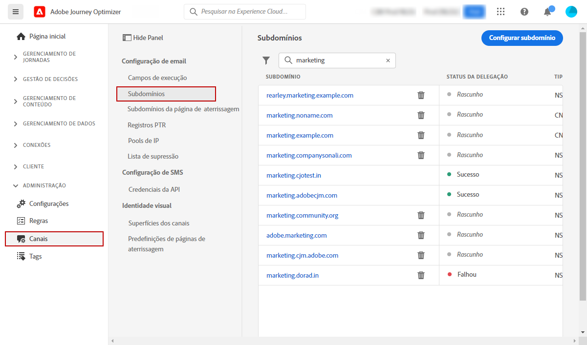
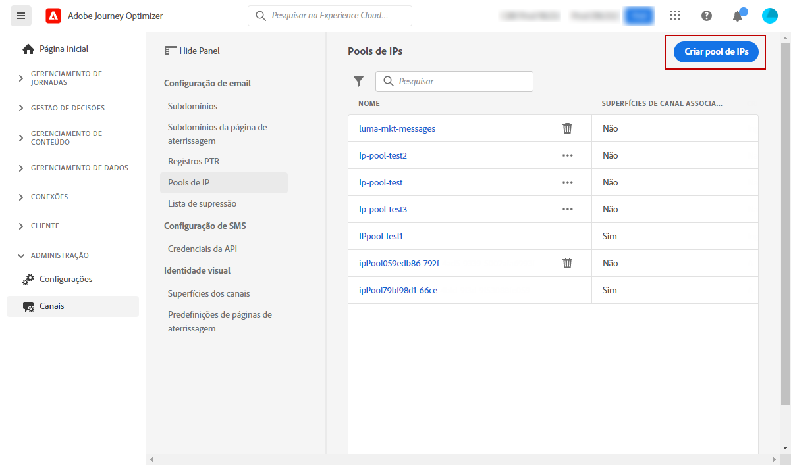
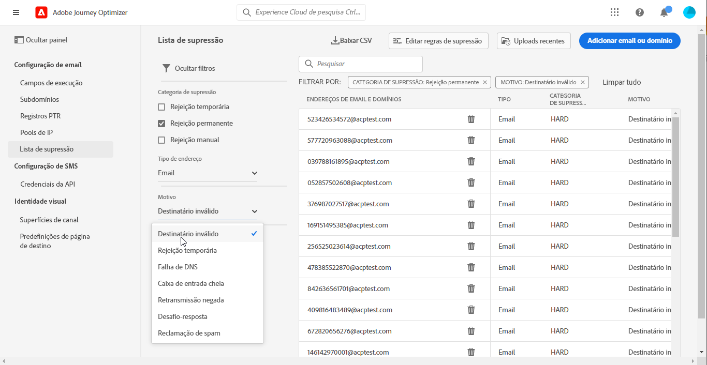

# Introdução para administradores de sistema {#get-started-sys-admins}

>[!BEGINSHADEBOX]

**Nesta página:** Defina usuários, permissões, sandboxes e configurações de canal para que suas equipes possam trabalhar na Adobe Journey Optimizer de forma segura e eficiente.

>[!ENDSHADEBOX]

Como **admin de sistema**, você configura o ambiente do Journey Optimizer e gerencia o acesso para permitir que suas equipes trabalhem de maneira eficiente e segura. Execute as etapas de configuração essenciais para que [engenheiros(as) de dados](data-engineer.md), [desenvolvedores(as)](developer.md) e [profissionais de marketing](marketer.md) possam começar a trabalhar com o [!DNL Adobe Journey Optimizer].

Suas principais responsabilidades incluem a configuração de grupos de usuários e permissões, a criação e o gerenciamento de sandboxes para particionar dados e jornadas para diferentes grupos de usuários e a configuração de canais de entrega e predefinições de mensagem para garantir uma identidade visual consistente entre as várias mensagens e ativos entregues por meio do Journey Optimizer. Você garante que as pessoas certas tenham acesso aos recursos certos, mantendo a segurança e a governança.

Esses recursos são gerenciados por **[!UICONTROL Administradores de produto]** com acesso ao produto Permissões. [Saiba mais sobre Permissões](../../administration/permissions.md){target="_blank"}.

>[!NOTE]
>
>**Ordem de implementação:** Você está aqui: **Administrador** → [Engenheiro de dados](data-engineer.md) → [Desenvolvedor](developer.md) → [Profissional de marketing](marketer.md)
>
>O administrador configura o ambiente primeiro. Engenheiros de dados, desenvolvedores e profissionais de marketing dependem da conclusão desse trabalho antes de começarem.

## Configurar acesso e permissões

Siga estas etapas para configurar o gerenciamento de acesso:

1. **Criar sandboxes** para particionar suas instâncias em ambientes virtuais separados e isolados. Os **Sandboxes** são criados em [!DNL Journey Optimizer]. Saiba mais na seção [Sandboxes](../../administration/sandboxes.md).

   >[!NOTE]
   >Como **Administrador do sistema**, se não conseguir visualizar o menu **[!UICONTROL Sandboxes]** no [!DNL Journey Optimizer], será necessário atualizar suas permissões. Saiba como atualizar sua função [nesta página](../../administration/permissions.md#edit-product-profile).

1. **Compreender funções**. Funções são um conjunto de direitos unitários que permitem aos usuários o acesso a determinadas funcionalidades ou objetos na interface. Saiba mais na seção [funções prontas para uso](../../administration/ootb-product-profiles.md).

1. **Defina permissões** para funções, incluindo **Sandboxes**, e conceda acesso aos membros da sua equipe, atribuindo-os a diferentes funções. Permissões são direitos unitários que permitem definir as autorizações atribuídas à **[!UICONTROL Função]**. Cada permissão é coletada em recursos, por exemplo, Jornada ou Ofertas, que representam as diferentes funcionalidades ou objetos em [!DNL Journey Optimizer]. Saiba mais na seção [Níveis de permissão](../../administration/high-low-permissions.md).

1. **Usar controle de acesso no nível do objeto** (opcional). Aplique rótulos de acesso a objetos como jornadas, campanhas e configurações de canal para controlar quais usuários podem acessar recursos específicos. Saiba mais sobre o [Controle de acesso em nível de objeto (OLAC)](../../administration/object-based-access.md).

Além disso, você deve adicionar usuários que precisam de acesso ao Assets Essentials nas funções **Usuários consumidores do Assets Essentials** e/ou **Usuários do Assets Essentials**. [Leia mais na documentação do Assets Essentials](https://experienceleague.adobe.com/docs/experience-manager-assets-essentials/help/deploy-administer.html?lang=pt-BR){target="_blank"}.

Ao acessar o [!DNL Journey Optimizer] pela primeira vez, você receberá acesso a uma sandbox de produção e a um determinado número de IPs dependendo do seu contrato.

## Configurar canais e mensagens

Para permitir que [profissionais de marketing](marketer.md) criem e enviem mensagens, acesse o menu **ADMINISTRAÇÃO**. Navegue pelo menu **[!UICONTROL Canais]** para definir as configurações de canal.

>[!NOTE]
>Como **admin de sistema**, se não conseguir visualizar o menu **[!UICONTROL Canais]** no [!DNL Journey Optimizer], atualize suas permissões no produto [Permissões](../../administration/permissions.md){target="_blank"}.

Siga estas etapas:

1. **Definir configurações de canal**. Defina todos os parâmetros técnicos necessários para email, SMS, notificações por push, push na web, correspondência direta e outros canais:

   * Defina as **configurações de notificação por push** no [!DNL Adobe Experience Platform] e na Coleção de dados da Adobe Experience Platform. [Saiba mais](../../push/push-gs.md)

   * Configure as **notificações por push da Web** para enviar notificações a navegadores em dispositivos móveis e desktop. [Saiba mais](../../push/push-configuration-web.md)

   * Crie **configurações de canal** para definir todos os parâmetros técnicos necessários para email, SMS, push, no aplicativo, web e outros canais. [Saiba mais](../../configuration/channel-surfaces.md)

   * Configure o **Canal SMS** para definir todos os parâmetros técnicos necessários para SMS. [Saiba mais](../../mobile/mobile-configuration.md)

   * Gerencie o número de dias durante os quais são executadas **tentativas** antes do envio de endereços de email para a lista de supressão. [Saiba mais](../../configuration/manage-suppression-list.md)

   * Habilite a **exportação de mensagens** no nível de configuração de canal para arquivar conteúdo de emails e SMS enviados quando necessário (oferta complementar). [Saiba mais](../../configuration/message-export.md)

1. **Delegar subdomínios**: para qualquer novo subdomínio ser usado no Journey Optimizer, a primeira etapa será delegá-lo. [Saiba mais](../../configuration/about-subdomain-delegation.md). Você pode migrar subdomínios de CNAME para delegação personalizada quando necessário. [Saiba mais](../../configuration/custom-subdomain-migration.md)

   

1. **Criar pools de IP**: melhore a capacidade de entrega de email e a reputação, agrupando os endereços IP provisionados com sua instância. [Saiba mais](../../configuration/ip-pools.md)

   

1. **Gerenciar a supressão e as listas de permissões**: melhore sua capacidade de entrega com supressão e listas de permissões

   * A [lista de supressão](../../reports/suppression-list.md) consiste em endereços de email que você deseja excluir de suas entregas, pois o envio para esses contatos pode prejudicar sua reputação de envio e as taxas de entrega. Você pode monitorar todos os endereços de email que são excluídos automaticamente do envio em uma jornada, como endereços inválidos, endereços que rejeitam de forma consistente e podem afetar negativamente sua reputação de email, e destinatários que emitem uma reclamação de spam de algum tipo contra uma de suas mensagens de email. Saiba como gerenciar a [lista de supressão](../../configuration/manage-suppression-list.md) e as [tentativas](../../configuration/retries.md).

   

   * A [lista de permissões](../../configuration/allow-list.md) permite especificar endereços de email ou domínios individuais que serão os únicos destinatários ou domínios autorizados a receber os emails enviados de uma sandbox específica. Isso pode impedir que você envie emails acidentalmente para endereços de clientes reais quando estiver em um ambiente de teste. Saiba como [habilitar a lista de permissões](../../configuration/allow-list.md).

   Saiba mais sobre o gerenciamento de capacidade de entrega no [!DNL Adobe Journey Optimizer] [nesta página](../../reports/deliverability.md).

## Recursos adicionais

À medida que as necessidades da organização aumentam, considere estes recursos avançados:

* **Políticas de consentimento**: se a organização adquiriu o Healthcare Shield ou o Privacy and Security Shield, crie políticas de consentimento para atender às preferências do cliente em todos os canais. [Saiba mais](../../action/consent.md)

* **Políticas de governança de dados**: aplique rótulos e políticas de uso de dados para controlar como os dados são usados em ações de marketing. [Saiba mais](../../action/action-privacy.md)

* **Planos de aquecimento de IP**: aumente gradualmente os volumes de envio de email para construir a reputação do remetente junto aos provedores de email. [Saiba mais](../../configuration/ip-warmup-gs.md)

* **Horário de silêncio**: configure conjuntos de regras para exclusões baseadas em tempo, quando as mensagens não devem ser enviadas durante períodos específicos. [Saiba mais](../../conflict-prioritization/quiet-hours.md)

## Colaborar entre funções

O trabalho administrativo permite que todas as equipes tenham êxito:

>[!BEGINTABS]

>[!TAB Engenheiros de dados de suporte]

Colabore com [engenheiros de dados](data-engineer.md) no gerenciamento e acesso aos dados. Consulte a seção de visão geral de [Introdução ao gerenciamento de dados](../../data/gs-data.md) para entender os esquemas, os conjuntos de dados e as fontes de dados que os engenheiros de dados precisam configurar.

* Conceder permissões para gerenciamento de dados e criação de esquema
* Aprovar o acesso à sandbox para desenvolvimento e testes
* Coordenar nas políticas de retenção de dados e regras de governança
* Habilitar o acesso a recursos avançados, como a Composição de público-alvo federado

>[!TAB Habilitar desenvolvedores]

Colabore com [desenvolvedores](developer.md) no acesso e teste da API:

* Forneça credenciais de API por meio do Adobe Developer Console
* Configurar ambientes de sandbox para desenvolvimento e testes
* Aprovar configurações de canal (certificados de push, provedores SMS)
* Coordenar em ambientes de teste e estratégia de implantação

>[!TAB Capacitar Profissionais de marketing]

Colaborar com [Profissionais de marketing](marketer.md) nas permissões e na configuração de canal:

* Atribuir as permissões apropriadas para criar jornadas e campanhas
* Configurar os canais que elas usarão (email, push, SMS etc.)
* Dar suporte a ambientes de teste e fluxos de trabalho de aprovação
* Habilitar o acesso a novos recursos e funcionalidades

>[!ENDTABS]

## Próximas etapas

Depois que o ambiente for configurado:

1. **Verificar configuração**: confirme se todos os membros da equipe podem acessar seus recursos necessários
2. **Monitorar uso**: use os painéis de administração para acompanhar o uso do sistema e identificar problemas
3. **Manter permissões**: revisar e atualizar permissões regularmente à medida que as funções da equipe evoluem

## Outros guias de função {#other-role-guides}

| Função | Guia |
|------|-------|
| Administrador | [Introdução para administradores](administrator.md) |
| Engenheiro de dados | [Introdução para engenheiros de dados](data-engineer.md) |
| Desenvolvedor | [Introdução para desenvolvedores](developer.md) |
| Profissional de marketing | [Introdução para profissionais de marketing](marketer.md) |

Voltar à [Visão geral de funções e responsabilidades](../quick-start.md) · Voltar à [Introdução](../../../rp_landing_pages/get-started-landing-page.md)
