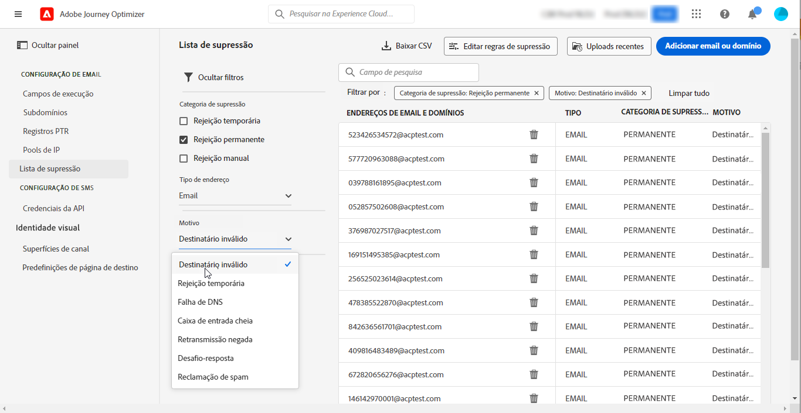

# Introdução para administradores do sistema {#get-started-sys-admins}

Antes de começar a usar [!DNL Adobe Journey Optimizer], várias etapas são necessárias para preparar seu ambiente.  Você deve executar essas etapas para que a variável [Engenheiro de dados](data-engineer.md) e [Jornada](marketer.md) pode começar a trabalhar com [!DNL Adobe Journey Optimizer].

Como um **Administrador do sistema**, é necessário **compreender perfis de produtos e atribuir permissões** para administração de sandbox e configuração de canal. Você também precisa configurar sandboxes e gerenciá-las para os perfis de produto disponíveis. É possível atribuir membros da equipe a perfis de produtos.

Esses recursos podem ser gerenciados por **[!UICONTROL Product administrators]** que têm acesso ao Admin Console. [Saiba mais sobre o Adobe Admin Console](https://helpx.adobe.com/br/enterprise/admin-guide.html){target=&quot;_blank&quot;}.

Saiba mais sobre o gerenciamento de acesso nas seguintes páginas:

1. **Criar sandboxes** para particionar suas instâncias em ambientes virtuais separados e isolados. **Sandboxes** são criados em [!DNL Journey Optimizer]. Saiba mais na [Sandboxes](../../administration/sandboxes.md) seção.

   >[!NOTE]
   >Como um **Administrador do sistema**, se não conseguir ver a variável **[!UICONTROL Sandboxes]** em [!DNL Journey Optimizer], atualize suas permissões no [Admin Console](https://adminconsole.adobe.com/){_blank}. Saiba como atualizar o perfil de produto no [esta página](../../administration/permissions.md#edit-product-profile).

1. **Entender os perfis de produto**. Os perfis de produto são um conjunto de direitos unitários que permite aos usuários acessar determinadas funcionalidades ou objetos na interface. Saiba mais na [Perfis de produto prontos para uso](../../administration/ootb-product-profiles.md) seção.

1. **Definir permissões** para perfis de produtos, incluindo **Sandboxes** e dê acesso aos membros da sua equipe, atribuindo-os a perfis de produtos diferentes. Essa etapa é executada no [Admin Console](https://adminconsole.adobe.com/){_blank}. As permissões são direitos unitários que permitem definir as autorizações atribuídas a **[!UICONTROL Product profile]**. Cada permissão é coletada em recursos, por exemplo, Jornada, mensagens ou ofertas, que representam as diferentes funcionalidades ou objetos em [!DNL Journey Optimizer]. Saiba mais na [Níveis de permissão](../../administration/high-low-permissions.md) seção.

Além disso, você deve adicionar usuários que precisam de acesso ao Assets Essentials para **Usuários do cliente do Assets Essentials** ou/e **Usuários do Assets Essentials** Perfis de produto. [Leia mais na documentação do Assets Essentials](https://experienceleague.adobe.com/docs/experience-manager-assets-essentials/help/deploy-administer.html){target=&quot;_blank&quot;}.

>[!NOTE]
>Para produtos da Journey Optimizer obtidos antes de 6 de janeiro de 2022, é necessário implantar [!DNL Adobe Experience Manager Assets Essentials] para sua organização. Saiba mais na [Implantar o Assets Essentials](https://experienceleague.adobe.com/docs/experience-manager-assets-essentials/help/deploy-administer.html)seção {target=&quot;_blank&quot;}.

Ao acessar [!DNL Journey Optimizer] pela primeira vez, você é provisionado com uma sandbox de produção e recebe um determinado número de IPs dependendo do seu contrato.

Para criar suas jornadas e enviar mensagens, acesse o **ADMINISTRAÇÃO** menu. Navegue pelo **[!UICONTROL Channels]** para configurar suas mensagens de email e predefinições.

>[!NOTE]
>Como um **Administrador do sistema**, se não conseguir ver a variável **[!UICONTROL Channels]** em [!DNL Journey Optimizer], atualize suas permissões no [Admin Console](https://adminconsole.adobe.com/){_blank}. Saiba como atualizar o perfil de produto no [esta página](../../administration/permissions.md#edit-product-profile).

Siga as etapas listadas abaixo:

1. **Configurar mensagens e canais**: definir predefinições, adaptar e personalizar configurações de mensagens de email e de push

   * Definir **configurações de notificações por push** em ambos [!DNL Adobe Experience Platform] e [!DNL Adobe Experience Platform Launch]. [Saiba mais](../../messages/push-gs.md)

   * Criar **predefinições de mensagens** para configurar todos os parâmetros técnicos necessários para mensagens de email e de notificação por push. [Saiba mais](../../configuration/message-presets.md)

   * Gerenciar o número de dias durante os quais **tentativas** são executados antes do envio de endereços de email para a lista de supressão. [Saiba mais](../../configuration/manage-suppression-list.md)

1. **Delegar subdomínios**: para qualquer novo subdomínio ser usado no Journey Optimizer, a primeira etapa será delegá-lo. [Saiba mais](../../configuration/about-subdomain-delegation.md)

   

1. **Criar pools de IP**: melhore a capacidade de delivery de email e a reputação, agrupando os endereços IP provisionados com sua instância. [Saiba mais](../../configuration/ip-pools.md)

   

1. **Gerenciar a supressão e a lista de permissões**: melhore sua capacidade de delivery com supressão e listas de permissões

   * A [lista de supressão](../../messages/suppression-list.md) O consiste em endereços de email que você deseja excluir de seus deliveries, pois o envio para esses contatos pode prejudicar sua reputação de envio e as taxas de delivery. Você pode monitorar todos os endereços de email que são excluídos automaticamente do envio em uma jornada, como endereços inválidos, endereços que compostam de forma consistente e podem afetar negativamente sua reputação de email, e recipients que emitem uma reclamação de spam de algum tipo contra uma de suas mensagens de email. Saiba como gerenciar o [lista de supressão](../../configuration/manage-suppression-list.md) e [tentativas](../../configuration/retries.md).
   

   * O [lista de permissões](../../messages/allow-list.md) O permite especificar endereços de email ou domínios individuais que serão os únicos recipients ou domínios autorizados a receber os emails enviados de uma sandbox específica. Isso pode impedir que você envie emails acidentalmente para endereços de clientes reais quando estiver em um ambiente de teste. Saiba como [habilite a lista de permissões](../../messages/allow-list.md).
   Saiba mais sobre o gerenciamento da capacidade de entrega em [!DNL Adobe Journey Optimizer] [nesta página](../../messages/deliverability.md).
