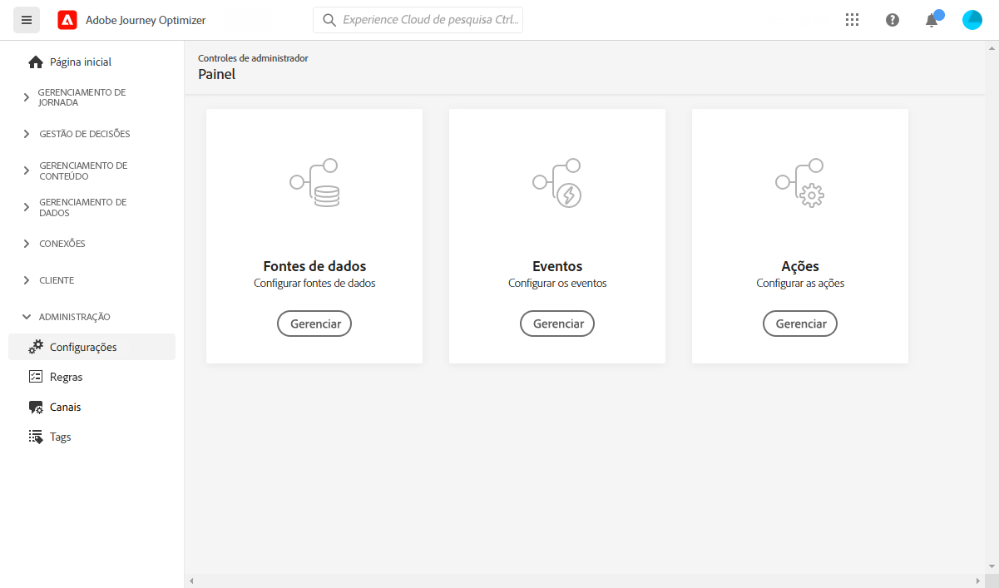

# Introdução ao engenheiro de dados {#data-engineer}

Como um **Engenheiro de dados da Adobe Journey Optimizer**, prepare e mantenha os dados do perfil do cliente para potencializar as experiências orquestradas pelo [!DNL Journey Optimizer], modele dados de clientes e negócios em schemas e configure conectores de origem para assimilar dados. Você pode começar a trabalhar com [!DNL Adobe Journey Optimizer] uma vez que a [Administrador do sistema](administrator.md) concedeu acesso e preparou seu ambiente.

Saiba como **identificar dados e criar esquema e conjunto de dados** para obter seus dados no Adobe Experience Platform nesta página.

>[!NOTE]
>
>Saiba mais sobre **ingestão de dados** em [Documentação do Adobe Experience Platform](https://experienceleague.adobe.com/docs/experience-platform/ingestion/home.html?lang=pt-BR){target=&quot;_blank&quot;}.

As etapas para criar um namespace de identidade e um conjunto de dados habilitado para perfis e perfis de teste são detalhadas nas seções abaixo:

1. **Criar um namespace de identidade**. No Adobe [!DNL Journey Optimizer], **Identidades** vincular consumidores em dispositivos e canais, o resultado é um gráfico de identidade. O gráfico de identidade vinculado é usado para personalizar experiências com base em interações em todos os pontos de contato comerciais.  Saiba mais sobre identidades e namespaces de identidade [nesta página](../../segment/get-started-identity.md).

1. **Criar um esquema** e ativá-la para perfis. Um esquema é um conjunto de regras que representam e validam a estrutura e o formato dos dados. Em um alto nível, os esquemas fornecem uma definição abstrata de um objeto do mundo real (como uma pessoa) e destacam quais dados devem ser incluídos em cada instância desse objeto (como nome, sobrenome, aniversário e assim por diante).  Saiba mais sobre schemas [nesta página](../get-started-schemas.md).

1. **Criar conjuntos de dados** e ativá-la para perfis. Um conjunto de dados é uma construção de armazenamento e gerenciamento para uma coleção de dados, normalmente uma tabela, que contém um esquema (colunas) e campos (linhas). Os conjuntos de dados também contêm metadados que descrevem vários aspectos dos dados armazenados. Depois que um conjunto de dados é criado, é possível mapeá-lo para um esquema existente e adicionar dados a ele. Saiba mais sobre conjuntos de dados [nesta página](../get-started-datasets.md).

1. **Configurar conectores de fontes**. O Adobe Jornada Otimzer permite que os dados sejam assimilados de fontes externas e, ao mesmo tempo, fornece a capacidade de estruturar, rotular e aprimorar os dados recebidos usando os serviços da plataforma. Você pode assimilar dados de várias fontes, como aplicativos Adobe, armazenamentos baseados em nuvem, bancos de dados e muitas outras. Saiba mais sobre conectores de origem [nesta página](../get-started-sources.md).

1. **Criar perfis de teste**. Os perfis de teste são necessários ao usar o [modo de teste](../../building-journeys/testing-the-journey.md) em uma jornada, e para [visualizar e testar suas mensagens](../../design/preview.md) antes de enviar. Descubra etapas para criar perfis de teste [nesta página](../../segment/creating-test-profiles.md).

Além disso, para poder enviar mensagens no jornada, você deve configurar **[!UICONTROL Data Sources]**, **[!UICONTROL Events]** e **[!UICONTROL Actions]**. Saiba mais [nesta seção](../../configuration/about-data-sources-events-actions.md).

* O **Fonte de dados** A configuração do permite definir uma conexão com um sistema para recuperar informações adicionais que serão usadas em suas jornadas. Saiba mais sobre Fontes de dados [nesta seção](../../datasource/about-data-sources.md).

* **Eventos** permite acionar as jornadas de forma unitária para enviar mensagens, em tempo real, ao indivíduo que flui para a jornada. Na configuração do evento, configure os eventos esperados nas jornadas. Os dados de entrada dos eventos são normalizados de acordo com o Adobe Experience Data Model (XDM). Os eventos vêm das APIs de assimilação de streaming para eventos autenticados e não autenticados (como eventos do Adobe Mobile SDK). Saiba mais sobre eventos [nesta seção](../../event/about-events.md).

* [!DNL Journey Optimizer] O vem com recursos de mensagem incorporados: você pode criar o conteúdo e publicar a mensagem. Se você estiver usando um sistema de terceiros para enviar mensagens, por exemplo, Adobe Campaign, crie um **ação personalizada**. Saiba mais sobre ações neste [nesta seção](../../action/action.md).
