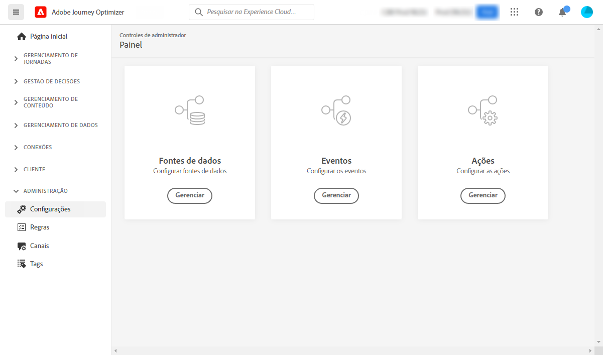

# Introdução ao engenheiro de dados {#data-engineer}

Como **Arquiteto(a) de dados** ou **Engenheiro(a) de dados**, você configura e mantém os dados de perfis de clientes e outras fontes de dados que viabilizam as experiências orquestradas pelo [!DNL Journey Optimizer]. Isso inclui a integração de todos os dados de clientes e negócios — da web, do CRM ou de fontes offline — em uma visão unificada de 360 graus do cliente. Você modela os dados de perfil do cliente e os dados de negócios em esquemas, configura conectores de origem para ingerir dados e garante que os dados fluam sem problemas para permitir insights do cliente e engajamento em tempo real. Você pode começar a trabalhar com o [!DNL Adobe Journey Optimizer] assim que o(a) [admin de sistema](administrator.md) conceder acesso e preparar seu ambiente.

>[!NOTE]
>
>Saiba mais sobre **ingestão de dados** na [documentação da Adobe Experience Platform](https://experienceleague.adobe.com/docs/experience-platform/ingestion/home.html?lang=pt-BR){target="_blank"}.

## Etapas essenciais de configuração de dados

Siga estas etapas para configurar a base de dados do Journey Optimizer:

1. **Criar namespaces de identidade**. No Adobe [!DNL Journey Optimizer], as **Identidades** vinculam consumidores em dispositivos e canais, e o resultado é um gráfico de identidade. O gráfico de identidade vinculado é usado para personalizar experiências com base em interações em todos os pontos de contato de negócios.  Saiba mais sobre identidades e namespaces de identidade [nesta página](../../audience/get-started-identity.md).

   Além disso, configure **identificadores complementares** para permitir que o mesmo perfil entre em várias instâncias da jornada com base em identificadores secundários, como IDs de pedido ou IDs de reserva. Saiba mais sobre [identificadores complementares](../../building-journeys/supplemental-identifier.md).

1. **Crie esquemas** e habilite-os para perfis. Um esquema é um conjunto de regras que representam e validam a estrutura e o formato dos dados. Em um nível alto, os esquemas fornecem uma definição abstrata de um objeto do mundo real (como uma pessoa) e descrevem quais dados devem ser incluídos em cada instância desse objeto (como nome, sobrenome, aniversário e assim por diante).

   * Para jornadas e campanhas padrão: use [esquemas XDM](../../data/get-started-schemas.md)
   * Para campanhas orquestradas: crie [esquemas relacionais](../../orchestrated/gs-schemas.md) para habilitar a segmentação de várias entidades

1. **Crie conjuntos de dados** e habilite-os para perfis. Um conjunto de dados é uma construção de armazenamento e gerenciamento para uma coleção de dados, normalmente uma tabela, que contém um esquema (colunas) e campos (linhas). Os conjuntos de dados também contêm metadados que descrevem vários aspectos dos dados armazenados. Depois que um conjunto de dados é criado, é possível mapeá-lo para um esquema existente e adicionar dados a ele. Saiba mais sobre conjuntos de dados [nesta página](../../data/get-started-datasets.md).

   Em cenários avançados, prepare **conjuntos de dados para pesquisas em tempo de execução** e enriqueça a execução da jornada com dados em tempo real de conjuntos de dados de registro. Saiba mais sobre a [pesquisa de conjunto de dados](../../building-journeys/dataset-lookup.md).

1. **Configurar conectores de origem**. O Adobe Journey Optimizer permite que os dados sejam assimilados de fontes externas e fornece a capacidade de estruturar, rotular e aprimorar os dados recebidos com os serviços da Platform. Você pode assimilar dados de várias fontes, como aplicativos Adobe, armazenamentos baseados em nuvem, bancos de dados e muitas outras. Saiba mais sobre conectores de origem [nesta página](../get-started-sources.md).

1. **Criar perfis de teste**. Os perfis de teste são necessários ao usar o [modo de teste](../../building-journeys/testing-the-journey.md) em uma jornada, e para [visualizar e testar suas mensagens](../../content-management/preview-test.md) antes de enviar. As etapas para criar perfis de teste são detalhadas [nesta página](../../audience/creating-test-profiles.md).

1. **Configurar atributos computados** (opcional). Crie atributos derivados de dados de perfil para simplificar a segmentação e a personalização. Os atributos computados calculam automaticamente métricas complexas como “Total de compras nos últimos 90 dias” ou “Valor médio do pedido”. Saiba mais sobre [atributos computados](../../audience/computed-attributes.md).

1. **Conjuntos de dados de exportação de mensagens** (opcional). Quando a exportação de mensagens é ativada no nível de configuração do canal, o conteúdo de emails e SMS enviados é exportado automaticamente para um conjunto de dados dedicado do Experience Platform para fins de conformidade, arquivamento ou análise downstream. Saiba mais sobre [exportação de mensagens](../../configuration/message-export.md).

Além disso, para poder enviar mensagens em jornadas, configure as **[!UICONTROL Fontes de dados]**, os **[!UICONTROL Eventos]** e as **[!UICONTROL Ações]**. Saiba mais [nesta seção](../../configuration/about-data-sources-events-actions.md).

* A configuração da **fonte de dados** permite definir uma conexão com um sistema para recuperar informações adicionais que serão usadas em suas jornadas. Saiba mais sobre Fontes de dados [nesta seção](../../datasource/about-data-sources.md).

* Os **Eventos** permitem acionar as jornadas de forma unitária para enviar mensagens, em tempo real, à pessoa que flui para a jornada. Na configuração do evento, configure os eventos esperados nas jornadas. Os dados de entrada dos eventos são padronizados de acordo com o Adobe Experience Data Model (XDM). Os eventos vêm das APIs de ingestão de transmissão para eventos autenticados e não autenticados (como eventos do Adobe Mobile SDK). Saiba mais sobre eventos [nesta seção](../../event/about-events.md).

* O [!DNL Journey Optimizer] vem com recursos de mensagem integrados: você pode criar suas mensagens em uma jornada e projetar o conteúdo. Se você estiver usando um sistema de terceiros para enviar mensagens, por exemplo, Adobe Campaign, crie uma **ação personalizada**. Saiba mais sobre ações [nesta seção](../../action/action.md).

## Monitorar e analisar dados de jornada

Após a entrada em execução das jornadas, é possível consultar os eventos de etapa da jornada no Data Lake para monitorar o desempenho, solucionar problemas e analisar o comportamento do cliente. Usar consultas SQL para analisar:

* Padrões de entrada e saída de perfil
* Taxas de erro e motivos para descarte
* Desempenho do trabalho de exportação do público-alvo de leitura
* Métricas de desempenho da ação personalizada
* Estados da instância e gargalos da jornada

Explore [exemplos de consulta para análise da jornada](../../reports/query-examples.md) prontos para uso como uma introdução à análise de dados e à solução de problemas.

## Colaborar entre funções

O trabalho de configuração de dados é essencial para outras equipes:

>[!BEGINTABS]

>[!TAB Trabalhar com admins]

Colabore com [Admins](administrator.md) no acesso e na governança:

* Solicite as permissões necessárias para o gerenciamento de dados e a criação de esquema
* Coordene o acesso à sandbox para desenvolvimento e testes
* Alinhe as políticas de governança de dados e o gerenciamento de consentimento
* Discuta as políticas de retenção de dados e os requisitos de armazenamento

>[!TAB Trabalhar com desenvolvedores]

Colabore com os [Desenvolvedores](developer.md) nos eventos e na estrutura dos dados:

* Forneça esquemas XDM e estruturas de evento necessárias para a implementação
* Defina quais eventos precisam ser enviados e o formato de conteúdo necessário
* Alinhe os requisitos de coleta de dados e os padrões de qualidade dos dados
* Teste a entrega de eventos e a ingestão de dados em conjunto

>[!TAB Trabalhar com profissionais de marketing]

Colabore com os [Profissionais de marketing](marketer.md) em relação aos públicos-alvo e dados:

* Crie atributos computados para personalização e segmentação
* Crie públicos-alvo com base nos seus requisitos de campanha e jornada
* Configure esquemas relacionais para campanhas orquestradas
* Suporte à segmentação de várias entidades para casos de uso avançados

>[!ENDTABS]
