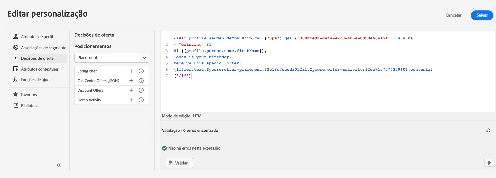
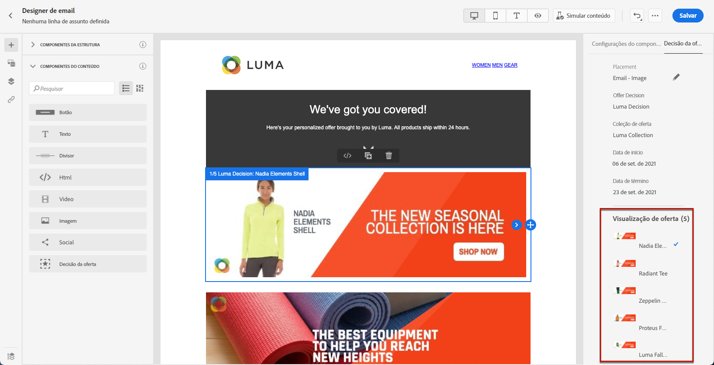
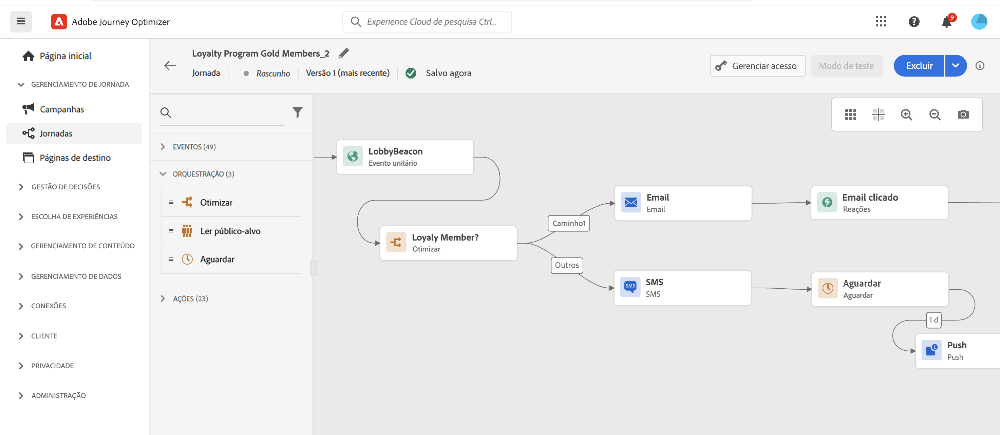

# Introdução aos profissionais de marketing {#get-started-marketers}

Como um **Profissional de marketing** ou **Jornada**, você é responsável por criar ofertas e jornadas e criar conteúdo. Você pode começar a trabalhar com [!DNL Adobe Journey Optimizer] uma vez que a [Administrador do sistema](administrator.md) e [Engenheiro de dados](data-engineer.md) concedeu acesso e preparou seu ambiente.

Consulte as seguintes seções para configurar a primeira jornada, adicionar ofertas e ativos e enviar mensagens:

1. **Criar segmentos**. O Journey Optimizer permite criar segmentos de público-alvo diretamente do **Segmentos** e aproveite-as em suas jornadas.  Saiba mais sobre segmentos [nesta página](../../segment/about-segments.md). Descubra como criar segmentos [nesta amostra](../../segment/creating-a-segment.md).

1. **Adicionar personalização**. Aproveite os recursos de personalização do Journey Optimizer para adaptar sua mensagem ao seu público-alvo. Saiba mais sobre a personalização [nesta seção](../../personalization/personalize.md).

   

1. **Criar e gerenciar ativos**. [!DNL Adobe Experience Manager Assets Essentials] O fornece um repositório único e centralizado de ativos que podem ser usados para preencher suas mensagens. Saiba mais [nesta seção](../../design/assets-essentials.md).

1. **Adicionar ofertas**. Use o [!DNL Journey Optimizer] para fornecer a melhor oferta e experiência aos seus clientes em todos os pontos de contato na hora certa. Depois de projetado, direcione os públicos com ofertas personalizadas. Saiba mais sobre o Gerenciamento de decisões [nesta seção](../../offers/get-started/starting-offer-decisioning.md).

   

1. **Testar e validar**. Após definir o conteúdo, é possível usar perfis de teste para pré-visualizá-lo e testá-lo. Se você inseriu [conteúdo personalizado](../../personalization/personalize.md), você poderá verificar como esse conteúdo é exibido na mensagem, aproveitando os dados do perfil de teste. Além disso, aproveite **Litmus** conta em [!DNL Journey Optimizer] para visualizar instantaneamente sua **renderização de email** em clientes de email populares. Em seguida, você pode garantir que seu conteúdo de email fique ótimo e funcione corretamente em cada caixa de entrada. Saiba como testar e validar suas mensagens [nesta seção](../../design/preview.md).

1. **Jornadas do cliente de design** para fornecer experiências personalizadas e contextuais. [!DNL Journey Optimizer] permite criar casos de uso de orquestração em tempo real, aproveitando dados contextuais armazenados em eventos ou fontes de dados. Projete cenários avançados com várias etapas e com os seguintes recursos:

   * Enviar em tempo real **entrega unitária** acionado quando um evento é recebido, ou **em lote** usando segmentos do Adobe Experience Platform.

   * Aproveitamento **dados contextuais** de eventos, informações do Adobe Experience Platform ou dados de serviços de API de terceiros.

   * Use o **ação de canal integrada** para enviar mensagens projetadas no [!DNL Journey Optimizer] ou criar **ações personalizadas** se estiver usando um sistema de terceiros para enviar mensagens.

   * Com o **Designer do jornada** crie seus casos de uso em várias etapas: arraste e solte facilmente um evento de entrada ou uma atividade de segmento de leitura, adicione condições e envie mensagens personalizadas.

   

   Saiba como projetar e executar jornadas [nesta seção](../../building-journeys/journey-gs.md)

1. **Monitorar mensagens e jornadas**. Para garantir que suas mensagens sejam executadas, enviadas e entregues com êxito, [!DNL Journey Optimizer] O oferece recursos para monitorar as mensagens publicadas e acionadas no momento. Saiba como monitorar desempenhos [nesta seção](../../reports/global-report.md).
