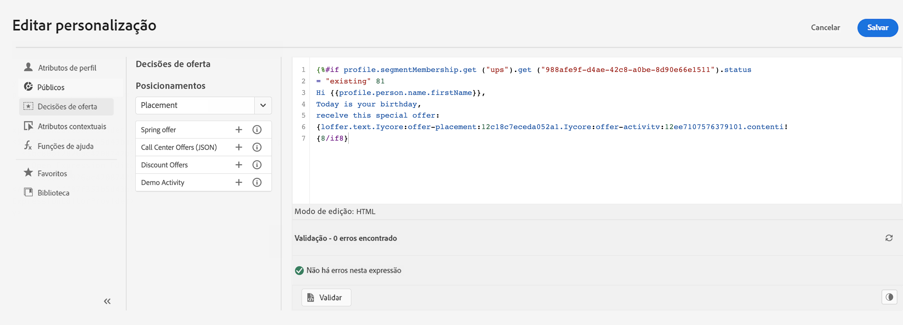
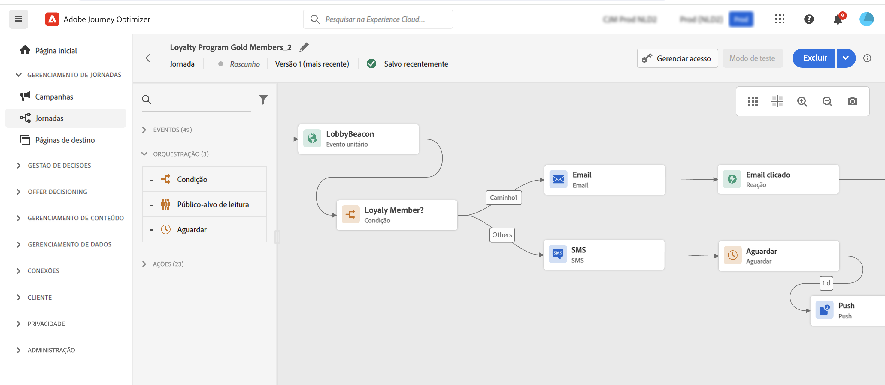

# Introdução para profissionais de marketing {#get-started-marketers}

Como um **Profissional de marketing** ou **Profissional de negócios**, você cria jornadas para clientes a fim de fornecer experiências pessoais e contextuais aos clientes. Crie e gerencie todos os vários componentes dessas jornadas personalizadas, incluindo mensagens de email e push, ofertas e componentes de decisão para personalizar o conteúdo da mensagem de forma inteligente. O Journey Optimizer fornece uma experiência de usuário unificada, onde você pode implementar casos de uso completos em um único local. Você pode começar a trabalhar com o [!DNL Adobe Journey Optimizer] assim que o [Administrador do sistema](administrator.md) e o [Engenheiro de dados](data-engineer.md) concederem acesso e prepararem seu ambiente.

## Introdução ao essentials

O Journey Optimizer reúne insights do cliente em tempo real, orquestração omnicanal moderna e decisão inteligente em um único aplicativo. Crie experiências personalizadas e conectadas do cliente por email, SMS, push, no aplicativo, Web, cartões de conteúdo e muito mais.

O Journey Optimizer oferece duas abordagens eficientes de orquestração:

* **Jornadas**: engajamento individualizado em tempo real no qual cada cliente se move no seu ritmo e acionado por comportamento ou eventos
* **Campanhas orquestradas**: campanhas em lote complexas, com várias etapas, em escala, nas quais os públicos se desenvolvem em conjunto por meio de fluxos de trabalho. Perfeito para campanhas iniciadas pela marca, como promoções sazonais, lançamentos de produtos ou comunicações baseadas em conta

Trabalhe com seus [Administradores](administrator.md) para obter acesso e com os [Engenheiros de dados](data-engineer.md) para configurar públicos, dados e esquemas relacionais para segmentação avançada.

Siga estas etapas principais para começar a criar experiências:

1. **Criar públicos-alvo**. Crie públicos-alvo por meio de definições de segmento, carregue arquivos CSV ou use a composição de público-alvo. A Journey Optimizer oferece várias maneiras de direcionar os clientes certos. Saiba mais sobre [públicos-alvo](../../audience/about-audiences.md) e [criação de definições de segmento](../../audience/creating-a-segment-definition.md).

1. **Criar conteúdo**. Crie mensagens atraentes em todos os canais, incluindo email, SMS, push, no aplicativo, Web e cartões de conteúdo:
   * Use o **Assistente de IA** para gerar conteúdo de email, linhas de assunto e imagens com base nas diretrizes da sua marca. [Saiba mais sobre a geração de conteúdo de IA](../../content-management/gs-generative.md)
   * **Personalize mensagens** com dados do cliente, conteúdo dinâmico e lógica condicional. [Saiba mais sobre personalização](../../personalization/personalize.md)
   * **Repita em dados contextuais** para exibir listas dinâmicas de eventos, ações personalizadas e pesquisas de conjuntos de dados. [Saiba mais sobre a iteração de dados contextuais](../../personalization/iterate-contextual-data.md)
   * Crie **modelos de conteúdo** e **fragmentos** reutilizáveis para manter a consistência da marca. [Trabalhar com modelos](../../content-management/content-templates.md)
   * Forneça **cartões de conteúdo** persistentes e não intrusivos em aplicativos móveis e sites. Diferentemente das notificações por push, os cartões de conteúdo permanecem visíveis até serem descartados. [Saiba mais sobre cartões de conteúdo](../../content-card/create-content-card.md)
   * Gerenciar ativos com a integração do **Adobe Experience Manager Assets**. [Saiba mais sobre ativos](../../integrations/assets.md)

   

1. **Adicionar ofertas e decisões**. Forneça a melhor oferta para cada cliente na hora certa usando a decisão baseada em IA. Saiba mais sobre a [Gestão de decisões](../../offers/get-started/starting-offer-decisioning.md) e a [Experience Decisioning](../../experience-decisioning/gs-experience-decisioning.md).

   

1. **Testar e validar**. Visualizar e testar o conteúdo antes de enviar:
   * Use **perfis de teste** para visualizar a personalização e verificar a renderização entre dispositivos
   * Testar com **dados de amostra** de arquivos CSV/JSON
   * Visualizar **renderização de email** entre clientes de email populares
   * Execute **testes A/B e experimentos** para otimizar as variações de conteúdo. Use a experimentação de bandit multi-armed para alocar automaticamente mais tráfego a variações vencedoras em tempo real. [Saiba mais sobre experimentação](../../content-management/content-experiment.md)
   * Configure **workflows de aprovação** para campanhas e jornadas (requer licença adicional). [Saiba mais sobre aprovações](../../test-approve/gs-approval.md)

   Saiba como [testar e validar mensagens](../../content-management/preview-test.md).

1. **Criar jornadas do cliente**. Crie experiências personalizadas em tempo real usando a tela de jornada:

   * Acione jornadas com **eventos** (ações do cliente) ou **públicos-alvo** (envios em lote)
   * Adicione **condições** para criar caminhos personalizados com base nos dados do cliente
   * Use **atividades de espera** para criar um tempo perfeito entre mensagens
   * Enviar mensagens em **vários canais** em uma jornada
   * Aplicar **teste A/B** e otimizar os tempos de envio para maximizar o envolvimento
   * Use a **pesquisa de conjunto de dados** para enriquecer jornadas com dados em tempo real do Adobe Experience Platform. [Saiba mais sobre a pesquisa de conjunto de dados](../../building-journeys/dataset-lookup.md)
   * Use **identificadores complementares** para permitir que o mesmo perfil entre em várias instâncias do jornada (por exemplo, pedidos ou reservas diferentes). [Saiba mais sobre identificadores complementares](../../building-journeys/supplemental-identifier.md)

   

   Saiba como [projetar e executar jornadas](../../building-journeys/journey-gs.md) e explorar [casos de uso do jornada](../../building-journeys/jo-use-cases.md). Entenda os [critérios de entrada/saída](../../building-journeys/entry-exit-criteria-guide.md) para controlar o fluxo de perfil.

1. **Iniciar campanhas orquestradas**. Projete campanhas em lote complexas e com várias etapas em escala usando uma tela visual:

   * Crie **públicos-alvo sob demanda** instantaneamente usando consultas relacionais para conectar dados do cliente com contas, compras, assinaturas e outras entidades
   * Crie **segmentação de várias entidades** para direcionamento preciso (por exemplo, &quot;clientes com assinaturas que expiram em 30 dias&quot; ou &quot;contas com compras recentes de alto valor&quot;)
   * Obtenha a **visibilidade de pré-envio** com contagens precisas de público-alvo antes de iniciar
   * Crie **fluxos de trabalho de várias etapas** para promoções sazonais, lançamentos de produtos, ofertas de fidelidade ou marketing baseado em conta
   * Programar campanhas para execução imediata, em horários específicos ou em agendamentos recorrentes (diariamente, semanalmente, mensalmente)
   * Processar públicos no **modo de lote**, onde todos os perfis avançam juntos pelo fluxo de trabalho

   Saiba como [começar a usar campanhas orquestradas](../../orchestrated/gs-orchestrated-campaigns.md) e saber quando [usar campanhas em comparação com o jornada](../../orchestrated/orchestrated-campaigns-faq.md).

1. **Monitorar e otimizar**. Acompanhe o desempenho e melhore os resultados ao longo do tempo:
   * Monitorar o desempenho da **jornada em tempo real** e identificar gargalos
   * Analisar as taxas de **entrega de mensagens** e as métricas de envolvimento
   * Use os **painéis de relatórios** com a integração do Customer Journey Analytics
   * Rastrear a **conversão** e o impacto nos negócios
   * Gerencie a **frequência e a priorização de mensagens** com regras de gerenciamento de conflitos para evitar comunicação excessiva. [Saiba mais sobre o gerenciamento de conflitos](../../conflict-prioritization/gs-conflict-prioritization.md)

   Saiba como [monitorar o desempenho](../../reports/report-gs-cja.md).

## Práticas recomendadas para o sucesso

### Criação de conteúdo

* **Comece com modelos**: use modelos pré-criados e fragmentos de conteúdo para acelerar a criação e manter a consistência
* **Teste com antecedência, teste com frequência**: sempre visualize o conteúdo entre dispositivos e use perfis de teste para validar a personalização
* **Aproveite a IA com sabedoria**: use o AI Assistant para rascunhos e variações iniciais, mas sempre revise e refine para voz da sua marca
* **Mantenha a simplicidade**: mensagens claras e concisas com chamadas para ação fortes têm melhor desempenho do que layouts complexos

### Jornada design

* **Definir metas claras**: estabelecer métricas de sucesso antes de criar sua jornada
* **Mapear a experiência do cliente**: visualizar toda a jornada antes da implementação
* **Usar atividades de espera estrategicamente**: dê aos clientes tempo para se engajarem antes de enviar acompanhamentos
* **Planejar estratégias de saída**: defina quando e por que os clientes devem sair da jornada
* **Teste no modo de rascunho**: valide a lógica de jornada com simulação antes de ativar

[Conheça as práticas recomendadas do jornada](../../building-journeys/entry-exit-criteria-guide.md#best-practices)

### Orquestração de campanha

* **Escolha a abordagem correta**: [Comparar tipos de jornadas](../../building-journeys/journey.md#journey-types) para experiências acionadas por comportamento em tempo real ou [tipos de campanhas](../../campaigns/get-started-with-campaigns.md#campaign-types) para campanhas agendadas em lote
* **Definir objetivos claros da campanha**: estabelecer metas antes de criar fluxos de trabalho de várias etapas
* **Comece com públicos-alvo piloto**: valide as contagens e a lógica de segmentação antes de dimensionar
* **Aproveite dados relacionais**: use a segmentação de várias entidades para conectar dados do cliente a contas, compras e assinaturas para direcionamento preciso
* **Mantenha a segmentação simples**: otimize o desempenho e a transparência com regras claras e sustentáveis
* **Usar nomenclatura consistente**: facilitar o gerenciamento de campanhas com convenções de nomenclatura claras

### Direcionamento de público

* **Segmente cuidadosamente**: crie segmentos de público-alvo específicos e acionáveis com base em critérios claros
* **Atualizar regularmente**: certifique-se de que os públicos-alvo permaneçam atualizados, definindo cronogramas de avaliação apropriados
* **Tamanho e precisão de equilíbrio**: públicos-alvo grandes o suficiente para significância estatística, mas específicos o suficiente para relevância
* **Usar atributos de enriquecimento**: use atributos computados e dados de enriquecimento para uma personalização mais profunda

### Gerenciamento de frequência

* **Respeitar as preferências do cliente**: respeitar as opções de não participação e de comunicação
* **Definir limites de frequência**: use conjuntos de regras para evitar a fadiga da mensagem entre canais
* **Coordenar campanhas**: use o gerenciamento de conflitos para garantir que os clientes recebam a mensagem certa na hora certa
* **Monitorar engajamento**: observe sinais de fadiga (taxas de abertura decrescentes, aumento de cancelamentos de assinatura)

[Saiba mais sobre limite de frequência](../../conflict-prioritization/channel-capping.md)

## Explorar casos de uso

Aprenda com exemplos práticos que demonstram os recursos do Journey Optimizer:

**Casos de uso do Jornada** (tempo real, um para um):

* **Série de boas-vindas**: integre novos clientes com jornadas personalizadas de várias etapas. [Exibir caso de uso](https://experienceleague.adobe.com/pt-br/docs/journey-optimizer-learn/tutorials/use-cases/customer-onboarding)
* **Recuperação do carrinho abandonado**: envolva novamente os clientes que deixaram itens em seus carrinhos. [Exibir caso de uso](https://experienceleague.adobe.com/pt-br/docs/journey-optimizer-learn/tutorials/use-cases/abandoned-cart)
* **Mensagens orientadas por eventos**: responda às ações do cliente em tempo real
* **Campanhas de aniversário**: enviar mensagens de aniversário personalizadas acionadas por datas de perfil
* **Recomendações de produto**: sugerir produtos relevantes com base no histórico de navegação e compra

**Casos de uso de campanha orquestrada** (em lote, de um para muitos):

* **Promoções sazonais**: inicie campanhas coordenadas em todos os segmentos de clientes (por exemplo, vendas de feriados, escolas)
* **Lançamentos de produtos**: anunciar novos produtos a públicos-alvo direcionados com mensagens sequenciadas
* **Ofertas do programa de fidelidade**: recompensa clientes de alto valor com ofertas em camadas com base no histórico de compras
* **Marketing baseado em conta**: contas de destino com características específicas e contatos relacionados
* **Renovações de assinatura**: alcance clientes com assinaturas que vencem em breve usando consultas de várias entidades
* **Campanhas de reengajamento**: conquiste clientes inativos com ofertas direcionadas no modo de lote. [Exibir caso de uso](https://experienceleague.adobe.com/pt-br/docs/experience-platform/rtcdp/use-cases/personalization-insights-engagement/use-cases-luma)

**padrões de Jornada:**

* [Enviar mensagens aos assinantes](../../building-journeys/message-to-subscribers-uc.md): listas de assinaturas de destino com conteúdo personalizado
* [Mensagens multicanais](../../building-journeys/journeys-uc.md): combinar email e push com eventos de reação
* [Emails somente para dias da semana](../../building-journeys/weekday-email-uc.md): agendar comunicações usando condições baseadas em tempo

Navegue pela [biblioteca de casos de uso do jornada](../../building-journeys/jo-use-cases.md) completa e saiba mais sobre [campanhas orquestradas](../../orchestrated/gs-orchestrated-campaigns.md).

## Colaborar entre funções

Seu trabalho de marketing se conecta com outras equipes:

>[!BEGINTABS]

>[!TAB Trabalhar com engenheiros de dados]

Colabore com [engenheiros de dados](data-engineer.md) em configurações de dados e público-alvo:

* Solicitar novos atributos computados para personalização e segmentação
* Coordenar em esquemas relacionais para campanhas orquestradas
* Fornecer feedback sobre a qualidade do público-alvo e a precisão dos dados
* Alinhe os requisitos de dados de várias entidades para segmentação avançada

>[!TAB Trabalhar com desenvolvedores]

Colabore com [desenvolvedores](developer.md) no rastreamento e na implementação de eventos:

* Alinhar em quais interações do usuário devem acionar eventos de jornada
* Testar implementações para dispositivos móveis e da Web antes do lançamento
* Validar o rastreamento para desempenho do conteúdo e envolvimento do usuário
* Solucionar problemas com entrega de mensagens ou personalização

>[!TAB Trabalhar com Administradores]

Colabore com [Administradores](administrator.md) sobre acesso e configurações:

* Solicite configurações de canal para suas campanhas e jornadas
* Confirmar o acesso à licença para campanhas orquestradas e outros recursos
* Relatar problemas com permissões ou acesso
* Coordenar os ambientes de teste e ativação de novos recursos

>[!ENDTABS]

## Próximas etapas

1. **Comece pequeno**: crie uma jornada de boas-vindas simples ou uma campanha de mensagem única para conhecer a plataforma
2. **Aproveite a IA**: use o Assistente de IA para fazer perguntas e acelerar a criação de conteúdo
3. **Ingressar na comunidade**: conectar-se a outros usuários do Journey Optimizer na [Comunidade do Experience League](https://experienceleaguecommunities.adobe.com/t5/journey-optimizer/ct-p/journey-optimizer?profile.language=pt){target="_blank"}
4. **Explorar tutoriais**: Assista aos vídeos passo a passo no [Experience League](https://experienceleague.adobe.com/pt-br/docs/journey-optimizer-learn/tutorials/overview){target="_blank"}
