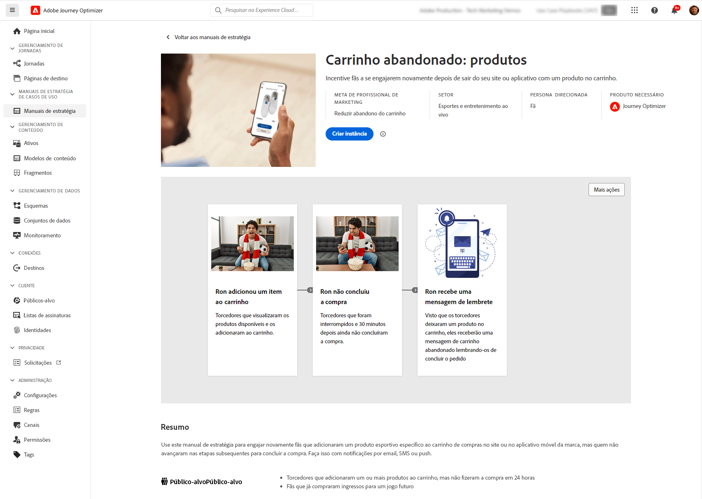
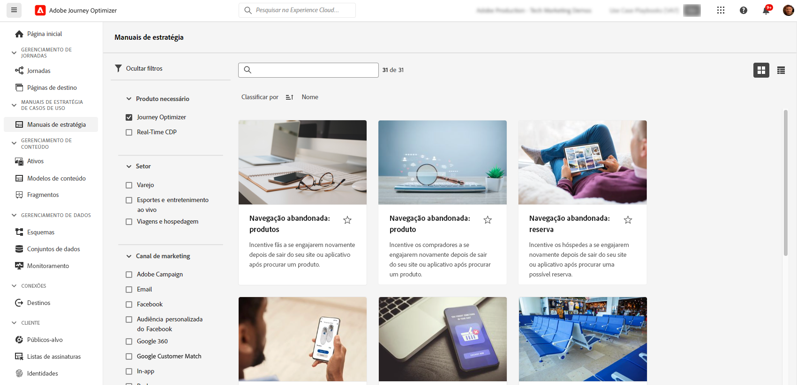

# Manuais de casos de uso  {#playbooks}

## O que são os manuais de casos de uso? {#gs}

Os Manuais de casos de uso são workflows predefinidos abordando casos de uso comuns que podem ser executados usando a Adobe Experience Platform e o Journey Optimizer.

{width="85%"}

Cada manual de estratégia fornece uma visão geral abrangente, incluindo a intenção, as metas, as personas direcionadas e os recursos necessários para implementá-lo. Além disso, um mapa mental está disponível em cada manual para representar visualmente pontos de contato reais do cliente associados ao manual.

{width="85%"}

## Pré-requisitos {#prerequisites}

As seguintes etapas de configuração são necessárias para trabalhar com os manuais de casos de uso. Há informações detalhadas sobre cada etapa disponíveis na página de [Introdução](https://experienceleague.adobe.com/docs/experience-platform/use-case-playbooks/playbooks/get-started.html?lang=pt-BR){target="_blank"} da documentação dos manuais de casos de uso.

* Criar uma sandbox
* Configuração de permissões de usuários e usuárias
* Definir configurações de canal do Journey Optimizer para notificações por email, push e SMS

## Acessar e habilitar um manual de estratégia {#access}

Para acessar os manuais, navegue até o menu **[!UICONTROL Manuais de estratégia]** localizado no painel de navegação esquerdo. A biblioteca inclui vários manuais de estratégia que são implementados usando o Adobe Journey Optimizer. Para acessá-los facilmente, use os filtros disponíveis ao lado da barra de pesquisa. Uma lista abrangente de manuais de estratégia do Journey Optimizer está disponível na [documentação dos manuais de casos de uso](https://experienceleague.adobe.com/docs/experience-platform/use-case-playbooks/playbooks/playbooks-list.html?lang=pt-BR){target="_blank"}.

{width="85%"}

Depois de escolher o manual de estratégia que melhor atende às suas necessidades, você pode habilitá-lo. Isso cria uma instância do manual de estratégia e gera automaticamente os recursos necessários para dar suporte ao seu caso de uso específico. Os recursos incluem ativos do Journey Optimizer, como jornadas, mensagens, bem como ativos da Adobe Experience Platform, como esquemas ou segmentos.

>[!NOTE]
>
>O propósito desses objetos é ajudar você a entender todos os recursos necessários para implementar seu caso de uso específico. Estes objetos não contêm dados e são criados em sandboxes de desenvolvimento. 

Para implementar seu caso de uso, você pode navegar até cada objeto para adaptá-lo às suas necessidades. Você também pode compartilhar o URL da página da instância do manual de estratégia com a sua equipe para colaborar na implementação do caso de uso.

Além disso, você pode importar os ativos dos manuais para outras sandboxes. Isso permite alinhar os ativos gerados com seus ativos existentes e garantir que sejam compatíveis com seus dados, caso já tenha configurado seus próprios esquemas, campos e grupos de campos. Essas etapas estão detalhadas na documentação dos manuais de casos de uso: [publicar ativos gerados pelo manual de estratégia em outras sandboxes](https://experienceleague.adobe.com/docs/experience-platform/use-case-playbooks/playbooks/data-awareness.html?lang=pt-BR){target="_blank"}.

## Criar seus próprios manuais de estratégia (beta privado) {#create}

>[!AVAILABILITY]
>
>No momento, a criação de manuais de estratégia de casos de uso está disponível apenas para algumas organizações como um beta privado. Para obter acesso, entre em contato com o(a) representante da Adobe.

Além de aproveitar manuais de estratégia predefinidos, é possível criar e compartilhar seus próprios manuais na Adobe Experience Platform.

Defina metadados manualmente ou usando os recursos de IA, associe ativos técnicos como esquemas e segmentos e compartilhe seus manuais de estratégia em diferentes organizações IMS.

Para obter mais informações sobre como criar e compartilhar manuais de estratégia, consulte a documentação dos manuais de casos de uso: [crie e compartilhe seus próprios manuais de estratégia com o Assistente de IA](https://experienceleague.adobe.com/docs/experience-platform/use-case-playbooks/playbooks/author.html?lang=pt-br#sharing-playbooks-sandboxes){target="_blank"}.
