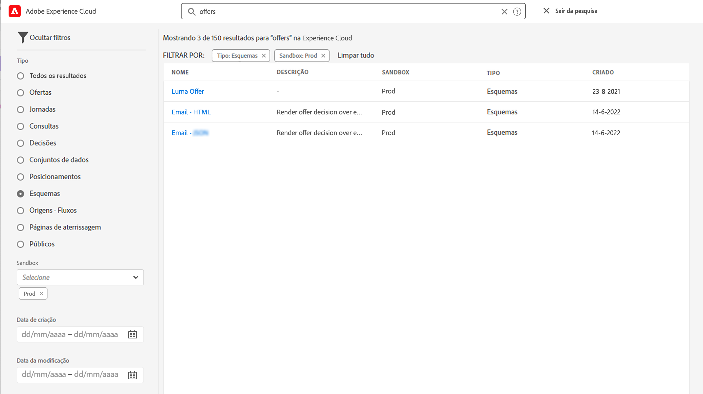

# Pesquisar, filtrar, organizar {#search-filter-organize}

## Pesquisa{#unified-search}

Em qualquer lugar na interface do Adobe Journey Optimizer, use o recurso de pesquisa unificada da Adobe Experience Cloud no centro da barra superior para localizar ativos, jornadas, conjuntos de dados e muito mais em suas sandboxes.

Comece a inserir conteúdo para exibir os principais resultados. Artigos de ajuda sobre as palavras-chave inseridas também são exibidos nos resultados.

Pressione **Enter** para acessar todos os resultados e filtrar por objeto comercial.

## Listas de filtros{#filter-lists}

Na maioria das listas, use a barra de pesquisa para localizar itens específicos e definir critérios de filtragem.

Os filtros podem ser acessados com um clique no ícone de filtro na parte superior esquerda de uma lista. O menu de filtro permite filtrar os elementos exibidos de acordo com critérios diferentes: Você pode optar por exibir apenas elementos de um determinado tipo ou status, os que você criou ou os que foram modificados nos últimos 30 dias. As opções diferem dependendo do contexto.

Além disso, você pode usar tags Unificadas para filtrar uma lista dependendo das tags atribuídas a um objeto. Por enquanto, as tags estão disponíveis para jornadas e campanhas. [Saiba como trabalhar com tags](#tags)

>[!NOTE]
>
>Observe que as colunas exibidas podem ser personalizadas usando o botão de configuração na parte superior direita das listas. A personalização é salva para cada usuário.

Nas listas, é possível executar ações básicas em cada elemento. Por exemplo, você pode duplicar ou excluir um item.

## Trabalhar com tags unificadas {#tags}

Com Adobe Experience Platform [Tags unificadas](https://experienceleague.adobe.com/docs/experience-platform/administrative-tags/overview.html), você pode classificar facilmente suas jornadas e campanhas do Journey Optimizer para melhorar a pesquisa nas listas.

>[!AVAILABILITY]
>
>As tags unificadas estão atualmente na versão beta. A documentação e a funcionalidade estão sujeitas a alterações.

## Adicionar tags a um objeto

O **Tags** no campo [jornada](../building-journeys/journey-gs.md#change-properties) ou [campanha](../campaigns/create-campaign.md#create) , permite definir tags para o objeto. Você pode selecionar uma tag existente ou criar uma nova.

Comece digitando o nome da tag desejada e selecione-a na lista. Se não estiver disponível, clique em **Criar** para criar um novo e adicioná-lo. Você pode definir quantas tags forem necessárias.

A lista de tags definidas é exibida abaixo do **Tags** campo.

>[!NOTE]
>
> As tags fazem distinção entre maiúsculas e minúsculas
> 
> Se você duplicar ou criar uma nova versão de uma jornada ou campanha, as tags serão preservadas.

## Filtrar em tags

As listas de jornadas e campanhas exibem uma coluna dedicada para que você possa visualizar facilmente suas tags.

Um filtro também está disponível para exibir somente jornadas ou campanhas com determinadas tags.

Você pode adicionar ou remover tags de qualquer tipo de jornada ou campanha (ao vivo, rascunho, etc.). Para fazer isso, clique no botão **Mais ações** ícone ao lado do objeto e selecione **Editar tags**.

## Gerenciar tags

Os administradores podem excluir tags e organizá-las por categorias usando o **Tags** menu, em **ADMINISTRAÇÃO**. Saiba mais sobre o gerenciamento de tags no [Documentação de Tags unificadas](https://experienceleague.adobe.com/docs/experience-platform/administrative-tags/ui/managing-tags.html).

>[!NOTE]
>
> Tags criadas diretamente da **[!UICONTROL Tags]** no Journey Optimizer são automaticamente adicionados à categoria &quot;Não categorizada&quot; integrada.
