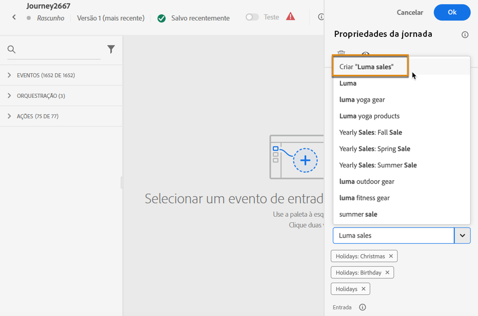

# Pesquisar, filtrar, organizar {#search-filter-organize}

## Pesquisa {#unified-search}

Na interface do Adobe Journey Optimizer, use o recurso de pesquisa unificada da Adobe Experience Cloud na parte central da barra superior para encontrar ativos, jornadas, conjuntos de dados e muito mais em suas sandboxes.

Comece a inserir conteúdo para exibir os principais resultados. Artigos de ajuda sobre as palavras-chave inseridas também são exibidos nos resultados.

Pressione **Enter** para acessar todos os resultados e filtrar por objeto comercial.

## Listas de filtros {#filter-lists}

Na maioria das listas, use a barra de pesquisa para localizar itens específicos e definir critérios de filtragem.

Os filtros podem ser acessados com um clique no ícone de filtro na parte superior esquerda de uma lista. O menu de filtros permite filtrar os elementos exibidos de acordo com diferentes critérios: é possível exibir apenas elementos de um determinado tipo ou status, aqueles que você criou ou os modificados nos últimos 30 dias. As opções diferem dependendo do contexto.

Além disso, é possível usar as tags unificadas para filtrar uma lista dependendo das tags atribuídas a um objeto. Por enquanto, as tags estão disponíveis para jornadas e campanhas. [Saiba como trabalhar com tags](#tags)

>[!NOTE]
>
>Observe que as colunas exibidas podem ser personalizadas usando o botão de configuração na parte superior direita das listas. A personalização é salva para cada usuário.

Nas listas, é possível executar ações básicas em cada elemento. Por exemplo, você pode duplicar ou excluir um item.

## Trabalhar com tags unificadas {#tags}

>[!CONTEXTUALHELP]
>id="ajo_campaigns_tags"
>title="Tags"
>abstract="Esse campo permite atribuir tags unificadas da Adobe Experience Platform à sua campanha. Isso permite classificá-las facilmente e melhorar a pesquisa na lista de campanhas."

Com as [Tags unificadas](https://experienceleague.adobe.com/docs/experience-platform/administrative-tags/overview.html?lang=pt-BR) do Adobe Experience Platform, é possível classificar facilmente os objetos do Journey Optimizer para melhorar a pesquisa nas listas.

Adicionar tags coerentes a públicos-alvo no Journey Optimizer permite filtrar e pesquisar para encontrar públicos-alvo com mais facilidade. As tags também podem ser usadas para organizar públicos-alvo em pastas relevantes e pesquisáveis, criar ofertas e experiências personalizadas e em regras de decisão de experiências.

### Adição de tags a um objeto {#add-tags}

O campo **[!UICONTROL Tags]** permite definir tags para o seu objeto. Tags estão disponíveis para os seguintes objetos:

* [Campanhas](../campaigns/create-campaign.md#create)
* [Itens de decisão](../experience-decisioning/items.md)
* [Fragmentos](../content-management/fragments.md)
* [Jornadas](../building-journeys/journey-properties.md)
* [Páginas de destino](../landing-pages/create-lp.md)
* [Listas de assinaturas](../landing-pages/subscription-list.md)
* [Modelos](../content-management/content-templates.md)
* [Configurações de canal](../configuration/channel-surfaces.md#channel-config-tags)

É possível selecionar uma tag já existente ou criar uma nova. Para isso, siga as etapas abaixo.

1. Comece digitando o nome da tag desejada e selecione-a na lista.

   

   >[!NOTE]
   >
   > As tags não diferenciam maiúsculas de minúsculas.

1. Se a tag que pesquisou não estiver disponível, clique em **[!UICONTROL Criar “”]** para definir uma nova. Ela será adicionada automaticamente ao objeto atual e ficará disponível para todos os outros.

   

1. A lista de tags selecionadas ou criadas é exibida abaixo do campo **[!UICONTROL Tags]**. É possível definir quantas tags forem necessárias.

>[!NOTE]
> 
> Se duplicar ou criar uma nova versão de um objeto, as tags serão preservadas.

### Filtrar por tags {#filter-on-tags}

Cada lista de objetos exibe uma coluna dedicada para que você possa visualizar facilmente suas tags.

Um filtro também está disponível para somente exibir objetos com determinadas tags.

É possível adicionar ou remover tags de qualquer tipo de jornada ou campanha (ativa, rascunho etc.). Para fazer isso, clique no ícone **[!UICONTROL Mais ações]** ao lado do objeto e selecione **[!UICONTROL Editar tags]**.

### Gerenciar tags {#manage-tags}

Os administradores podem excluir tags e organizá-las por categorias usando o menu **[!UICONTROL Tags]** em **[!UICONTROL ADMINISTRAÇÃO]**. Saiba mais sobre o gerenciamento de tags na [documentação de tags unificadas](https://experienceleague.adobe.com/docs/experience-platform/administrative-tags/ui/managing-tags.html?lang=pt-BR).

>[!NOTE]
>
> Tags criadas diretamente do campo **[!UICONTROL Tags]** no Journey Optimizer são automaticamente adicionadas à categoria integrada “Não categorizada”.
