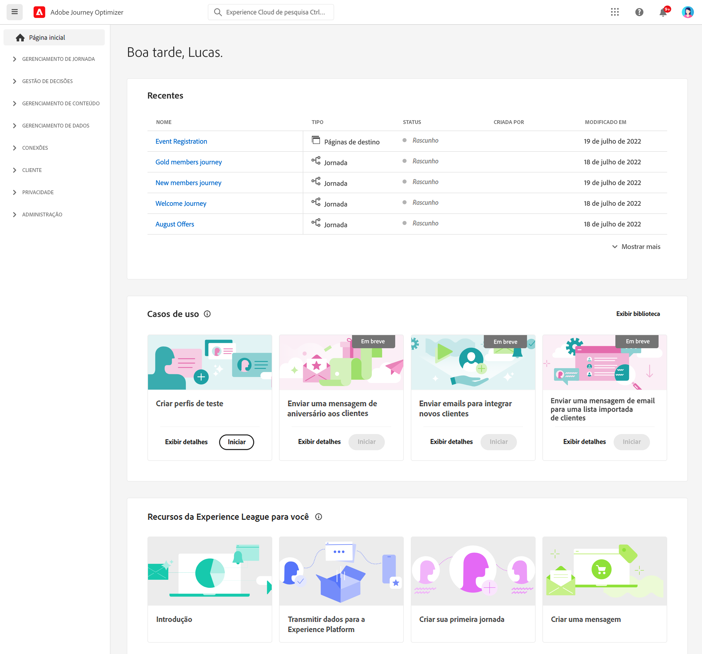

# Navegar na interface {#user-interface}

Para acessar o Adobe Journey Optimizer, entre no [Adobe Experience Cloud](https://experience.adobe.com) com sua Adobe ID e selecione [!DNL Journey Optimizer].

>[!NOTE]
>
>* Os componentes e recursos disponíveis em seu ambiente dependem das [permissões](../administration/permissions.md) e do [pacote de licenciamento](https://helpx.adobe.com/legal/product-descriptions/adobe-journey-optimizer.html){target="_blank"}.
>* Esta documentação é atualizada com frequência. Algumas capturas de tela podem ser um pouco diferentes da interface.

## Tour rápido {#quick-tour}

A interface do Journey Optimizer consiste em quatro áreas principais:

1. **Navegação à esquerda** - Acesse todos os recursos e funcionalidades organizados por função
2. **Barra superior** - Pesquisa universal, ajuda, notificações e configurações
3. **Página inicial** - Acesso rápido a itens recentes e recursos úteis
4. **Espaço de trabalho principal** - Onde você cria e gerencia seu conteúdo

**Dica:** novos usuários podem começar na página **Página inicial** para acessar itens e casos de uso recentes ou usar o ícone **Ajuda** na barra superior para orientação contextual.

## Recursos da barra superior {#top-bar}

### Pesquisa universal {#universal-search}

Use o ícone de pesquisa para localizar rapidamente jornadas, campanhas, ativos e outros objetos no Journey Optimizer. Digite palavras-chave para ver os resultados relevantes de todas as áreas da plataforma. [Saiba mais sobre a pesquisa universal](search-filter-categorize.md#unified-search).

### Ajuda e suporte {#help}

Clique no ícone da **Ajuda** para:

* Pesquisar artigos e vídeos de ajuda
* Acessar a ajuda contextual da página atual
* Entre em contato com o suporte da Adobe
* Compartilhar feedback

A ajuda contextual exibe orientações relevantes para a tela que você está visualizando e vincula diretamente à documentação correspondente, para que você possa obter as informações certas sem sair do seu fluxo de trabalho.

#### Diretrizes de tíquete de suporte {#support-ticket-guidelines}

Ao entrar em contato com o suporte da Adobe, inclua o seguinte para ajudar a agilizar a análise e a resolução da causa principal:

* **Detalhes do ambiente** - Nome da sandbox, ID da organização e área de produto (por exemplo, Jornadas, Campanhas, Decisão)
* **Nível de impacto** - Gravidade do problema (por exemplo, produção bloqueada, funcionalidade limitada, superficial)
* **Etapas de replicação** - Instruções claras, passo a passo, para reproduzir o problema
* **Logs ou capturas de tela** - Mensagens de erro relevantes, IDs de solicitação ou capturas de tela que ilustram o problema
* **IDs relevantes** - ID de Jornada, ID de campanha, ID de público-alvo ou outros identificadores de objeto relacionados ao problema

### Notificação {#in-product-uc}

Ative as notificações no produto e por email para manter-se informado sobre:

* **Alertas** - Falhas do sistema e problemas de desempenho
* **Aprovações** - Solicitações que exigem sua revisão
* **Novas versões** - Atualizações de produtos e novos recursos

Para configurar notificações:

1. Clique no seu ícone de perfil e selecione **[!UICONTROL Preferências]**
2. Em **[!UICONTROL Notificações]**, localize o **[!UICONTROL Journey Optimizer]**
3. Ativar os tipos de notificação que você deseja receber

{width="60%" align="center"}

### Preferências de idioma {#language}

A interface está disponível em inglês, francês, alemão, italiano, espanhol, português (brasileiro), japonês, coreano, chinês tradicional e chinês simplificado.

Para alterar o idioma:

1. Clique em **[!UICONTROL Preferências]** no menu de perfil
2. Selecione o idioma de sua preferência
3. Opcionalmente, selecione um segundo idioma como alternativa
4. Clique em **Salvar**

Os atalhos de teclado e os recursos de acessibilidade estão disponíveis. [Saiba mais](accessibility.md)

## Home page {#home-page}

A home page fornece:

* **Recentes** - Atalhos para eventos, jornadas, campanhas e outros objetos criados recentemente
* **Casos de uso** - Cenários pré-criados para ajudar você a começar rapidamente (criar perfis de teste, enviar mensagens de aniversário etc.)
* **Recursos** - Links para documentação, tutoriais e suporte

### Casos de uso e workflows de início rápido {#use-cases}

Os workflows de início rápido ajudam você a realizar tarefas comuns:

* **Criar perfis de teste** - Gerar perfis de teste usando modelos CSV
* **Enviar mensagens de aniversário** - Enviar emails de aniversário automaticamente (em breve)
* **Incorpore novos clientes** - Série de boas-vindas para novos clientes (em breve)
* **Enviar push para listas importadas** - Notificações rápidas por push de dados CSV (em breve)

Clique em **[!UICONTROL Exibir detalhes]** para saber mais sobre cada caso de uso, ou **[!UICONTROL Começar]** para começar.

## Navegação à esquerda {#left-nav}

A navegação à esquerda organiza os recursos do Journey Optimizer em categorias funcionais. Os itens de menu disponíveis dependem das suas permissões e licença.

| Seção | Finalidade |
|---------|---------|
| Gerenciamento de jornadas | Campanhas, jornadas, relatórios |
| Gerenciamento de decisão | Ofertas e personalização |
| Gestão de conteúdo | Assets, modelos, fragmentos, landing pages |
| Gerenciamento de dados | Esquemas, conjuntos de dados, consultas |
| Conexões | Origens e destinos |
| Cliente | Públicos, perfis, identidades |
| Privacidade | Políticas, solicitações, auditoria |
| Administração | Configurações, canais, sandboxes |

### Seções principais {#main-sections}

**Página inicial** - Seu ponto de partida com acesso rápido a itens e recursos úteis criados recentemente

**Gerenciamento de Jornadas** - Criar e gerenciar experiências do cliente

* **Campanhas** - Criar mensagens únicas ou agendadas para públicos-alvo específicos. [Introdução às campanhas](../campaigns/get-started-with-campaigns.md)
* **Jornada** - Crie experiências de clientes em várias etapas e entre canais. [Criar a primeira jornada](../building-journeys/journey-gs.md)
* **Relatórios** - Analise o desempenho com relatórios integrados do Customer Journey Analytics. [Exibir a documentação dos relatórios](../reports/campaign-global-report-cja.md)

**Gerenciamento de decisões** - Gerencie ofertas personalizadas. [Saiba mais sobre a gestão de decisões](../offers/get-started/starting-offer-decisioning.md)

* **Ofertas** - Criar e gerenciar ofertas personalizadas
* **Componentes** - Configurar disposições, regras e marcas para ofertas

**Gerenciamento de conteúdo** - Criar e organizar conteúdo

* **Assets** - Repositório centralizado para imagens e mídia. [Gerenciar ativos](../integrations/assets.md)
* **Modelos de conteúdo** - Modelos de mensagem reutilizáveis para campanhas e jornadas. [Criar modelos](../content-management/content-templates.md)
* **Fragmentos** - Blocos de conteúdo que podem ser usados em várias mensagens. [Trabalhar com fragmentos](../content-management/fragments.md)
* **Páginas de aterrissagem** - Formulários Web para assinaturas e preferências. [Criar páginas de aterrissagem](../landing-pages/get-started-lp.md)
* **Manuais de Caso de Uso** - Fluxos de trabalho pré-criados para cenários de marketing comuns. [Explorar manuais](ai-features.md#playbooks)

**Gerenciamento de dados** - Gerencie sua base de dados. [Saiba mais sobre esquemas e conjuntos de dados](../data/get-started-schemas.md)

* **Esquemas** - Definir estrutura de dados
* **Conjuntos de dados** - Armazene e gerencie coleções de dados
* **Consultas** - Gravar e executar consultas
* **Monitoramento** - Rastrear assimilação de dados

**Conexões** - Integrar a outros sistemas

* **Fontes** - Assimilar dados de sistemas externos. [Configurar fontes](get-started-sources.md)
* **Destinos** - Exportar dados para o armazenamento na nuvem. [Configurar destinos](../data/export-datasets.md)

**Cliente** - Gerenciar públicos e perfis

* **Públicos-alvo** - Crie e gerencie segmentos de clientes. [Trabalhar com públicos-alvo](../audience/about-audiences.md)
* **Listas de assinaturas** - Gerenciar listas de aceitação. [Gerenciar assinaturas](../landing-pages/subscription-list.md)
* **Perfis** - Exibir perfis de clientes unificados. [Explorar perfis](../audience/get-started-profiles.md)
* **Identidades** - Gerenciar resolução de identidade. [Saiba mais sobre identidades](../audience/get-started-identity.md)

**Privacidade** - Controle a privacidade e a conformidade. [Visão geral sobre privacidade](../privacy/get-started-privacy.md)

* **Políticas** - Definir políticas de governança de dados
* **Solicitações** - Manipular solicitações de privacidade (GDPR, CCPA)
* **Auditoria** - Revisar logs de atividades. [Exibir logs de auditoria](../privacy/audit-logs.md)
* **Ciclo de vida dos dados** - Configurar retenção de dados

**Administração** - Definir configurações do sistema. [Visão geral do controle de acesso](../administration/permissions-overview.md)

* **Configurações** - Configure eventos, fontes de dados e ações. [Configurar canais](../configuration/get-started-configuration.md)
* **Regras de negócio** - Controlar frequência de mensagem e entrada de jornada. [Configurar regras de negócio](../conflict-prioritization/rule-sets.md)
* **Alertas** - Exibir e gerenciar alertas do sistema. [Monitorar alertas](../reports/alerts.md)
* **Sandboxes** - Gerencie ambientes e copie objetos entre sandboxes. [Trabalhar com sandboxes](../administration/sandboxes.md)
* **Canais** - Defina as configurações e a capacidade de entrega do canal. [Definir configurações de canal](../configuration/channel-surfaces.md) | [Introdução à configuração](../configuration/get-started-configuration.md)
* **Marcas** - Organiza e categoriza o conteúdo. [Trabalhar com marcas unificadas](search-filter-categorize.md#tags)

## Assistente de IA {#ai-assistant}

O Assistente de IA fornece ajuda instantânea e insights operacionais. Clique no ícone do Assistente de IA na barra superior para:

* Obtenha respostas sobre os recursos do produto
* Receba informações operacionais sobre suas jornadas
* Navegar pelos conceitos e práticas recomendadas

[Saiba mais sobre o Assistente de IA](ai-features.md#ai-assistant)

## Tópicos relacionados {#related-topics}

* [Escolha seu caminho de aprendizado por função](quick-start.md)
* [Pesquisar, filtrar e categorizar o conteúdo](search-filter-categorize.md)
* [Entender como o Journey Optimizer funciona](understanding-ajo.md)
* [Recursos de acessibilidade](accessibility.md)

<!--CONTEXTUAL HELP TO DISPATCH IN DOCS ONCE FEATURE LIVE-->

<!--ORCHESTRATED CAMPAIGNS - Overview page-->

<!--OVERVIEW TAB ORCHESTRATED CAMPAIGNS SKU only-->

>[!CONTEXTUALHELP]
>id="ajo_oc_campaign_ovv_1"
>title="Orquestração de campanha"
>abstract="Dividir, combinar, enriquecer e manipular conjuntos de dados relacionais para definir seu público"

>[!CONTEXTUALHELP]
>id="ajo_oc_campaign_ovv_2"
>title="Aproveitar dados de várias entidades"
>abstract="Saiba como as campanhas orquestradas podem aproveitar os conjuntos de dados relacionais para enriquecer dados para segmentação e personalização"

>[!CONTEXTUALHELP]
>id="ajo_oc_campaign_ovv_3"
>title="Segmentação ad-hoc e contagens exatas"
>abstract="Crie o segmento passo a passo com contagens exatas"

>[!CONTEXTUALHELP]
>id="ajo_oc_campaign_ovv_4"
>title="Canais disponíveis"
>abstract="Email, SMS, Notificações por push, Mala direta"

<!--OVERVIEW TAB ORCHESTRATED CAMPAIGNS + JOURNEYS SKU -->

>[!CONTEXTUALHELP]
>id="ajo_oc_jo_campaign_ovv_1"
>title="Interface guiada para criar e enviar uma campanha"
>abstract="Defina uma ou várias ações com um canal, escolha um público, defina o conteúdo, defina um agendamento e você está pronto para enviar"

>[!CONTEXTUALHELP]
>id="ajo_oc_jo_campaign_ovv_2"
>title="Canais disponíveis"
>abstract="Email, SMS, Notificações por push, No aplicativo, Web, Experiências baseadas em código"

<!--OVERVIEW TAB ORCHESTRATED CAMPAIGNS - API triggered tab -->

>[!CONTEXTUALHELP]
>id="ajo_oc_api_campaign_ovv_1"
>title="Campanhas acionadas por API transacional"
>abstract="Acionar mensagens em tempo real por meio de chamadas de API"

>[!CONTEXTUALHELP]
>id="ajo_oc_api_campaign_ovv_2"
>title="Mensagens de marketing"
>abstract="Conteúdo promocional (requer aceitação, sujeito às regras de negócios)"

>[!CONTEXTUALHELP]
>id="ajo_oc_api_campaign_ovv_3"
>title="Mensagens transacionais"
>abstract="Conteúdo relacionado ao serviço (confirmação, alertas, não sujeito a consentimento de marketing)"

>[!CONTEXTUALHELP]
>id="ajo_oc_api_campaign_ovv_4"
>title="Canais disponíveis"
>abstract="Email, SMS, notificações por push"

<!--APPROVAL POLICIES-->

>[!CONTEXTUALHELP]
>id="ajo_campaigns_edit_disabled"
>title="Edição desabilitada"
>abstract="Edição desabilitada (campanhas)"

>[!CONTEXTUALHELP]
>id="ajo_journey_edit_disabled"
>title="Edição desabilitada"
>abstract="Edição desabilitada (jornada)"

>[!CONTEXTUALHELP]
>id="ajo_approval_policy_approval_status"
>title="Status de aprovação"
>abstract="Status de aprovação"

>[!CONTEXTUALHELP]
>id="ajo_campaigns_approve"
>title="Aprovar"
>abstract="Aprovar (campanhas)"

>[!CONTEXTUALHELP]
>id="ajo_journey_approve"
>title="Aprovar"
>abstract="Aprovar (jornada)"

>[!CONTEXTUALHELP]
>id="ajo_journey_simulation"
>title="Simular sua jornada"
>abstract="A Simulação de jornada permite validar suas jornadas e ver como elas funcionam antes de serem ativadas. Ele usa dados de um modelo treinado para fornecer números em toda a jornada e ver como a jornada se comportará em um cenário real."

<!-- WEBHOOKS -->

>[!CONTEXTUALHELP]
>id="ajo_channels_feedback_webhook_settings"
>title="Ativar webhooks"
>abstract="Ative os webhooks para receber feedback em tempo real sobre o status de execução de suas mensagens. Antes de ativar esta opção, verifique se você configurou um webhook no menu **Administração** / **Canais** / **Webhook de comentários**."

>[!CONTEXTUALHELP]
>id="ajo_channels_feedback_webhook_settings_create"
>title="Webhooks de comentários"
>abstract="Os webhooks de feedback permitem receber feedback em tempo real sobre o status de execução das mensagens enviadas com campanhas acionadas pela API transacional. Somente uma configuração de webhook por organização + combinação de sandbox é permitida."

>[!CONTEXTUALHELP]
>id="ajo_channels_feedback_webhook_settings_configuration"
>title="Configuração básica"
>abstract="Nesta seção, insira um nome descritivo para identificar o webhook e selecione os canais para os quais esse webhook deve receber feedback (Email e/ou SMS). No campo URL do Webhook, forneça o endpoint HTTPS onde os eventos de feedback devem ser entregues."

>[!CONTEXTUALHELP]
>id="ajo_channels_feedback_webhook_settings_authentication"
>title="Autenticação"
>abstract="Se o seu ponto de extremidade requer autenticação JWT, selecione **Autenticação JWT** na lista e forneça os detalhes necessários."

>[!CONTEXTUALHELP]
>id="ajo_channels_feedback_webhook_settings_header_parameters"
>title="Parâmetros de cabeçalho"
>abstract="Nesta seção, você pode configurar cabeçalhos personalizados adicionais a serem enviados com cada solicitação de webhook."

>[!CONTEXTUALHELP]
>id="ajo_admin_aem_content_fragment_configuration"
>title="&quot;Ajuda de configuração do AEM"
>abstract="Saiba mais sobre como criar e gerenciar uma configuração"

>[!CONTEXTUALHELP]
>id="ajo_admin_aem_configure_instance"
>title="Configuração da instância"
>abstract="Selecione o tipo de configuração de instância apropriado para sua configuração.  Configuração somente para autores: use fragmentos de conteúdo da instância de autor do AEM. A configuração da instância de publicação e as atualizações em tempo real não são compatíveis. Configuração da instância de publicação: definir configurações da instância de publicação. Ative opcionalmente &quot;Enviar token para a instância de publicação&quot; para fornecer credenciais de serviço para autenticação."

>[!CONTEXTUALHELP]
>id="ajo_admin_aem_send_token"
>title="Enviar token para a instância de publicação"
>abstract="Quando ativadas, as Credenciais de serviço são enviadas para autenticar solicitações na instância de publicação. Forneça uma Credencial de Serviço JSON válida abaixo."

>[!CONTEXTUALHELP]
>id="ajo_admin_aem_service_credential"
>title="Colar credencial de serviço JSON"
>abstract="Cole a credencial de serviço do AEM JSON depois de criá-la, consultando a documentação de conta técnica pública. Ele será formatado e validado automaticamente."
>additional-url=""

>[!CONTEXTUALHELP]
>id="ajo_admin_aem_custom_domain"
>title="Domínio personalizado"
>abstract="Opcional. Forneça um domínio personalizado se publish-p16552-e147195.adobeaemcloud.comis estiver bloqueado para buscar conteúdo para sua organização"

<!-- JOURNEYS - EXPRESSION ASSISTANT -->

>[!CONTEXTUALHELP]
>id="journeyExpAI"
>title="Assistente de expressão"
>abstract="Use o Assistente de expressão para gerar e refinar expressões no Journey Optimizer."
