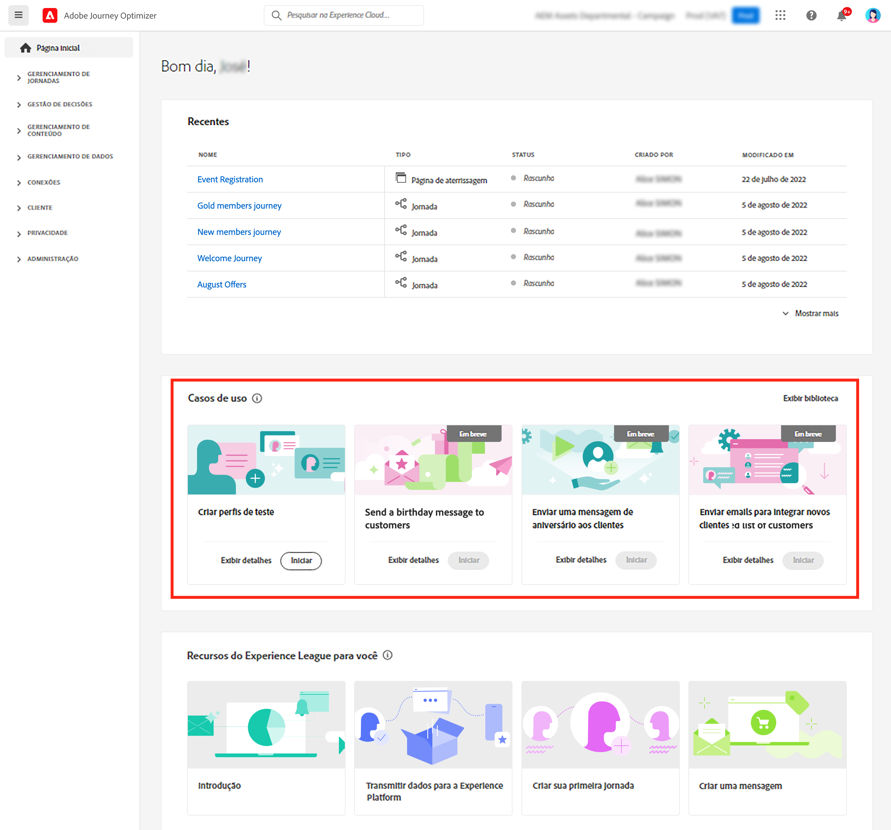
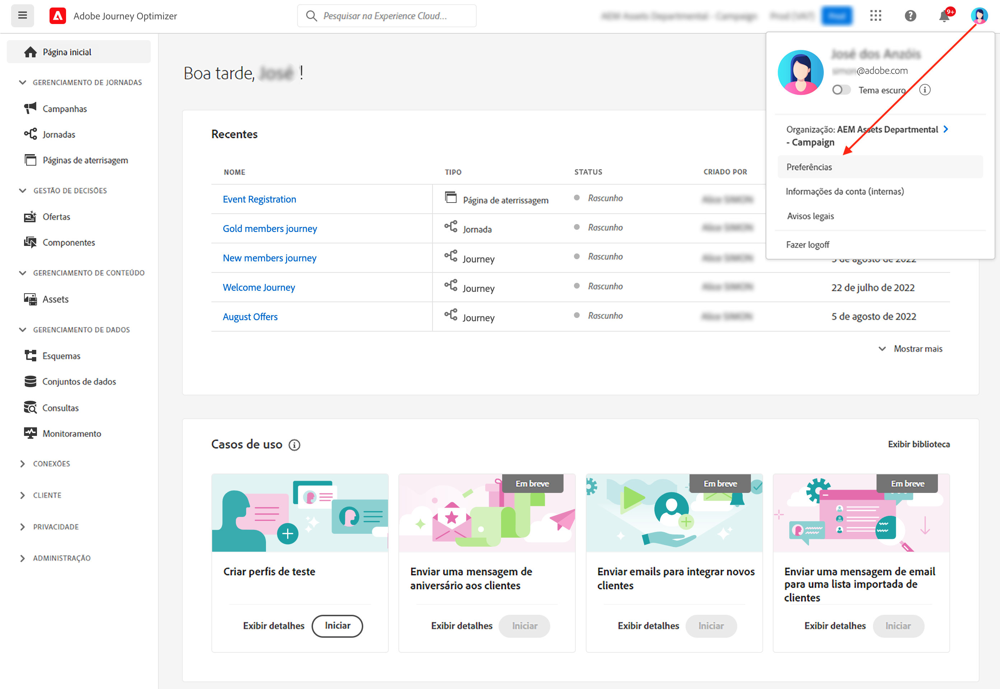

# Interface do usuário {#cjm-user-interface}

Conecte-se à [Adobe Experience Cloud ](http://experience.adobe.com) e navegue até [!DNL Journey Optimizer].

Os principais conceitos de navegação na interface do usuário são comuns à Adobe Experience Platform. Consulte a [documentação da Adobe Experience Platform](https://experienceleague.adobe.com/docs/experience-platform/landing/platform-ui/ui-guide.html?lang=pt-BR#adobe-experience-platform-ui-guide) {target=&quot;_blank&quot;} para obter mais detalhes.

Os componentes e recursos disponíveis na interface do usuário dependem das suas [ permissões](../administration/permissions.md) e do seu [pacote de licenciamento](https://helpx.adobe.com/br/legal/product-descriptions/adobe-campaign-managed-cloud-services.html){target=&quot;_blank&quot;}. Em caso de dúvidas, entre em contato com o Gerente de sucesso do cliente da Adobe.

>[!NOTE]
>
>Essa documentação é atualizada com frequência para refletir as alterações mais recentes na interface do usuário do produto. Entretanto, algumas capturas de tela podem ser um pouco diferentes de sua interface do usuário.

## Navegação à esquerda {#left-nav}

Use os links à esquerda para procurar recursos.

>[!NOTE]
>
>Os recursos disponíveis podem variar dependendo de suas permissões e do contrato de licença.

Veja abaixo uma lista completa de serviços e recursos disponíveis na navegação à esquerda, além de links para a documentação associada.

**Início**

A página inicial do [!DNL Journey Optimizer] contém os links e recursos principais para iniciar. A lista **[!UICONTROL Recents]** fornece atalhos para as mensagens, jornadas e eventos recém-criados ou atualizados. Esta lista mostra as datas de criação e modificação e o status.

**[!UICONTROL JOURNEY MANAGEMENT]**

* **[!UICONTROL Journeys]**: crie, configure e orquestre as jornadas do cliente. [Saiba mais](../building-journeys/journey-gs.md#jo-build)

* **[!UICONTROL Messages]**: crie, projete, teste e publique mensagens de email e por push. [Saiba mais](../messages/get-started-content.md)

**[!UICONTROL DECISION MANAGEMENT]**

* **[!UICONTROL Offers]**: acesse as fontes e os conjuntos de dados recentes nesse menu. Use esta seção para criar novas ofertas. [Saiba mais](../offers/offer-library/creating-personalized-offers.md)

* **[!UICONTROL Components]**: crie inserções, regras e tags. [Saiba mais](../offers/offer-library/key-steps.md)

**[!UICONTROL CONTENT MANAGEMENT]**

* **[!UICONTROL Assets]**: o [!DNL Adobe Experience Manager Assets Essentials] é um repositório centralizado de ativos que podem ser usados para preencher as suas mensagens. [Saiba mais](../design/assets-essentials.md)

**[!UICONTROL DATA MANAGEMENT]**

* **[!UICONTROL Schemas]**: Use a Adobe Experience Platform para criar e gerenciar esquemas do Experience Data Model (XDM) em uma tela visual interativa chamada de Editor de esquemas. [Saiba mais](get-started-schemas.md)

* **[!UICONTROL Datasets]**: todos os dados assimilados na Adobe Experience Platform são mantidos no Data Lake como conjuntos de dados. Um conjunto de dados é uma construção de armazenamento e gerenciamento para uma coleção de dados, normalmente uma tabela, que contém um esquema (colunas) e campos (linhas). [Saiba mais](get-started-datasets.md)

* **[!UICONTROL Queries]**: Use o Serviço de consulta da Adobe Experience Platform para escrever e executar consultas, visualizar consultas executadas anteriormente e acessar consultas salvas por usuários em sua organização. [Saiba mais](get-started-queries.md)

* **[!UICONTROL Monitoring]**: Use esse menu para monitorar a assimilação de dados na interface do usuário da Adobe Experience Platform. [Saiba mais](https://experienceleague.adobe.com/docs/experience-platform/ingestion/quality/monitor-data-ingestion.html?lang=pt-BR){target=&quot;_blank&quot;}

**[!UICONTROL CONNECTIONS]**

* **[!UICONTROL Sources]**: Use esse menu para assimilar dados de várias fontes, como aplicativos da Adobe, armazenamentos na nuvem, bancos de dados e muito mais, e estruturar, rotular e aprimorar os dados recebidos. [Saiba mais](get-started-sources.md)

**[!UICONTROL CUSTOMER]**

* **[!UICONTROL Segments]**: Crie e gerencie definições de segmento da Experience Platform e aproveite-as em suas jornadas. [Saiba mais](../segment/about-segments.md)

* **[!UICONTROL Profiles]**: O Perfil do cliente em tempo real cria uma visualização integral de cada cliente individual, combinando dados de vários canais, inclusive dados online, offline, de CRM e de terceiros. [Saiba mais](../segment/get-started-profiles.md)

* **[!UICONTROL Identities]**: o Serviço de identidade da Adobe Experience Platform gerencia a identificação entre dispositivos e canais quase em tempo real dos clientes no que é conhecido como um gráfico de identidade na Adobe Experience Platform. [Saiba mais](../segment/get-started-identity.md)

**[!UICONTROL ADMINISTRATION]**

* **[!UICONTROL Journey Administration]**: use esse menu para configurar [eventos](../event/about-events.md), [fontes de dados](../datasource/about-data-sources.md) e [ações](../action/action.md) para usar em suas jornadas.

* **[!UICONTROL Sandboxes]**: a Adobe Experience Platform fornece sandboxes que particionam uma única instância em ambientes virtuais separados para ajudar a desenvolver aplicativos de experiência digital. [Saiba mais](../administration/sandboxes.md)

<!--
* **[!UICONTROL Alerts]** - The user interface allows you to view a history of received alerts based on metrics revealed by Adobe Experience Platform Observability Insights. The UI also allows you to view, enable, and disable available alert rules. [Learn more](https://experienceleague.adobe.com/docs/experience-platform/observability/alerts/overview.html){target="_blank"}
-->

## Casos de uso no produto {#in-product-uc}

Aproveite os casos de uso do [!DNL Adobe Journey Optimizer] na home page e forneça algumas informações rápidas para criar uma jornada do cliente.

Os casos de uso disponíveis são:

* **Crie perfis de teste** usando nosso modelo CSV para testar mensagens e jornadas personalizadas. Saiba como implementar esse caso de uso[nesta página](../segment/creating-test-profiles.md#use-case-1).
* **Envie uma mensagem de aniversário aos clientes**, para enviar automaticamente um email parabenizando os clientes em seus aniversários. (em breve)
* **Envie emails para integrar os novos clientes**, para enviar facilmente até dois emails de boas-vindas a clientes recém-registrados. (em breve)
* **Envie mensagens de push a uma lista importada de clientes**, para enviar rapidamente uma notificação por push a uma lista de clientes importados de um arquivo CSV. (em breve)

Clique em **[!UICONTROL View details]** para saber mais sobre cada caso de uso.

Clique no botão **[!UICONTROL Begin]** para iniciar o caso de uso.

Você pode acessar casos de uso executados por meio do botão **[!UICONTROL View use case library]**.

## Acessibilidade{#accessibility}

Os recursos de acessibilidade no [!DNL Adobe Journey Optimizer] são herdados da Adobe Experience Platform:

* Acessibilidade do teclado
* Contraste de cores
* Validação de campos obrigatórios

[Saiba mais](https://experienceleague.adobe.com/docs/experience-platform/accessibility/features.html?lang=pt-BR){target=&quot;_blank&quot;} na documentação da Adobe Experience Platform.

Você pode usar esses atalhos de teclado comuns no [!DNL Journey Optimizer]:

| Ação | Atalho |
| --- | --- |
| Mover entre elementos da interface do usuário, seções e grupos de menu | Tab |
| Retroceder entre elementos da interface do usuário, seções e grupos de menu | Shift + Tab |
| Mover dentro de seções para definir o foco de elementos individuais | Seta |
| Selecionar ou limpar um elemento em foco | Enter ou Barra de espaço |
| Cancelar uma seleção, recolher um painel ou fechar uma caixa de diálogo | Esc |

[Saiba mais](https://experienceleague.adobe.com/docs/experience-platform/accessibility/custom.html?lang=pt-BR){target=&quot;_blank&quot;} na documentação da Adobe Experience Platform.

Você pode usar esses atalhos em partes específicas do Journey Optimizer:

<table>
  <thead>
    <tr>
      <th>Elemento da interface</th>
      <th>Ação</th>
      <th>Atalho</th>
    </tr>
  </thead>
  <tr>
    <td>Lista de jornadas, ações, fontes de dados ou eventos</td>
    <td>Criar uma jornada, uma ação, uma fonte de dados ou um evento</td>
    <td>C</td>
  </tr>
  <tr>
    <td rowspan="3">Tela da jornada no status de rascunho</td>
    <td>Adicionar uma atividade da paleta esquerda na primeira posição disponível, de cima para baixo</td>
    <td>Clique duas vezes na atividade</td>
  </tr>
  <tr>
    <td>Selecione todas as atividades</td>
    <td>Ctrl + A (Windows) Command + A (Mac)</td>
  </tr>
  <tr>
    <td>Excluir as atividades selecionadas</td>
    <td>Delete ou Backspace, em seguida, tecle Enter para confirmar a exclusão</td>
  </tr>
  <tr>
  <td rowspan="3">

Painel de configuração destes elementos:

<ul>
  <li>Atividade em uma jornada</li>
  <li>Evento</li>
  <li>Fonte de dados</li>
  <li>Ação</li>
</ul>

</td>
    <td>Mover para o próximo campo a ser configurado</td>
    <td>Guia</td>
  </tr>
  <tr>
    <td>Salve as alterações e feche o painel de configuração</td>
    <td>Enter</td>
  </tr>
  <tr>
    <td>Descartar alterações e fechar o painel de configuração</td>
    <td>Esc</td>
  </tr>
  <tr>
    <td rowspan="4">Jornada no modo de teste</td>
    <td>Ative ou desative o modo de teste</td>
    <td>T</td>
  </tr>
  <tr>
    <td>Acionar um evento em uma jornada baseada em eventos</td>
    <td>E</td>
  </tr>
  <tr>
    <td>

Acione um evento em uma jornada baseada em segmento para a qual a opção **[!UICONTROL Single profile at a time]** esteja ativada

</td>
    <td>P</td>
  </tr>
  <tr>
    <td>Exibir os logs de teste</td>
    <td>L</td>
  </tr>
<!-- //Ajouter ce raccourci quand il marchera (actuellement, le raccourci Ctrl/Cmd+F du navigateur a priorité sur celui de AJO).//
  <tr>
    <td>Page with a search bar</td>
    <td>Select the search bar</td>
    <td>Ctrl/Command + F</td>
  </tr>
-->
  <tr>
    <td>Campo de texto</td>
    <td>Selecionar todo o texto no campo selecionado</td>
    <td>Ctrl + A (Windows) Command + A (Mac)</td>
  </tr>
  <tr>
    <td rowspan="2">Janela pop-up</td>
    <td>Salvar alterações ou confirmar a ação</td>
    <td>Enter</td>
  </tr>
  <tr>
    <td>Fechar a janela</td>
    <td>Esc</td>
  </tr>
  <tr>
    <td>Editor de expressão simples</td>
    <td>Selecionar e adicionar um campo</td>
    <td>Clique duas vezes em um campo</td>
  </tr>
  <tr>
    <td>Navegar pelos campos XDM</td>
    <td>Selecionar todos os campos de um nó</td>
    <td>Selecione o nó principal</td>
  </tr>
  <tr>
    <td>Visualização da carga</td>
    <td>Selecionar a carga</td>
    <td>Ctrl + A (Windows) Command + A (Mac)</td>
  </tr>
</table>

## Obter ajuda e suporte {#find-help}

Acesse as principais páginas de ajuda do Adobe Journey Optimizer na seção inferior da home page.

Use o ícone **Ajuda** para acessar páginas de ajuda, entrar em contato com o suporte e compartilhar feedback. Você pode pesquisar artigos e vídeos de ajuda no campo de pesquisa.

## Navegadores compatíveis {#browsers}

A interface do Adobe [!DNL Journey Optimizer] foi projetada para funcionar de maneira ideal na versão mais recente do Google Chrome. Você pode ter problemas ao usar determinados recursos em versões mais antigas ou outros navegadores.

## Preferências de idioma {#language-pref}

A interface do usuário está disponível atualmente nos seguintes idiomas:

* Inglês
* Francês
* Alemão

O idioma padrão da interface é determinado pelo idioma preferencial especificado no perfil do usuário.

Para alterar o idioma:

* Clique em **Preferências** em seu avatar, no canto superior direito.
   
* Em seguida, clique no idioma exibido sob seu endereço de email
* Selecione o idioma de sua preferência e clique em **Salvar**. Você poderá selecionar um segundo idioma, caso o componente que está usando não esteja traduzido em seu primeiro idioma.
   

## Pesquisa{#unified-search}

Em qualquer lugar na interface do Adobe Journey Optimizer, use o recurso de pesquisa unificada da Adobe Experience Cloud no centro da barra superior para localizar ativos, jornadas, conjuntos de dados, mensagens e muito mais em suas sandboxes.

Comece a inserir conteúdo para exibir os principais resultados. Artigos de ajuda sobre as palavras-chave inseridas também são exibidos nos resultados.

Pressione **Enter** para acessar todos os resultados e filtrar por objeto comercial.

## Listas de filtros{#filter-lists}

Na maioria das listas, uma barra de pesquisa permite procurar um item específico e selecionar critérios de filtragem.

Filtros podem ser acessados com um clique no ícone de filtro na parte superior esquerda da lista. O menu de filtros permite filtrar os elementos exibidos de acordo com diferentes critérios. Você pode optar por exibir apenas os elementos de determinado tipo ou status, os que você criou ou os que foram modificados nos últimos 30 dias. As opções diferem dependendo do contexto.

Na lista de jornadas, você pode filtrar jornadas de acordo com o status, tipo e versão de cada jornada em **[!UICONTROL Status and version filters]**. O tipo pode ser: **[!UICONTROL Unitary event]**, **[!UICONTROL Segment qualification]**, **[!UICONTROL Read segment]**, **[!UICONTROL Business event]** ou **[!UICONTROL Burst]**. Você pode optar por exibir somente jornadas que usam um evento, grupo de campos ou ação específica **[!UICONTROL Activity filters]** e **[!UICONTROL Data filters]**. O **[!UICONTROL Publication filters]** permite selecionar uma data de publicação ou um usuário. Por exemplo, você pode optar por exibir somente as versões mais recentes de jornadas ao vivo que foram publicadas ontem. [Saiba mais](../building-journeys/using-the-journey-designer.md).

>[!NOTE]
>
>Observe que as colunas exibidas podem ser personalizadas usando o botão de configuração na parte superior direita das listas. A personalização é salva para cada usuário.

Use as colunas **[!UICONTROL Last update]** e **[!UICONTROL Last update by]** para verificar quando aconteceu a última atualização de suas jornadas e quem as salvou.

Nos painéis de configuração Evento, Fonte de dados e Ação, o campo **[!UICONTROL Used in]** exibe o número de jornadas que usam aquele determinado evento, grupo de campo ou ação. Você pode clicar no botão **[!UICONTROL View journeys]** para exibir a lista de jornadas correspondentes.

Nas diferentes listas, é possível executar ações básicas em cada elemento. Por exemplo, você pode duplicar ou excluir um item.

