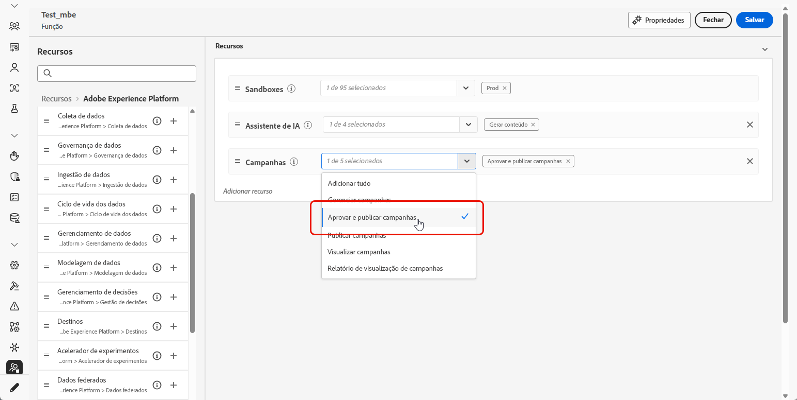
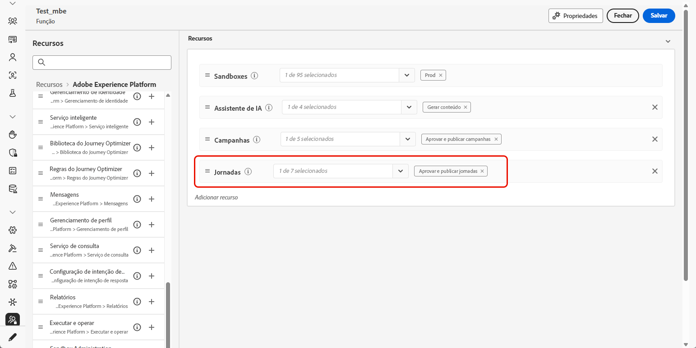
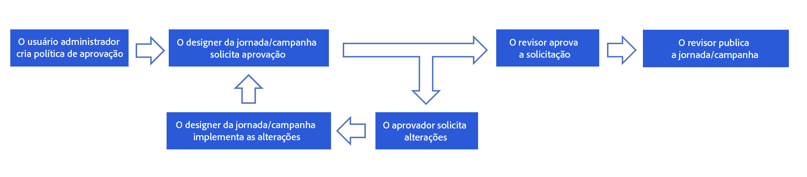
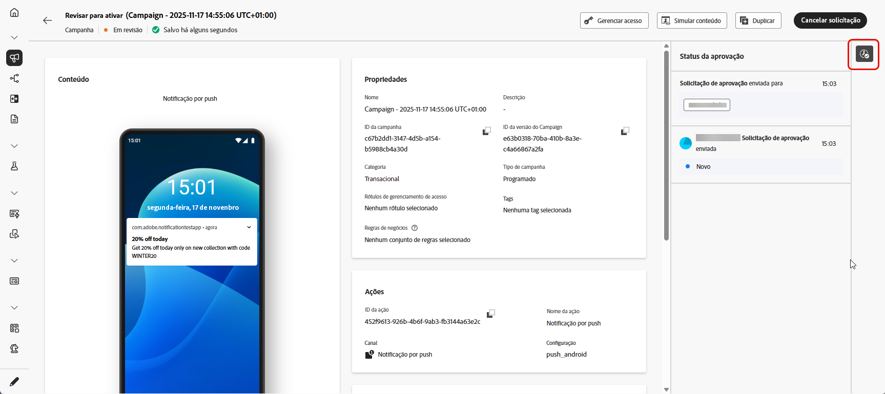

# Introdução à aprovação de jornadas e campanhas {#send-proofs}

## Introdução a políticas de aprovação {#gs}

O [!DNL Journey Optimizer] permite configurar um processo de aprovação para que as equipes de marketing garantam que as campanhas e jornadas sejam revisadas e aprovadas pelas partes interessadas apropriadas antes de serem publicadas.

As políticas de aprovação introduzem um fluxo de trabalho estruturado diretamente na interface, eliminando a necessidade de mídias externas, como ferramentas de gerenciamento de tarefas ou emails e assegurando que todas as aprovações sejam gerenciadas e rastreadas centralmente.

Além disso, esse recurso oferece controle avançado da publicação de suas jornadas e campanhas. Com o processo de aprovação incorporado no Journey Optimizer, as campanhas e jornadas permanecem em um estado “bloqueado” durante a revisão, garantindo que nenhuma alteração ou ativação não intencional ocorra antes que todas as aprovações necessárias estejam em vigor.

## Pré-requisitos {#prerequisites}

Antes de iniciar, verifique se as permissões abaixo foram configuradas.

Para aprovar e publicar jornadas e campanhas, os usuários precisam receber as permissões **Aprovar e publicar campanhas** e **Aprovar e publicar jornadas**. [Saiba mais](../administration/permissions.md)

+++  Saiba como atribuir permissões relacionadas à aprovação

1. No produto **Permissões**, abra a guia **Funções** e selecione a **função** desejada.

1. Clique em **Editar** para modificar as permissões.

1. Adicione o recurso **Campanhas** e selecione **Aprovar e publicar campanhas** no menu suspenso.

   {zoomable="yes"}

1. Adicione o recurso **Jornadas** e selecione **Aprovar e publicar jornadas** no menu suspenso.

   {zoomable="yes"}

1. Clique em **Salvar** para aplicar as alterações.

As permissões de todos os usuários já atribuídos a essa função serão atualizadas automaticamente.

1. Para atribuir essa função a novos usuários, navegue até a guia **Usuários** no painel **Funções** e clique em **Adicionar usuário**.

1. Insira o nome do usuário, seu endereço de email ou escolha na lista e clique em **Salvar**.

1. Se o usuário não foi criado anteriormente, consulte [esta documentação](https://experienceleague.adobe.com/pt-br/docs/experience-platform/access-control/abac/permissions-ui/users).

O usuário receberá um email com instruções para acessar a sua instância.

+++

## Visão geral do processo de aprovação {#process}

O processo de aprovação global é o seguinte:

{zoomable="yes"}

1. **Configuração de políticas de aprovação**

   Um usuário administrador cria uma política de aprovação, definindo as condições sob as quais a política deve ser aplicada a jornadas ou campanhas. Por exemplo, você pode criar uma política de aprovação que exija que todas as campanhas agendadas criadas por um determinado usuário sejam aprovadas antes de serem ativadas. [Saiba como criar políticas de aprovação](approval-policies.md)

1. **Envio de campanha/jornada para aprovação**

   Os criadores da campanha/jornada criam uma jornada ou campanha e a enviam para aprovação. A campanha/jornada insere um estado “Em revisão”, durante o qual nenhuma edição pode ser feita, a menos que a solicitação seja cancelada. [Saiba como solicitar aprovação](request-approval.md)

   >[!NOTE]
   >
   >Campanhas e jornadas só precisam ser enviadas para aprovação se uma política de aprovação estiver em vigor. Se essa política não se aplicar, o criador poderá publicar diretamente a campanha ou jornada sem exigir aprovação.

1. **Revisão e aprovação**

   O(s) aprovador(es) definido(s) na política de aprovação que se aplica à jornada ou campanha recebe(m) uma notificação. Ele(s) pode(m) revisar o conteúdo, o público-alvo e as configurações da jornada ou da campanha. Se forem necessárias alterações, o aprovador as solicitará, retornando a campanha para “Rascunho” para fazer revisões. Se estiver pronto, ele pode ativar e iniciar a jornada ou campanha. [Saiba como revisar e aprovar uma solicitação](review-approve-request.md)

## Monitorar solicitações de aprovação {#monitor}

Você pode monitorar todas as solicitações de aprovação e alteração que foram enviadas para uma determinada jornada ou campanha. Para fazer isso, clique no ícone **[!UICONTROL Mostrar trilha de auditoria]** localizado na seção superior direita da tela de jornada ou na tela de revisão da campanha.

## Perguntas frequentes {#faq}

+++Preciso criar uma política de aprovação para cada campanha ou jornada?

Não. As políticas de aprovação são condicionais. Você só precisa criar uma política se quiser impor a revisão para um conjunto específico de campanhas ou jornadas (por exemplo, todas as campanhas agendadas criadas por uma equipe específica). Se nenhuma política se aplicar a uma campanha ou jornada, o criador pode publicar diretamente sem solicitar aprovação.

+++

+++O que acontece se o aprovador não estiver disponível?

A solicitação permanece “Em revisão” até que um aprovador tome uma decisão. Você pode cancelar a solicitação (retornando o item para o status “Rascunho”) e reenviar assim que o aprovador certo estiver disponível. Os administradores também podem atualizar a política de aprovação para adicionar mais aprovadores.

+++

+++Posso editar uma campanha ou jornada enquanto a aprovação está pendente?

Não. Depois de enviada para aprovação, a campanha ou jornada fica em um estado bloqueado “Em revisão”. Para fazer alterações, o criador ou um aprovador deve cancelar a solicitação primeiro. O item retorna para o status “Rascunho” e pode ser editado antes de ser reenviado.

+++

+++Não vejo a permissão Aprovar e publicar no menu suspenso — o que devo verificar?

Verifique se você está adicionando o recurso correto primeiro. A permissão **Aprovar e publicar campanhas** requer que o recurso **Campanhas** seja adicionado à função, e a permissão **Aprovar e publicar jornadas** requer o recurso **Jornada**. Ambos devem ser adicionados separadamente. [Saiba como atribuir permissões relacionadas à aprovação](#prerequisites)

+++

+++Como o [!DNL Journey Optimizer] determina qual política de aprovação se aplica se mais de uma política corresponder?

Quando várias políticas de aprovação ativas podem ser aplicadas à mesma jornada ou campanha, a política que foi **ativada mais recentemente** tem prioridade. Os grupos de usuários aprovadores definidos nessa política são os que são notificados e que controlam a solicitação.

[Saiba mais](approval-policies.md#multiple-policies)

+++

+++Se um solicitante pertencer a vários grupos de usuários, é possível escolher para qual grupo a solicitação de aprovação é enviada?

Não. Os solicitantes não podem selecionar manualmente qual grupo de usuários recebe ou encaminha a solicitação de aprovação. Os grupos de usuários especificados na política de aprovação que se aplica — de acordo com a [precedência de política](approval-policies.md#multiple-policies) — são notificados automaticamente.

+++

## Recursos adicionais

* **[Criar políticas de aprovação](approval-policies.md)**: saiba como configurar políticas de aprovação para impor fluxos de trabalho de revisão sobre campanhas e jornadas.
* **[Solicitar aprovação](request-approval.md)**: entenda como enviar conteúdo para aprovação e acompanhar o status de aprovação.
* **[Revisar e aprovar solicitações](review-approve-request.md)**: saiba como revisar, aprovar ou rejeitar solicitações de aprovação como aprovador.
* **[Simular com entradas de exemplo](simulate-sample-input.md)**: saiba como testar e validar conteúdo usando dados de perfil de exemplo.
