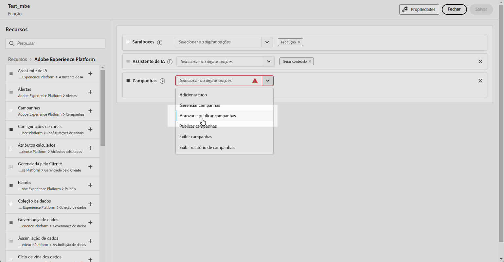
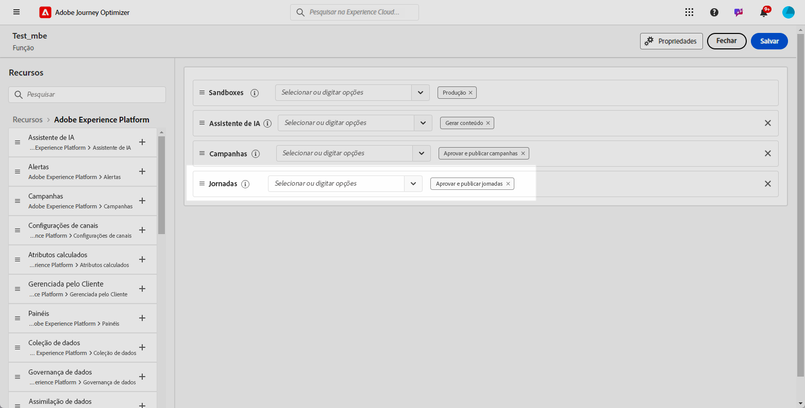
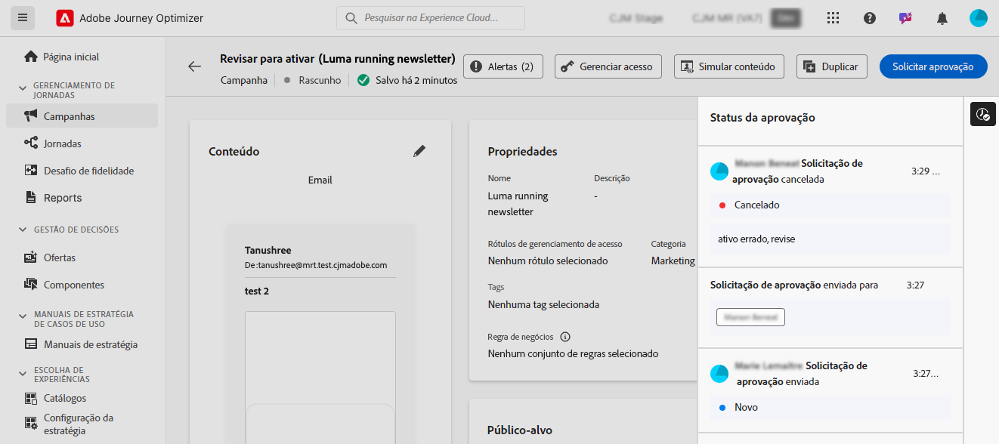

# Introdução à aprovação de jornadas e campanhas {#send-proofs}

>[!AVAILABILITY]
>
> No momento, as políticas de aprovação estão disponíveis apenas para um conjunto de organizações (disponibilidade limitada). Para obter acesso, entre em contato com seu representante da Adobe.

## Introdução a políticas de aprovação {#gs}

Com o Journey Optimizer é possível configurar um processo de aprovação para que as equipes de marketing garantam que as campanhas e jornadas sejam revisadas e aprovadas pelas partes interessadas apropriadas antes de serem publicadas.

As políticas de aprovação introduzem um fluxo de trabalho estruturado diretamente na interface, eliminando a necessidade de mídias externas, como ferramentas de gerenciamento de tarefas ou emails e assegurando que todas as aprovações sejam gerenciadas e rastreadas centralmente.

Além disso, esse recurso oferece controle avançado da publicação de suas jornadas e campanhas. Com o processo de aprovação incorporado no Journey Optimizer, as campanhas e jornadas permanecem em um estado “bloqueado” durante a revisão, garantindo que nenhuma alteração ou ativação não intencional ocorra antes que todas as aprovações necessárias estejam em vigor.

## Pré-requisitos {#prerequisites}

Antes de iniciar, verifique se as permissões abaixo foram configuradas.

Para acessar as campanhas e jornadas de aprovação e publicação, os usuários precisam ter as permissões **Aprovar e publicar campanhas** e **Aprovar e publicar jornadas**. [Saiba mais](../administration/permissions.md)

+++  Saiba como atribuir permissões relacionadas à aprovação

1. No produto **Permissões**, abra a guia **Funções** e selecione a **função** desejada.

1. Clique em **Editar** para modificar as permissões.

1. Adicione o recurso **Campanhas** e selecione **Aprovar e publicar campanhas** no menu suspenso.

   {zoomable="yes"}

1. Adicione o recurso **Jornadas** e selecione **Aprovar e publicar jornadas** no menu suspenso.

   {zoomable="yes"}

1. Clique em **Salvar** para aplicar as alterações.

As permissões de todos os usuários já atribuídos a essa função serão atualizadas automaticamente.

1. Para atribuir essa função a novos usuários, navegue até a guia **Usuários** no painel **Funções** e clique em **Adicionar usuário**.

1. Insira o nome do usuário, seu endereço de email ou escolha na lista e clique em **Salvar**.

1. Se o usuário não tiver sido criado anteriormente, consulte [esta documentação](https://experienceleague.adobe.com/pt-br/docs/experience-platform/access-control/abac/permissions-ui/users).

O usuário receberá um email com instruções para acessar a sua instância.

+++

## Visão geral do processo de aprovação {#process}

O processo de aprovação global é o seguinte:

{zoomable="yes"}

1. **Configuração de políticas de aprovação**

   A pessoa responsável pela administração cria uma política de aprovação, definindo condições sob as quais a política deve ser aplicada a jornadas ou campanhas. Por exemplo, você pode criar uma política de aprovação que exija que todas as campanhas agendadas criadas por um determinado usuário sejam aprovadas antes de serem ativadas. [Saiba como criar políticas de aprovação](approval-policies.md)

1. **Envio de campanha/jornada para aprovação**

   Os criadores da campanha/jornada criam uma jornada ou campanha e a enviam para aprovação. A campanha/jornada insere um estado “Em revisão”, durante o qual nenhuma edição pode ser feita, a menos que a solicitação seja cancelada. [Saiba como solicitar aprovação](request-approval.md)

   >[!NOTE]
   >
   >Campanhas e jornadas só precisam ser enviadas para aprovação se uma política de aprovação estiver em vigor. Se essa política não se aplicar, o criador poderá publicar diretamente a campanha ou jornada sem exigir aprovação.

1. **Revisão e aprovação**

   O(s) aprovador(es) definido(s) na política de aprovação que se aplica à jornada ou campanha recebe(m) uma notificação. Ele(s) pode(m) revisar o conteúdo, o público-alvo e as configurações da jornada ou da campanha. Se forem necessárias alterações, o aprovador as solicitará, retornando a campanha para “Rascunho” para fazer revisões. Se estiver pronto, ele pode ativar e iniciar a jornada ou campanha. [Saiba como revisar e aprovar uma solicitação](review-approve-request.md)

## Monitorar solicitações de aprovação {#monitor}

Você pode monitorar todas as solicitações de aprovação e alteração que foram enviadas para uma determinada jornada ou campanha. Para fazer isso, clique no ícone **[!UICONTROL Mostrar trilha de auditoria]** localizado na seção superior direita da tela de jornada ou na tela de revisão da campanha.

