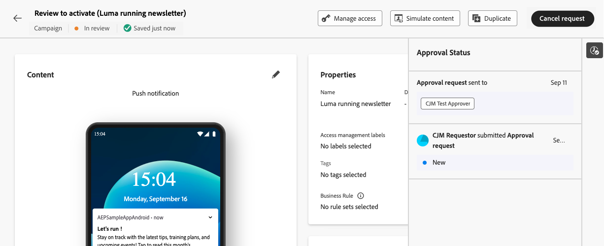

# Solicitar aprovação {#request-approval}

O acesso ao fluxo de trabalho de aprovação é determinado pelo seu caso de uso específico:

* **Não existe nenhuma política de Aprovação ativa**

   * **Campanhas**: se nenhuma política de aprovação estiver ativa para o objeto Campanha em uma sandbox, as campanhas exibirão o botão **[!UICONTROL Ativar]**, permitindo que você as ative sem precisar de aprovação.

   * **Jornadas**: se nenhuma política de aprovação estiver ativa para o objeto de Jornada, o jornada exibirá o botão **[!UICONTROL Publish]**, permitindo que você publique diretamente.

* **Existem políticas de Aprovação Ativas**

   * **Campanhas**: se uma ou mais políticas de aprovação ativas existirem para o objeto Campanha em uma sandbox, todas as campanhas nessa sandbox exibirão o botão **[!UICONTROL Solicitar Aprovação]**.
Se nenhuma política de aprovação se aplicar ao objeto selecionado quando o botão **[!UICONTROL Solicitar Aprovação]** for clicado, o fluxo de trabalho de aprovação automática será acionado.

   * **Jornadas**: se uma ou mais políticas de aprovação ativas existirem para o objeto de Jornada em uma sandbox, todas as jornadas exibirão o botão **[!UICONTROL Solicitar Aprovação]**.
Se nenhuma política de aprovação se aplicar ao objeto selecionado quando o botão **[!UICONTROL Solicitar Aprovação]** for clicado, o fluxo de trabalho de aprovação automática será acionado.

## Enviar solicitação de aprovação

Depois de criar sua campanha ou jornada, clique no botão **[!UICONTROL Solicitar Aprovação]**. Isso verificará se há uma política de aprovação ativa na sandbox que se aplique à campanha ou jornada.

* Se uma política de aprovação aplicável for encontrada, sua campanha ou jornada será enviada para revisão.

* Se nenhuma política de aprovação for aplicável à campanha ou jornada depois de clicar no botão **[!UICONTROL Solicitar Aprovação]**, a campanha ou jornada será automaticamente aprovada e ativada ou publicada.

O painel **[!UICONTROL Solicitar aprovação]** é aberto. Forneça uma mensagem ao(s) aprovador(es), se necessário, e clique em **[!UICONTROL Enviar]** para enviar sua solicitação.

Enquanto a campanha ou jornada estiver no estado **[!UICONTROL Em revisão]**, você terá a opção de cancelar a solicitação de aprovação. Ao clicar no botão **[!UICONTROL Cancelar solicitação]**, a campanha ou jornada retornará ao estágio de rascunho e uma notificação será enviada aos revisores informando que a solicitação foi cancelada. Em seguida, você pode fazer as edições necessárias e reenviar a campanha ou jornada para aprovação.

## Gerenciar solicitações de aprovação

Depois que a solicitação de aprovação é enviada aos aprovadores, eles podem revisá-la e ativar a jornada/campanha para ativá-la ou solicitar alterações, se necessário. [Saiba como revisar e aprovar uma solicitação](review-approve-request.md)

Se os aprovadores solicitarem alterações, você será notificado por meio de um email e um alerta do Journey Optimizer, que é acessível ao clicar no ícone de sino na parte superior direita da tela, na guia **[!UICONTROL Solicitações]**.

Para percorrer a solicitação de alteração, abra-a no email ou no alerta para acessar a jornada ou campanha e fazer as alterações solicitadas. Quando sua jornada/campanha estiver pronta para ser revisada novamente, envie uma nova solicitação de aprovação usando o botão **[!UICONTROL Solicitar aprovação]**.
