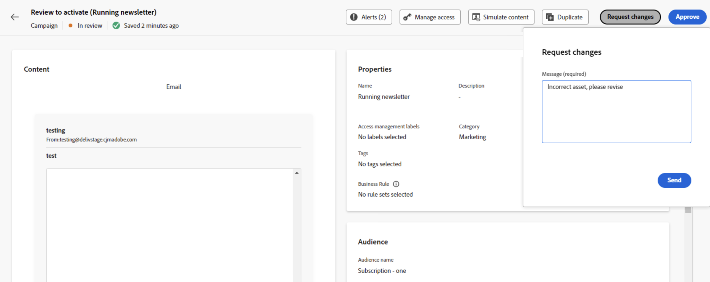

# Revisar e aprovar uma solicitação {#approve-requests}

Se uma política de aprovação se aplicar a uma jornada ou campanha, ela precisará ser enviada para aprovação para ser publicada. Para fazer isso, o criador de jornadas/campanhas envia uma solicitação ao(s) aprovador(es) definido(s) na política de aprovação e a jornada/campanha recebe o status **[!UICONTROL Em revisão]**.

Se você tiver sido selecionado como aprovador, será notificado por meio de um email e um alerta do Journey Optimizer, que pode ser acessado ao clicar no ícone de sino na parte superior direita da tela, na guia **[!UICONTROL Solicitações]**.

Para revisar a jornada/campanha, abra-a no email ou alerta e verifique suas configurações, como público-alvo, conteúdo ou configurações.
Depois de concluído, você pode [aprovar e publicar a jornada/campanha](#approve) ou [solicitar alterações antes de ativá-la](#changes).

>[!NOTE]
>
>Revisar uma campanha é uma etapa somente leitura: você pode visualizar todas as suas configurações, mas não pode executar nenhuma ação nela.
>
>Antes de revisar uma jornada ou campanha, verifique se você tem as permissões necessárias.

## Aprovar e publicar uma jornada/campanha {#approve}

Se uma jornada ou campanha estiver pronta para entrar no ar, você poderá aprová-la clicando no botão **[!UICONTROL Aprovar]**.

Na janela exibida, clique em **[!UICONTROL Aprovar e ativar]** para ativar a jornada/campanha.

## Solicitar alterações em uma jornada/campanha {#changes}

Se forem necessárias alterações em uma jornada ou campanha enviada para aprovação, você poderá enviar uma solicitação ao criador para que ele faça as alterações necessárias.

Para fazer isso, clique no botão **[!UICONTROL Solicitar alterações]**. No painel que é aberto, forneça uma mensagem detalhando sua solicitação e clique em **[!UICONTROL Enviar]** para enviar sua solicitação.

Após o envio da solicitação, o criador de jornadas/campanhas é notificado por um email e um alerta do Journey Optimizer. A campanha retorna ao status &quot;Rascunho&quot;. Depois que as alterações forem integradas, o criador da jornada/campanha poderá enviá-la novamente para aprovação.

>[!NOTE]
>
> Se você não estiver recebendo a notificação de aprovação por meio de um email, será necessário atualizar as preferências da assinatura nos perfis do Experience Cloud. [Saiba mais](https://experienceleague.adobe.com/pt-br/docs/core-services/interface/features/account-preferences)
