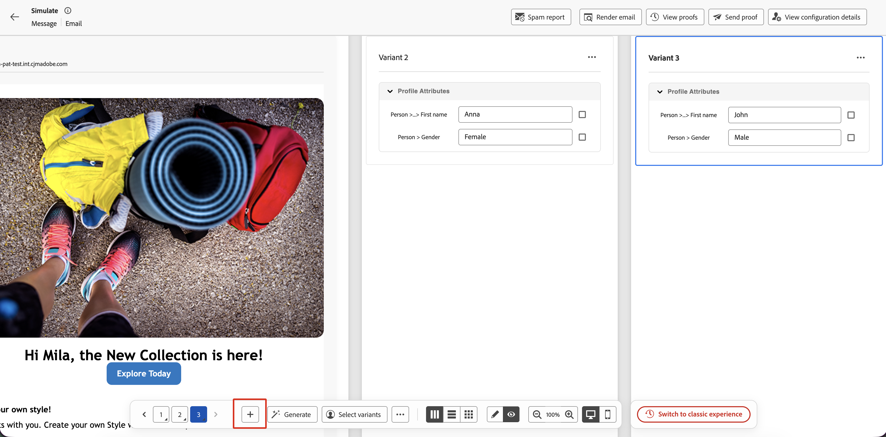
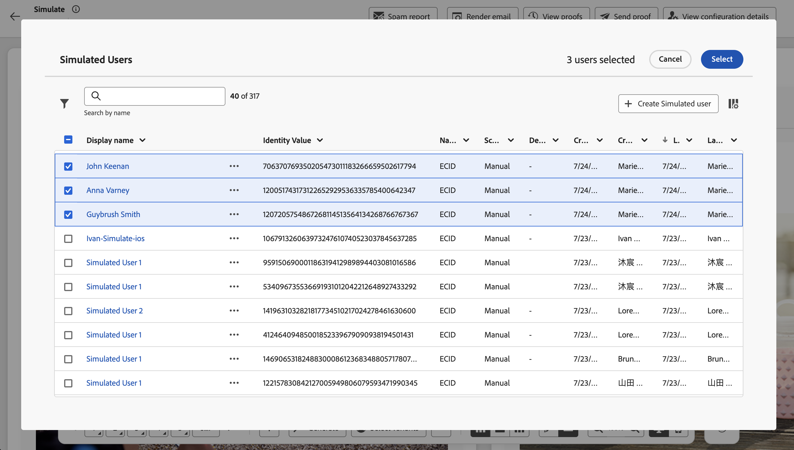

# Simular variações de conteúdo {#simulate-content-variations}

>[!BEGINSHADEBOX]

**Nesta página:** visualize todas as suas variantes de conteúdo rapidamente em uma grade lado a lado, gerencie-as a partir de uma barra de ação inferior consolidada e volte para a experiência clássica a qualquer momento.

>[!ENDSHADEBOX]

A experiência **[!UICONTROL Simular variações de conteúdo]** foi reprojetada para testar e comparar suas variantes de forma mais rápida e fácil. Agora, todas as variantes são renderizadas em conjunto em uma única grade rolável, e todos os controles necessários estão disponíveis em uma única barra de ação inferior.

Para acessar a nova experiência, em seu conteúdo, clique em **[!UICONTROL Simular conteúdo]** para abrir a tela de simulação de conteúdo. Se as variantes já estiverem disponíveis, a grade de visualização será exibida imediatamente. Se ainda não houver nenhuma, uma variante em branco será exibida e você poderá começar a criá-la usando qualquer um dos métodos descritos abaixo.

Se preferir o layout anterior, clique em **[!UICONTROL Alternar para experiência clássica]** na barra de ação inferior a qualquer momento. A documentação da experiência clássica está disponível em [Simular variações de conteúdo (experiência clássica)](simulate-sample-input.md).

## Criar e gerenciar variantes {#manage-variants}

As variantes podem ser criadas de maneiras diferentes: manualmente uma por uma ou importando um arquivo, gerando-as com IA ou selecionando usuários simulados existentes. Você pode adicionar até 30 variantes manualmente ou por meio de upload de arquivo. Ao usar a geração de IA, até 40 variantes podem ser criadas dependendo da complexidade do conteúdo.

### Adicionar grades manualmente {#add-variants}

Para adicionar uma variante em branco manualmente, clique em **[!UICONTROL +]** na barra de ação inferior. Uma nova variante em branco é adicionada e você pode inserir os valores de atributo diretamente.

Você também pode usar **[!UICONTROL ...]** > **Carregar variantes** para importar um arquivo CSV, JSON ou JSONLINES em que cada linha ou entrada se torne uma variante. Baixe o modelo de arquivo na caixa de diálogo de upload para usar o formato correto.

### Gerar variantes automaticamente {#auto-generate}

Para gerar variantes automaticamente usando IA, clique no botão **[!UICONTROL Gerar]** na barra de ações inferior. O sistema analisa o conteúdo, identifica campos de personalização e ramificações condicionais e gera quantas variantes forem necessárias para cobri-los com valores realistas. As variantes geradas por IA podem ser identificadas pelo ícone de brilho exibido no cartão.

>[!CAUTION]
>
>Clicar em **[!UICONTROL Gerar]** substitui todas as variantes existentes, incluindo as adicionadas manualmente ou de um arquivo.

### Selecionar variantes de usuários simulados {#simulated-users}

Você pode basear suas variantes em **usuários simulados**, que são entidades de teste reutilizáveis semelhantes a perfis, salvas entre sessões e que podem ser compartilhadas com outros usuários. Ao contrário das variantes inseridas manualmente, os usuários simulados persistem além da sessão atual do navegador.

Os usuários simulados são criados e gerenciados a partir do recurso **[!UICONTROL Simulação]** da jornada. Para obter o procedimento completo, consulte [Criar e gerenciar usuários simulados](../building-journeys/simulate-journey.md#test-users).

Para usar usuários simulados como variantes:

1. Clique em **[!UICONTROL Selecionar variantes]** na barra de ações inferior.
1. Selecione os usuários simulados que deseja usar na lista e clique em **[!UICONTROL Selecionar]**.

Os usuários simulados selecionados são adicionados como variantes. É possível editar os valores de atributo de uma variante localmente para teste, mas essas alterações não são salvas no registro do usuário simulado.

### Exportar grades {#export-variants}

É possível exportar todas as variantes atuais, sejam elas adicionadas manualmente, geradas com IA ou selecionadas de usuários simulados, para um arquivo CSV. Clique em **[!UICONTROL ...]** na barra de ações inferior e selecione **[!UICONTROL Exportar variantes]**.

## Visualizar variantes {#preview-grid}

### Alternar entre variantes {#switch-variants}

Quando estiver no modo de visualização, todas as variantes são renderizadas lado a lado com um indicador numerado na parte superior. Para alternar entre variantes, clique no número ou use os botões de navegação **&lt; >** na barra de ação inferior.

### Exibir variantes no modo de visualização ou edição {#edit-variants}

É possível exibir variantes no modo de visualização ou edição, em que você pode editar o conteúdo e os valores de atributo diretamente. Clique em **[!UICONTROL Visualizar]** ou **[!UICONTROL Editar]** na barra de ações inferior para alternar todas as visualizações de uma só vez entre os dois modos.

Para alternar uma única variante individualmente, clique no botão **[!UICONTROL Mostrar visualização]** ou **[!UICONTROL Mostrar detalhes da variante]** na parte superior do cartão, ou pressione o número na barra de ação inferior (ou use Alt + Seta para cima/Seta para baixo).

### Alterar o layout {#change-layout}

Para alterar a forma como as variantes são exibidas, use a **barra de ação inferior** para alternar entre layouts lado a lado, empilhados verticalmente ou encapsulados.

### Alternar entre as visualizações para desktop e para dispositivos móveis {#switch-views}

Para exibir como as variantes serão renderizadas em diferentes dispositivos, clique nos ícones na barra de ação inferior para alternar entre as exibições de desktop e dispositivos móveis. A grade de visualização é atualizada para mostrar como as variantes serão exibidas no dispositivo selecionado.

## Recursos adicionais para o canal de email {#email-capabilities}

Ao simular conteúdo de email, uma barra superior fornece ferramentas adicionais específicas de email.

* **[!UICONTROL Relatório de spam]** — Analise seu conteúdo de email em relação aos filtros de spam e obtenha uma pontuação de capacidade de entrega. [Saiba mais](../content-management/spam-report.md)
* **[!UICONTROL Renderizar email]** — Visualize como seu email é renderizado em clientes e dispositivos de email populares. [Saiba mais](../content-management/rendering.md)
* **[!UICONTROL Enviar prova]** — Envie uma prova de uma ou mais variantes a um conjunto de destinatários de email. Clique em **[!UICONTROL Enviar prova]**, adicione até 10 endereços de destinatários, selecione as variantes a serem incluídas e clique em **[!UICONTROL Enviar prova]** para confirmar. Para revisar provas enviadas anteriormente, clique em **[!UICONTROL Exibir provas]**. [Saiba mais](../content-management/proofs.md)
* **[!UICONTROL Exibir detalhes da configuração]** — Examine a configuração de canal aplicada a este conteúdo.
