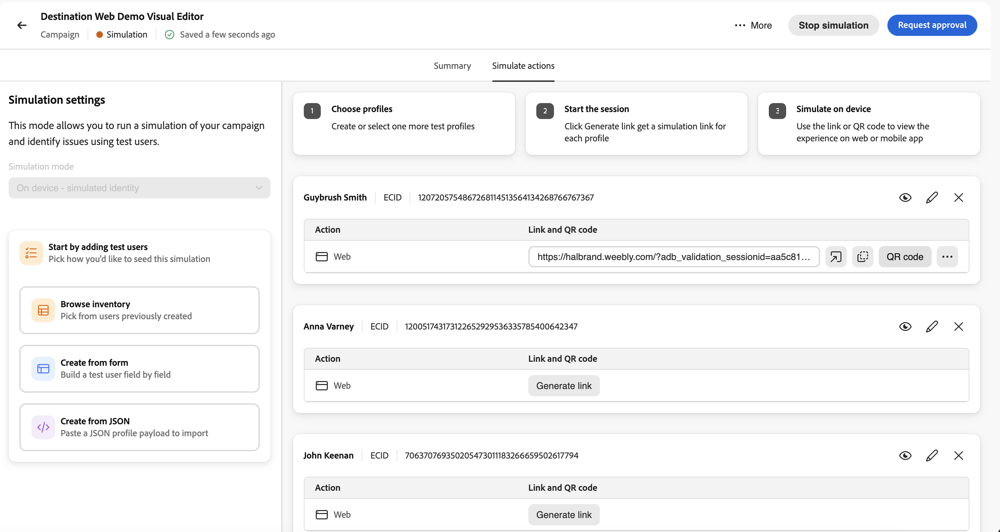

# Simular experiências de entrada {#simulate-inbound-experiences}

>[!BEGINSHADEBOX]

**Nesta página:** valide experiências de campanha de Ação de entrada com usuários simulados antes de entrar em funcionamento, incluindo visualização de link e QR, comportamento de simulação e limitações de chaves.

>[!ENDSHADEBOX]

>[!AVAILABILITY]
>
>No momento, esse recurso está na Private Beta. Para solicitar acesso, entre em contato com o representante da Adobe.

## Visão geral {#inbound-simulation-overview}

A simulação da experiência de entrada permite validar experiências de entrada personalizadas para uma **Campanha de ação** com usuários simulados antes que a campanha esteja ativa. Use-o para verificar o direcionamento, a decisão, o conteúdo renderizado e a solução de problemas de comportamento nos caminhos de visualização da Web e móvel.

Quando o modo de simulação é iniciado, a campanha entra no status **[!UICONTROL Simulation]**. Você pode sair e retornar mais tarde, enquanto a simulação permanece ativa e o conteúdo e a configuração da campanha são bloqueados para edição (semelhante a um estado publicado). As experiências simuladas não são expostas ao público-alvo da produção.

Para obter o fluxo de análise da campanha completo, incluindo a análise do conteúdo e o contexto de simulação, consulte [Revisar e ativar uma campanha de Ação](../campaigns/review-activate-campaign.md).

## Entrar e executar o modo de simulação {#enter-simulation-mode}

Para entrar no modo de simulação:

1. Na campanha Ação, acesse a interface **[!UICONTROL Revisar para ativar]** e selecione a guia **[!UICONTROL Simular ações]**.

   

1. Selecione os usuários simulados que deseja usar na simulação usando um dos métodos disponíveis:

   * **[!UICONTROL Procurar inventário]** - Selecione os usuários simulados criados anteriormente.
   * **[!UICONTROL Criar a partir do formulário]** - Criar um campo de usuário simulado por campo.
   * **[!UICONTROL Criar a partir de JSON]** - Importe uma carga de perfil de usuário simulada de arquivo JSON.

   

   Para obter mais detalhes sobre como criar e gerenciar usuários simulados, consulte [Criar e gerenciar usuários simulados](../building-journeys/simulate-journey.md#test-users).

1. Após selecionar ou criar os usuários simulados, eles são exibidos no painel central. Para cada usuário, você pode exibir detalhes, atualizar as informações do usuário ou remover o usuário da lista de simulação.

   

1. Para gerar a saída simulada para cada usuário, clique no botão **[!UICONTROL Gerar link]**. Isso gera:

   * Um URL compartilhável para visualizar a experiência de entrada renderizada para o usuário selecionado.
   * Um código QR para cenários de visualização móvel.

1. Para cada usuário simulado, use os controles gerados para validar a experiência:

   

   | Botão | O que faz |
   | --- | --- |
   |  | Abra o link gerado em um navegador para visualizar a experiência de entrada desse usuário simulado. |
   |  | Copie o link gerado para compartilhá-lo ou colá-lo em outro navegador ou dispositivo. |
   |  | Abra o código QR (se disponível para o canal), selecione **[!UICONTROL iOS]** ou **[!UICONTROL Android]**, verifique o código com a câmera do dispositivo e insira o código exibido quando solicitado. |
   |  | Abra opções adicionais para **[!UICONTROL Abrir sessão de garantia]** ou **[!UICONTROL Nova sessão de garantia]** e continue a solução de problemas na interface do usuário do Assurance. |

1. Você pode sair do modo de simulação a qualquer momento clicando em **[!UICONTROL Parar simulação]** na barra de ações da campanha, por exemplo, se precisar voltar e editar a campanha.
