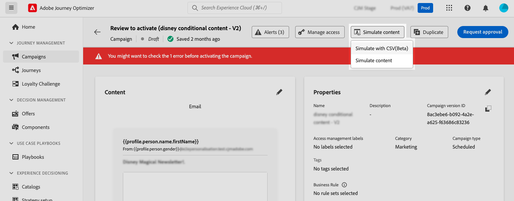
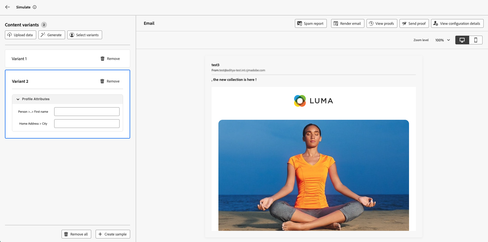
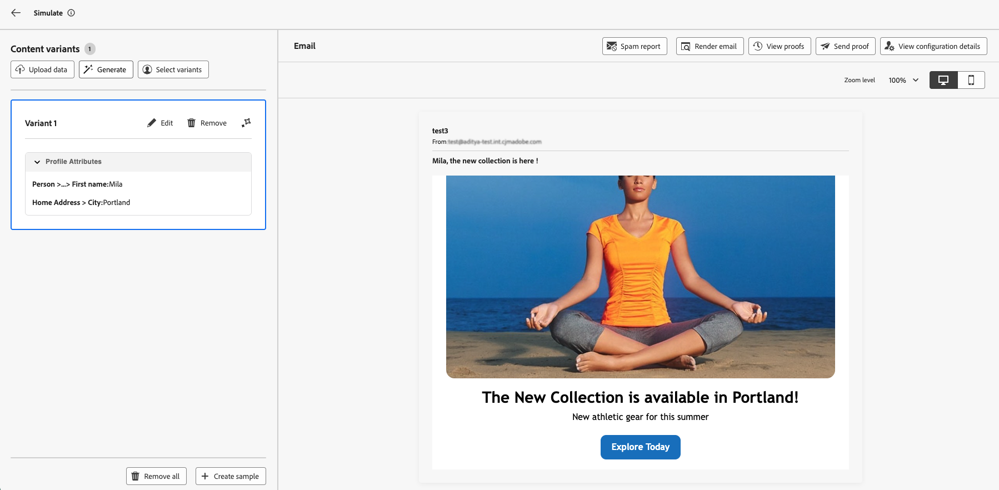
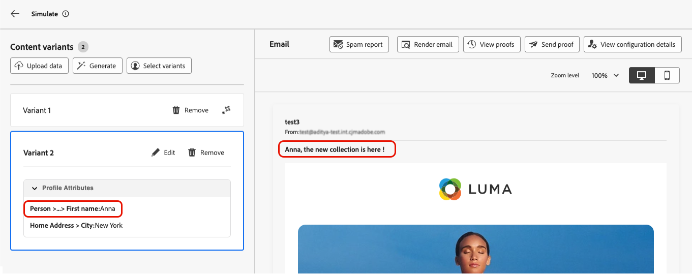
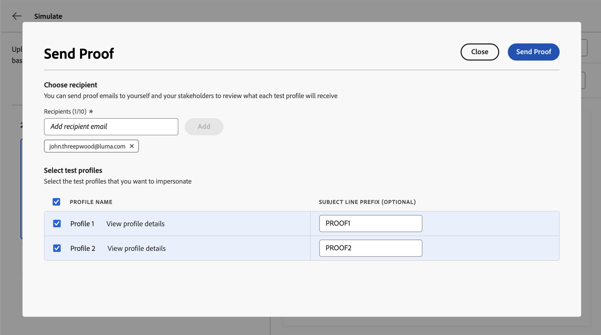

# Simular variações de conteúdo {#custom-profiles}

>[!CONTEXTUALHELP]
>id="ajo_simulate_sample_profiles"
>title="Simular usando exemplos de entrada"
>abstract="Nesta tela, você pode testar as variantes de conteúdo gerando-as automaticamente com IA, adicionando valores por meio de um modelo CSV ou JSON, inserindo-as manualmente ou usando perfis de teste."

Quando o conteúdo inclui personalização ou lógica condicional, é necessário verificar se ele é renderizado corretamente para cada tipo de recipient antes de enviá-lo.

A experiência **[!UICONTROL Simular variações de conteúdo]** no [!DNL Journey Optimizer] resolve isso permitindo que você teste várias variantes do seu conteúdo de uma única tela, gerada automaticamente com IA, inserida manualmente, importada de um arquivo ou com base em usuários simulados reutilizáveis. Você pode visualizar como cada variante é renderizada e enviar provas, tudo isso sem criar perfis persistentes no Adobe Experience Platform antecipadamente.

Em seu conteúdo, selecione **[!UICONTROL Simular conteúdo]** e **[!UICONTROL Simular variações de conteúdo]** para abrir uma única experiência onde você pode:

* **Gerar variantes automaticamente** usando IA para abranger a personalização e ramificações condicionais
* **Adicionar variantes manualmente** ou de um arquivo CSV ou JSON
* **Usar usuários simulados** para visualizar e revisar com dados de teste salvos e reutilizáveis
* **Visualizar** renderização e **enviar provas de email** para variantes selecionadas

Todos os atributos usados em seu conteúdo para personalização são detectados automaticamente. Uma variante é uma versão do conteúdo com valores diferentes para seus atributos.

>[!NOTE]
>
>As variantes servem apenas como fins de teste para o conteúdo atual. Eles não são armazenados no Adobe Experience Platform, mas na sessão do navegador do usuário, o que significa que não serão exibidos ao fazer logoff ou ao trabalhar de outro dispositivo.

## Medidas de proteção e limitações {#limitations}

Antes de começar a testar seu conteúdo usando exemplos de dados de entrada, considere as seguintes medidas de proteção e pré-requisitos.

* **Canais** - A simulação de variações de conteúdo está disponível para:

   * Os canais de email, SMS e notificação por push;
   * todos os canais de entrada (Web, experiência baseada em código, no aplicativo, cartões de Conteúdo).

* **Recursos com suporte** - As variações de conteúdo podem ser usadas com [!DNL Journey Optimizer] recursos de conteúdo multilíngue e experimentos de conteúdo. Isso permite testar mensagens em vários idiomas e otimizar o conteúdo por meio de experimentação.

  Você também pode aproveitar variações de conteúdo para testar seus modelos de conteúdo.

  >[!NOTE]
  >
  >Por enquanto, a renderização da caixa de entrada e os relatórios de spam não estão disponíveis na experiência atual. Para usar esses recursos, selecione o botão **[!UICONTROL Simular conteúdo]** no seu conteúdo para acessar a interface de usuário anterior.

* **Atributos** - Há suporte para atributos de perfil e contextuais.

* **Tipos de dados** - Somente os seguintes tipos de dados têm suporte ao inserir dados para suas variantes: número (inteiro e decimal), cadeia de caracteres, booleano e tipo de data. Qualquer outro tipo de dados mostrará um erro.

* **Número de variantes** - Você pode adicionar até 30 variantes para testar o conteúdo, usando um arquivo, manualmente ou por meio de geração automática.

## Criar variantes de conteúdo

Para criar variações para o seu conteúdo, clique no botão **[!UICONTROL Simular conteúdo]** e escolha **[!UICONTROL Simular variações de conteúdo]**.



É possível criar variantes das seguintes maneiras:

* [Adicionar variantes manualmente ou de um arquivo](#profiles).
* [Gerar variantes automaticamente](#auto-generate-variants) com IA.
* [Selecione variantes de usuários simulados existentes](#simulated-users).

Depois que suas variantes forem criadas, você poderá [visualizar seu conteúdo e enviar provas](#preview-proofs).

### Adicionar variantes manualmente ou de um arquivo {#profiles}

Ao acessar a experiência de variações de conteúdo, todos os campos de personalização usados no conteúdo são detectados automaticamente e exibidos em uma variante em branco.

Por exemplo, se o email contiver dois campos de personalização &quot;Nome&#39; e &quot;Cidade&quot;, eles aparecerão na lista. Inicialmente, nenhum valor é inserido e nenhum conteúdo personalizado é exibido no painel de visualização.


Você pode adicionar variantes manualmente ou carregá-las de um arquivo.

+++ Adicionar grades manualmente

Para editar o valor da variante padrão, clique no botão **[!UICONTROL Editar]** para fornecer valores personalizados para cada campo de personalização. O painel de visualização será atualizado para mostrar como o conteúdo é renderizado com os valores inseridos.

Para adicionar uma nova variante, clique no botão **[!UICONTROL Criar amostra]**. Uma nova variante em branco é exibida, contendo todos os campos de personalização detectados. É possível editar a nova variante, conforme necessário.



+++

+++ Adicionar variantes de um arquivo

É possível fazer upload de um arquivo com variantes e valores predefinidos para acelerar o processo.

1. Clique no botão **[!UICONTROL Carregar dados]** para abrir a tela de carregamento de arquivos.
1. Selecione **[!UICONTROL Baixar amostra]** para baixar um modelo de arquivo CSV, JSON ou JSONLINES.
1. Abra o arquivo de modelo e preencha os valores desejados para cada atributo de perfil. O template inclui uma coluna para cada atributo de perfil usado em seu conteúdo para personalização.

   Exemplo de sintaxe JSON:

   ```json
   {
   "profile": {
       "attributes": {
       "person": {
           "name": {
               "lastName": "Doe",
               "firstName": "John"
               }
           }
       }
   }
   }
   ```

1. Quando o arquivo estiver pronto, selecione **[!UICONTROL Confirmar]** para carregá-lo. Depois de fazer upload, uma nova variante é adicionada à lista para cada entrada no arquivo.

+++

### Gerar variantes de conteúdo automaticamente {#auto-generate-variants}

O [!DNL Journey Optimizer] pode usar a simulação baseada em IA para gerar automaticamente uma variante de conteúdo para que você possa validar sua lógica de personalização sem criar variantes manualmente. Ao renderizar conteúdo para simulação ou prova, o sistema analisa o conteúdo, identifica campos de personalização e os substitui por valores significativos para uma visualização quase realista.

Para gerar uma variante automaticamente, clique no botão **[!UICONTROL Gerar]** e aguarde o sistema gerar a variante. Revise a variante gerada na lista de variantes e sua renderização.



>[!NOTE]
>
>A geração produz uma única variante. Clicar em **[!UICONTROL Gerar]** substituirá todas as variantes de conteúdo existentes na lista, incluindo as adicionadas manualmente ou de um arquivo, por uma variante gerada.

### Selecionar variantes de usuários simulados {#simulated-users}

Em **[!UICONTROL Simular variações de conteúdo]**, você pode basear suas variantes em **usuários simulados**. Os usuários simulados são entidades temporárias semelhantes a perfis criadas para teste sem usar perfis persistentes no Adobe Experience Platform. Diferentemente das variantes adicionadas apenas para a sessão atual do navegador, os usuários simulados são salvos e podem ser reutilizados em jornadas e por outros usuários.

Os usuários simulados são criados e gerenciados a partir do recurso **[!UICONTROL Simulação]** da jornada. Para obter o procedimento completo para criar, salvar e reutilizar, consulte [Criar e gerenciar usuários simulados](../building-journeys/simulate-journey.md#test-users).

Depois que os usuários simulados forem criados, você poderá usá-los para visualizar o conteúdo. Para fazer isso, siga estes passos:

1. Clique no botão **[!UICONTROL Selecionar variantes]**.
1. Na lista de usuários simulados existentes, selecione aqueles que deseja usar e clique em **[!UICONTROL Selecionar]**.

   

1. Os usuários simulados selecionados são adicionados à lista de variantes de conteúdo, onde é possível visualizar o conteúdo com os valores de atributo. Também é possível editar os valores de uma variante manualmente para teste, mas essas alterações não são salvas no usuário simulado.

## Pré-visualizar conteúdo e enviar provas {#preview-proofs}

Depois que as variantes forem adicionadas, você poderá usá-las para visualizar seu conteúdo no painel direito e enviar provas de email.

### Visualizar variações de conteúdo {#preview}

Para visualizar seu conteúdo usando uma variante, selecione a variante relevante na lista para atualizar o conteúdo no painel de visualização com as informações inseridas para essa variante.

No exemplo abaixo, adicionamos duas variantes para a linha de assunto do email:

| Seleção da variante 1 | Seleção da variante 2 |
|----------|-------------|
|  |  |

<!--
For multilingual content and experimentation, a dropdown is available to switch between the different language variants or treatments.


-->

### Enviar provas {#proofs}

O Journey Optimizer permite enviar provas para endereços de email enquanto representa uma ou várias variantes adicionadas na tela de simulação. As etapas são as seguintes:

1. Verifique se as variantes foram adicionadas para testar o conteúdo e clique no botão **[!UICONTROL Enviar Prova]**.

1. No campo **[!UICONTROL Recipients]**, digite o endereço de email para o qual deseja enviar a prova e clique em **[!UICONTROL Adicionar]**. Repita a operação para enviar a prova para endereços de email adicionais. Você pode adicionar até 10 recipients de prova.

1. Na seção inferior da tela, selecione a variante que deseja usar na prova. É possível selecionar várias variantes, nesse caso, o email incluirá quantas provas forem as variantes selecionadas.

   Para obter mais informações sobre uma variante, selecione o link **[!UICONTROL Exibir detalhes do perfil]**. Isso permite exibir as informações inseridas na tela anterior para as diferentes variantes.

   

1. Clique no botão **[!UICONTROL Enviar Prova]** para começar a enviar a prova.

1. Para acompanhar o envio da prova, clique no botão **[!UICONTROL Exibir provas]** na tela de conteúdo simulado.


