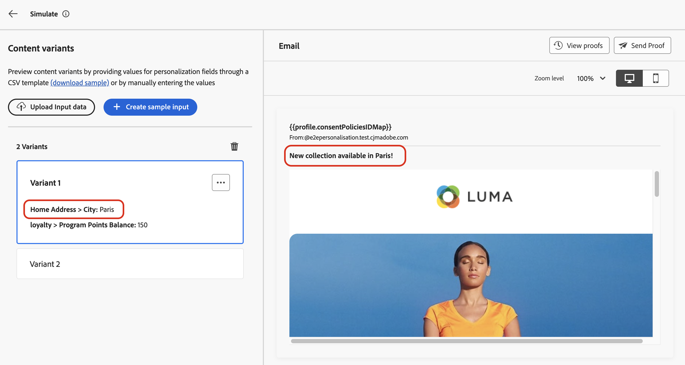
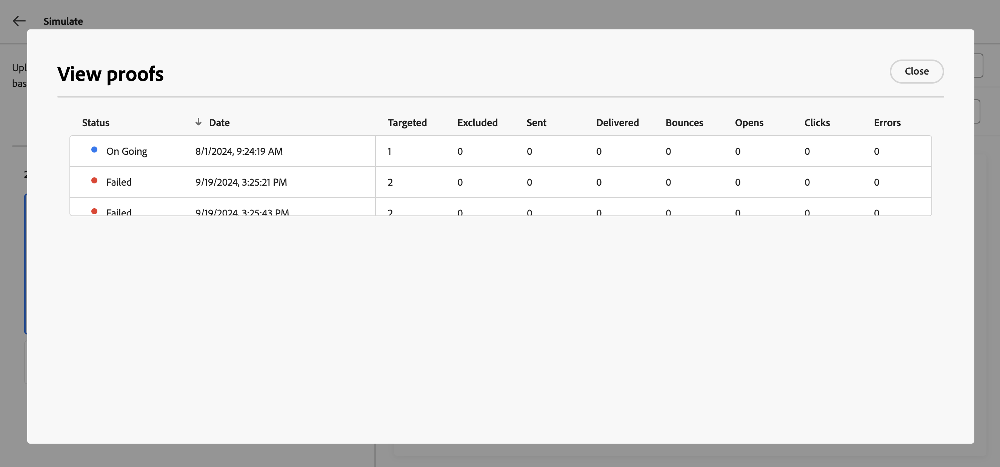

# Simular variações de conteúdo {#custom-profiles}

>[!CONTEXTUALHELP]
>id="ajo_simulate_sample_profiles"
>title="Simular usando exemplos de entrada"
>abstract="Esta tela permite testar diferentes variantes do seu conteúdo, seja fornecendo valores para os campos de personalização por meio de um modelo CSV ou JSON ou inserindo manualmente os valores."

O otimizador de Jornada permite que você visualize diferentes variações de seu conteúdo usando dados de entrada de amostra carregados de um arquivo CSV ou JSON ou adicionados manualmente.

Todos os atributos usados em seu conteúdo para personalização são detectados automaticamente pelo sistema e podem ser usados para seus testes criarem várias variantes. Uma variante se refere a uma versão do conteúdo com valores diferentes para seus atributos.

>[!NOTE]
>
>As variantes servem apenas como fins de teste para o conteúdo atual. Eles não são armazenados no Adobe Experience Platform, mas na sessão do navegador do usuário, o que significa que não serão exibidos ao fazer logoff ou ao trabalhar de outro dispositivo.

## Medidas de proteção e limitações {#limitations}

Antes de começar a testar seu conteúdo usando exemplos de dados de entrada, considere as seguintes medidas de proteção e pré-requisitos.

* **Canais** - A simulação de variações de conteúdo só está disponível para os canais de email, SMS e notificação por push.

* **Recursos com suporte** - As variações de conteúdo podem ser usadas com [!DNL Journey Optimizer] recursos de conteúdo multilíngue e experimentos de conteúdo. Isso permite testar mensagens em vários idiomas e otimizar o conteúdo por meio de experimentação.

  Você também pode aproveitar variações de conteúdo para testar seus modelos de conteúdo.

  >[!NOTE]
  >
  >Por enquanto, a renderização da caixa de entrada e os relatórios de spam não estão disponíveis na experiência atual:. Para usar esses recursos, selecione o botão **[!UICONTROL Simular conteúdo]** no seu conteúdo para acessar a interface de usuário anterior.

* **Atributos** - Há suporte para atributos de perfil e contextuais.

* **Tipos de dados** - Somente os seguintes tipos de dados têm suporte ao inserir dados para suas variantes: número (inteiro e decimal), cadeia de caracteres, booleano e tipo de data. Qualquer outro tipo de dados mostrará um erro.

* **Número de variantes** - Você pode adicionar até 30 variantes para testar o conteúdo, usando um arquivo ou manualmente.

## Adicionar e visualizar variações de conteúdo

Para criar variações para o seu conteúdo e visualizá-las, clique no botão **[!UICONTROL Simular conteúdo]** e escolha **[!UICONTROL Simular variações de conteúdo]**.


As principais etapas para testar seu conteúdo são as seguintes:

1. **Adicionar variantes** - Adicione até 30 variantes com dados de entrada de exemplo, carregando um arquivo ou adicionando dados manualmente. [Saiba como adicionar variantes](#profiles)
1. **Visualizar variações de conteúdo** - Verifique a visualização do conteúdo usando as diferentes variantes. [Saiba como visualizar seu conteúdo](#preview)
1. **Enviar provas de email** - Para conteúdo de email, envie até 10 provas para endereços de email usando as diferentes variantes. [Saiba como enviar provas](#proofs)

### Adicionar variantes {#profiles}

Ao acessar a experiência de variações de conteúdo, todos os campos de personalização usados no conteúdo são automaticamente detectados e exibidos em uma lista de variantes em branco.

Por exemplo, se seu email contiver dois campos de personalização &quot;Cidade&quot; e &quot;Saldo de pontos do programa&quot;, eles aparecerão na lista. Inicialmente, nenhum valor é inserido e nenhum conteúdo personalizado é exibido no painel de visualização.


Para editar o valor de uma variante:

1. Clique no botão de reticências ao lado da variante.
1. Selecione **[!UICONTROL Editar]** para fornecer valores personalizados para cada campo de personalização.
1. O painel de visualização será atualizado para mostrar como o conteúdo é renderizado com os valores inseridos.

Para adicionar uma nova variante:

1. Clique no botão **[!UICONTROL Criar entrada de amostra]**.
1. Uma nova variante em branco é exibida, contendo todos os campos de personalização detectados.
1. Edite a nova variante conforme necessário.


Também é possível fazer upload de um arquivo com variantes e valores predefinidos para acelerar o processo.

1. Clique em **[!UICONTROL Baixar amostra]** para baixar um modelo de arquivo.
1. Escolha um formato de arquivo: CSV, JSON ou JSONLINES.
1. Abra o arquivo de modelo e preencha os valores desejados para cada atributo de perfil. O template inclui uma coluna para cada atributo de perfil usado em seu conteúdo para personalização.

   Exemplo de sintaxe JSON:

   ```
   {
   "profile": {
       "attributes": {
       "person": {
           "name": {
               "lastName": "Doe",
               "firstName": "John"
               }
           }
       }
   }
   }
   ```

1. Quando o arquivo estiver pronto, clique em **[!UICONTROL Carregar Dados de Entrada]** para carregá-lo.
1. Depois de fazer upload, uma nova variante é adicionada à lista para cada entrada no arquivo.

   

Depois que as variantes forem adicionadas, você poderá usá-las para visualizar seu conteúdo no painel direito e enviar provas de email.

### Visualizar variações de conteúdo {#preview}

Para visualizar seu conteúdo usando uma variante, selecione a variante relevante na lista para atualizar o conteúdo no painel de visualização com as informações inseridas para essa variante.

No exemplo abaixo, adicionamos duas variantes para a linha de assunto do email:

| Seleção da variante 1 | Seleção da variante 2 |
|----------|-------------|
|  |  |

Para conteúdo e experimentação multilíngues, uma lista suspensa está disponível para alternar entre as diferentes variantes de idioma ou tratamentos.


Você pode remover uma variante a qualquer momento usando o botão de reticências no canto superior direito e selecionando **[!UICONTROL Remover]**. Para editar informações de uma variante, clique no botão de reticências e selecione **[!UICONTROL Editar]**.

### Enviar provas {#proofs}

O Journey Optimizer permite enviar provas para endereços de email enquanto representa uma ou várias variantes adicionadas na tela de simulação. As etapas são as seguintes:

1. Verifique se as variantes foram adicionadas para testar o conteúdo e clique no botão **[!UICONTROL Enviar Prova]**.

1. No campo **[!UICONTROL Recipients]**, digite o endereço de email para o qual deseja enviar a prova e clique em **[!UICONTROL Adicionar]**. Repita a operação para enviar a prova para endereços de email adicionais. Você pode adicionar até 10 recipients de prova.

1. Na seção inferior da tela, selecione a variante que deseja usar na prova. É possível selecionar várias variantes, nesse caso, o email incluirá quantas provas forem as variantes selecionadas.

   Para obter mais informações sobre uma variante, selecione o link **[!UICONTROL Exibir detalhes do perfil]**. Isso permite exibir as informações inseridas na tela anterior para as diferentes variantes.

   

1. Clique no botão **[!UICONTROL Enviar Prova]** para começar a enviar a prova.

1. Para acompanhar o envio da prova, clique no botão **[!UICONTROL Exibir provas]** na tela de conteúdo simulado.


