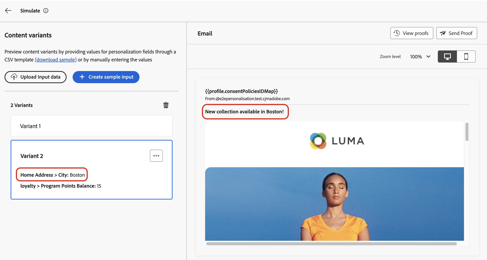

# Teste o conteúdo usando dados de entrada de exemplo{#custom-profiles}

>[!CONTEXTUALHELP]
>id="ajo_simulate_sample_profiles"
>title="Simular usando exemplos de entrada"
>abstract="Esta tela permite testar diferentes variantes do seu conteúdo, seja fornecendo valores para os campos de personalização por meio de um modelo CSV ou JSON ou inserindo manualmente os valores."

>[!AVAILABILITY]
>
>No momento, esses recursos estão disponíveis para todos os clientes como um beta público.

O otimizador de Jornada permite testar diferentes variantes do conteúdo, visualizando-o e enviando provas usando dados de entrada de amostra carregados de um arquivo CSV ou JSON ou adicionados manualmente. Todos os atributos de perfis usados em seu conteúdo para personalização são detectados automaticamente pelo sistema e podem ser usados para seus testes criarem várias variantes. Uma variante se refere a uma versão do conteúdo com valores diferentes para seus atributos.

>[!NOTE]
>
>Por enquanto, a simulação de variações de conteúdo está disponível somente para os canais de Email, SMS e Notificação por push.

Para acessar esta experiência, clique no botão **[!UICONTROL Simular conteúdo]** e escolha **[!UICONTROL Simular variações de conteúdo (Beta)]**.


As principais etapas para testar seu conteúdo são as seguintes:

1. Adicione até 30 variantes com dados de entrada de amostra, fazendo upload de um arquivo ou adicionando dados manualmente. [Saiba como adicionar variantes](#profiles)
1. Verifique a visualização do conteúdo usando as diferentes variantes. [Saiba como visualizar seu conteúdo](#preview)
1. Para conteúdo de email, envie até 10 provas para endereços de email usando as diferentes variantes. [Saiba como enviar provas](#proofs)


## Medidas de proteção e limitações {#limitations}

Antes de começar a testar seu conteúdo usando exemplos de dados de entrada, considere as seguintes medidas de proteção e pré-requisitos.

* A partir de agora, o teste usando dados de entrada de amostra está disponível apenas para os canais de Email, SMS e Notificação por push. A experiência não pode ser acessada pelo botão &quot;Simular conteúdo&quot; no Designer de email.
* Os seguintes recursos não estão disponíveis na experiência atual: renderização da caixa de entrada, relatórios de spam, conteúdo multilíngue e experimento de conteúdo. Para usar esses recursos, selecione o botão **[!UICONTROL Simular conteúdo]** no seu conteúdo para acessar a interface de usuário anterior.
* Somente atributos de perfil são suportados no momento. Se atributos contextuais forem usados em seu conteúdo para personalização, você não poderá testar seu conteúdo usando esses atributos.
* Somente os seguintes tipos de dados são suportados ao inserir dados para suas variantes: número (inteiro e decimal), string, booleano e tipo de data. Qualquer outro tipo de dados mostrará um erro.

## Adicionar variantes {#profiles}

Você pode adicionar até 30 variantes para testar o conteúdo, usando um arquivo ou manualmente.

>[!NOTE]
>
>As variantes adicionadas servem apenas como fins de teste para o conteúdo atual. Os não são armazenados no Adobe Experience Platform, mas na sessão do navegador do usuário, o que significa que não serão exibidos ao fazer logoff ou ao trabalhar de outro dispositivo.

### Adicionar variante usando um arquivo {#file}

Para adicionar uma variante de um arquivo, siga estas etapas:

1. Clique no link **[!UICONTROL baixar amostra]** para recuperar um modelo de arquivo e escolha o formato de arquivo que deseja usar (CSV, JSON ou JSONLINES).
1. Clique em **[!UICONTROL Baixar]** e armazene o modelo no local desejado.
1. Abra o arquivo e preencha o modelo de acordo com suas necessidades. O template inclui uma coluna para cada atributo de perfil usado em seu conteúdo para personalização.

   +++Arquivo de amostra

   ```
   {
   "profile": {
       "attributes": {
       "person": {
           "name": {
               "lastName": "Doe",
               "firstName": "John"
               }
           }
       }
   }
   }
   ```

   +++

1. Quando o arquivo estiver pronto, clique em **[!UICONTROL Carregar dados de entrada]** para carregá-los e testar o conteúdo.
1. Depois que o arquivo for carregado, uma caixa será adicionada no painel esquerdo para cada linha do arquivo. Cada caixa contém todos os atributos de perfil usados no conteúdo para personalização. Agora você pode usar as variantes para pré-visualizar seu conteúdo no painel direito e enviar provas.

   

### Adicionar grades manualmente {#manual}

Para adicionar uma variante manualmente, siga estas etapas:

1. Clique no botão **[!UICONTROL Criar entrada de amostra]**.

   Uma caixa é adicionada no painel esquerdo com todos os atributos de perfil usados em seu conteúdo para personalização.

1. Preencha o exemplo de dados de entrada para a variante e clique em **[!UICONTROL Salvar]**.

   

1. Depois que as variantes forem adicionadas, você poderá usá-las para visualizar seu conteúdo no painel direito e enviar provas.

## Pré-visualizar suas variantes de conteúdo {#preview}

Para visualizar o conteúdo usando uma das variantes, selecione a caixa relevante para atualizar a visualização do conteúdo na seção direita com as informações inseridas para essa variante.

No exemplo abaixo, adicionamos duas variantes para a linha de assunto do email:

| Seleção da variante 1 | Seleção da variante 2 |
|----------|-------------|
|  |  |

Você pode remover uma variante a qualquer momento usando o botão de reticências no canto superior direito e selecionando **[!UICONTROL Remover]**. Para editar informações de uma variante, clique no botão de reticências e selecione **[!UICONTROL Editar]**.

## Enviar provas {#proofs}

O Journey Optimizer permite enviar provas para endereços de email enquanto representa uma ou várias variantes adicionadas na tela de simulação. As etapas são as seguintes:

1. Verifique se as variantes foram adicionadas para testar o conteúdo e clique no botão **[!UICONTROL Enviar Prova]**.

1. No campo **[!UICONTROL Recipients]**, digite o endereço de email para o qual deseja enviar a prova e clique em **[!UICONTROL Adicionar]**. Repita a operação para enviar a prova para endereços de email adicionais. Você pode adicionar até 10 recipients de prova.

1. Na seção inferior da tela, selecione a variante que deseja usar na prova. É possível selecionar várias variantes, nesse caso, o email incluirá quantas provas forem as variantes selecionadas.

   Para obter mais informações sobre uma variante, selecione o link **[!UICONTROL Exibir detalhes do perfil]**. Isso permite exibir as informações inseridas na tela anterior para as diferentes variantes.

   

1. Clique no botão **[!UICONTROL Enviar Prova]** para começar a enviar a prova.

1. Para acompanhar o envio da prova, clique no botão **[!UICONTROL Exibir provas]** na tela de conteúdo simulado.


