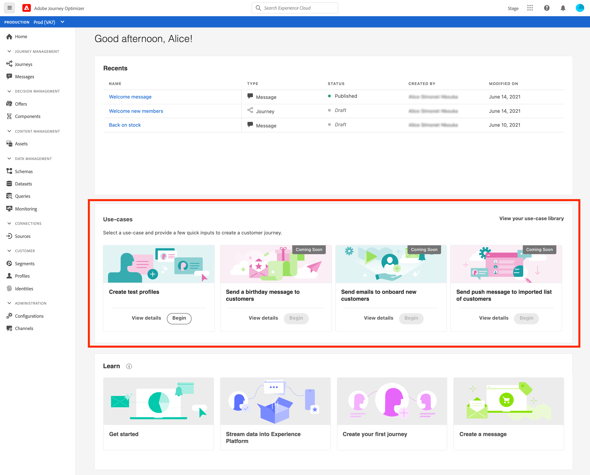
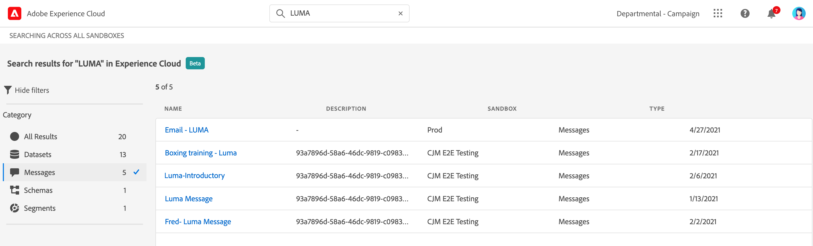

# Interface do usuário {#cjm-user-interface}

Depois de conectado à [Adobe Experience Cloud](http://experience.adobe.com), navegue até o [!DNL Journey Optimizer].

>[!NOTE]
>
>* Os principais conceitos ao navegar na interface do usuário são comuns ao Adobe Experience Platform. Consulte [Documentação do Adobe Experience Platform](https://experienceleague.adobe.com/docs/experience-platform/landing/platform-ui/ui-guide.html?lang=br#adobe-experience-platform-ui-guide) para obter mais detalhes.
   >
   >
* Essa documentação é atualizada com frequência para refletir as alterações mais recentes na interface do usuário do produto. Entretanto, algumas capturas de tela podem ser um pouco diferentes da interface do usuário.
   >
   > 
* Os componentes e recursos disponíveis na interface do usuário dependem das suas permissões e do seu pacote de licenciamento. Para qualquer pergunta, entre em contato com o Gerente de sucesso do cliente do Adobe.

## Navegação à esquerda

Use os links à esquerda para procurar recursos.

>[!NOTE]
>
>Os recursos disponíveis podem variar dependendo de suas permissões e do contrato de licença.

Veja abaixo uma lista completa de serviços e recursos disponíveis na navegação à esquerda, além de links para a documentação associada.

**Início**

A página inicial do [!DNL Journey Optimizer] contém os links e recursos principais para iniciar. A lista **[!UICONTROL Recents]** fornece atalhos para as mensagens, jornadas e eventos recém-criados ou atualizados. Esta lista mostra as datas de criação e modificação e o status.

**[!UICONTROL JOURNEY MANAGEMENT]**

* **[!UICONTROL Journeys]**: crie, configure e orquestre as jornadas do cliente. Saiba mais [nesta seção](building-journeys/journey-gs.md#jo-build)

* **[!UICONTROL Messages]**: crie, projete, teste e publique mensagens de email e por push. Saiba mais [nesta seção](create-message.md)

**[!UICONTROL DECISION MANAGEMENT]**

* **[!UICONTROL Offers]**: acesse as fontes e os conjuntos de dados recentes nesse menu. Use esta seção para criar novas ofertas. [Saiba mais](offers/offer-library/creating-personalized-offers.md)

* **[!UICONTROL Components]**: crie inserções, regras e tags. Saiba mais [nesta seção](offers/offer-library/key-steps.md)

**[!UICONTROL CONTENT MANAGEMENT]**

* **[!UICONTROL Assets]**: o [!DNL Adobe Experience Manager Assets Essentials] é um repositório centralizado de assets que podem ser usados para preencher suas mensagens. Saiba mais [nesta seção](assets-essentials.md)

**[!UICONTROL DATA MANAGEMENT]**

* **[!UICONTROL Schemas]**: use a Adobe Experience Platform para criar e gerenciar esquemas do Experience Data Model (XDM) em uma tela visual interativa chamada de Editor de esquemas. [Saiba mais nesta documentação](https://experienceleague.adobe.com/docs/experience-platform/xdm/tutorials/create-schema-ui.html?lang=pt-BR)

* **[!UICONTROL Datasets]**: todos os dados assimilados na Adobe Experience Platform são mantidos no Data Lake como conjuntos de dados. Um conjunto de dados é uma construção de armazenamento e gerenciamento para uma coleção de dados, normalmente uma tabela, que contém um esquema (colunas) e campos (linhas). [Saiba como visualizar e criar um conjunto de dados nesta documentação](https://experienceleague.adobe.com/docs/experience-platform/catalog/datasets/user-guide.html?lang=pt-BR)

* **[!UICONTROL Queries]**: use o Serviço de consulta da Adobe Experience Platform para gravar e executar consultas, exibir consultas executadas anteriormente e acessar consultas salvas por usuários em sua organização. [Saiba mais nesta documentação](https://experienceleague.adobe.com/docs/experience-platform/query/ui/overview.html?lang=pt-BR)

* **[!UICONTROL Monitoring]**: use esse menu para monitorar a assimilação de dados na interface do usuário da Adobe Experience Platform. [Saiba mais nesta documentação](https://experienceleague.adobe.com/docs/experience-platform/ingestion/quality/monitor-data-ingestion.html?lang=pt-BR)

**[!UICONTROL CONNECTIONS]**

* **[!UICONTROL Sources]**: use esse menu para assimilar dados de várias fontes, como aplicativos da Adobe, armazenamentos na nuvem, bancos de dados e muito mais, e estruturar, rotular e aprimorar os dados recebidos. [Saiba mais nesta documentação](https://experienceleague.adobe.com/docs/experience-platform/sources/home.html?lang=pt-BR)

**[!UICONTROL CUSTOMER]**

* **[!UICONTROL Segments]**: crie e gerencie definições de segmento da Experience Platform e aproveite-as em suas jornadas. Saiba mais [nesta página](segment/about-segments.md)

* **[!UICONTROL Profiles]**: o Perfil do cliente em tempo real cria uma visualização integral de cada cliente individual, combinando dados de vários canais, inclusive dados online, offline, CRM e de terceiros. [Saiba mais nesta documentação](https://experienceleague.adobe.com/docs/experience-platform/profile/ui/user-guide.html?lang=pt-BR)

* **[!UICONTROL Identities]**: o Adobe Experience Platform Identity Service gerencia a identificação entre dispositivos, canais e quase em tempo real dos clientes no que é conhecido como um gráfico de identidade na Adobe Experience Platform. [Saiba como criar um namespace de identidade nesta documentação](https://experienceleague.adobe.com/docs/experience-platform/identity/namespaces.html?lang=br#manage-namespaces)

**[!UICONTROL ADMINISTRATION]**

* **[!UICONTROL Journey Administration]**: use esse menu para configurar [eventos](event/about-events.md), [fontes de dados](datasource/about-data-sources.md) e [ações](action/action.md) para usar em suas jornadas.

* **[!UICONTROL Sandboxes]**: a Adobe Experience Platform fornece sandboxes que particionam uma única instância em ambientes virtuais separados para ajudar a desenvolver aplicativos de experiência digital. [Saiba mais sobre sandboxes nesta documentação](https://experienceleague.adobe.com/docs/experience-platform/sandbox/ui/user-guide.html?lang=pt-BR)

## Casos de uso no produto

Aproveite os [!DNL Adobe Journey Optimizer] casos de uso da página inicial e forneça algumas informações rápidas para criar uma jornada do cliente.

Os casos de uso disponíveis são:

* **Crie perfis** de teste para criar perfis de teste usando nosso modelo CSV para testar mensagens e jornadas personalizadas. Saiba como implementar este caso de uso [nesta página](building-journeys/creating-test-profiles.md#use-case-1).
* **Envie uma mensagem de aniversário aos clientes**, para enviar automaticamente um e-mail para desejar aos clientes aniversários. (em breve)
* **Envie emails para integrar novos clientes**, para enviar facilmente até dois emails para receber seus clientes recém-registrados. (em breve)
* **Envie mensagens de push para uma lista importada de clientes**, a fim de enviar rapidamente uma notificação por push para uma lista de clientes importados de um arquivo CSV. (em breve)

Clique em **[!UICONTROL View details]** para saber mais sobre cada caso de uso.

Clique no botão **[!UICONTROL Begin]** para iniciar o caso de uso.

Você pode acessar casos de uso executados pelo botão **[!UICONTROL View use case library]** .

## Buscar ajuda e suporte

Acesse as principais páginas de ajuda do Adobe Journey Optimizer na seção inferior da página inicial.

Use o ícone **Ajuda** para acessar páginas de ajuda, entrar em contato com o suporte e compartilhar feedback. Você pode pesquisar artigos e vídeos de ajuda no campo de pesquisa.

## Navegadores compatíveis

A interface do Adobe [!DNL Journey Optimizer] foi projetada para funcionar de maneira ideal na versão mais recente do Google Chrome. Você pode ter problemas ao usar determinados recursos em versões mais antigas ou outros navegadores.

## Preferências de idioma

A interface do usuário está disponível atualmente nos seguintes idiomas:

* Inglês
* Francês
* Alemão

O idioma padrão da interface é determinado pelo idioma preferencial especificado no perfil do usuário.

Para alterar o idioma:

* Clique em **Preferências** em seu avatar, no canto superior direito.
   
* Em seguida, clique no idioma exibido sob seu endereço de email
* Selecione o idioma de sua preferência e clique em **Salvar**. Você poderá selecionar um segundo idioma, caso o componente que está usando não esteja traduzido em seu primeiro idioma.
   

## Pesquisa

Em qualquer lugar da interface do Adobe Journey Optimizer, use a pesquisa do Adobe Experience Cloud no centro da barra superior para localizar ativos, jornadas ou mensagens em suas sandboxes. Comece a inserir conteúdo para exibir os principais resultados.

Pressione **Enter** para acessar todos os resultados e filtrar.

## Listas de filtros{#section_lgm_hpz_pgb}

Na maioria das listas, uma barra de pesquisa permite procurar um item específico e selecionar critérios de filtragem.

Filtros podem ser acessados com um clique no ícone de filtro na parte superior esquerda da lista. O menu de filtros permite filtrar os elementos exibidos de acordo com diferentes critérios. Você pode optar por exibir apenas os elementos de determinado tipo ou status, os que você criou ou os que foram modificados nos últimos 30 dias. As opções diferem dependendo do contexto.

Na lista de jornadas, você pode filtrar jornadas de acordo com seu status, tipo e versão do **[!UICONTROL Status and version filters]**. O tipo pode ser: **[!UICONTROL Unitary event]**, **[!UICONTROL Segment qualification]**, **[!UICONTROL Read segment]**, **[!UICONTROL Business event]** ou **[!UICONTROL Burst]**. Você pode optar por exibir somente jornadas que usam um evento, grupo de campos ou ação específica **[!UICONTROL Activity filters]** e **[!UICONTROL Data filters]**. O **[!UICONTROL Publication filters]** permite selecionar uma data de publicação ou um usuário. Por exemplo, você pode optar por exibir somente as versões mais recentes de jornadas ao vivo que foram publicadas ontem. [Saiba mais](building-journeys/using-the-journey-designer.md).

>[!NOTE]
>
>Observe que as colunas exibidas podem ser personalizadas usando o botão de configuração na parte superior direita das listas. A personalização é salva para cada usuário.

Use as colunas **[!UICONTROL Last update]** e **[!UICONTROL Last update by]** para verificar quando aconteceu a última atualização de suas jornadas e quem as salvou.

Nos painéis de configuração Evento, Fonte de dados e Ação, o campo **[!UICONTROL Used in]** exibe o número de jornadas que usam aquele determinado evento, grupo de campo ou ação. Você pode clicar no botão **[!UICONTROL View journeys]** para exibir a lista de jornadas correspondentes.

Nas diferentes listas, é possível executar ações básicas em cada elemento. Por exemplo, você pode duplicar ou excluir um item.

