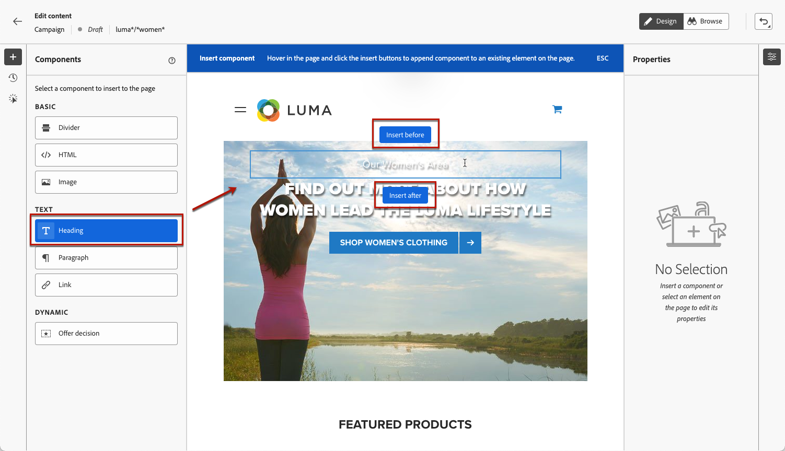
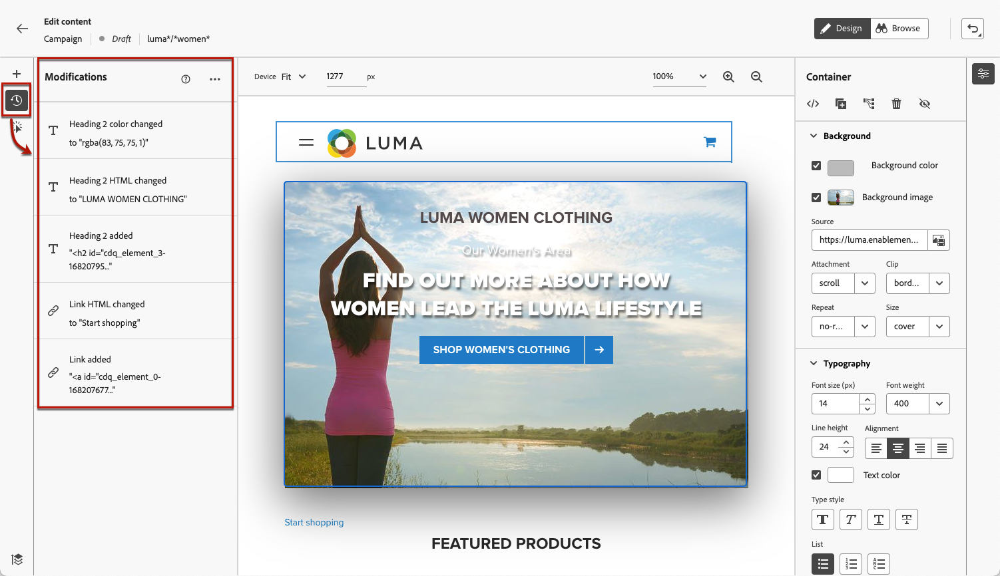

# Páginas da Web do autor {#author-web}

>[!AVAILABILITY]
>
>O recurso de canal da Web está disponível no momento como um beta somente para usuários selecionados.

Em [!DNL Journey Optimizer] a criação na web é disponibilizada pela extensão de navegador do chrome do Adobe Experience Cloud Visual Helper. [Saiba mais](visual-editing-helper.md)

Para acessar e criar páginas da Web no [!DNL Journey Optimizer] na interface do usuário, siga os pré-requisitos listados em [esta seção](create-web.md#prerequesites).

## Editar conteúdo da página da Web {#edit-web-content}

Depois de criar uma ação da Web a partir da campanha, você pode editar o conteúdo usando o web designer. Para isso, siga as etapas abaixo.

1. No **[!UICONTROL Ação]** da campanha, selecione **[!UICONTROL Editar conteúdo]** para começar a criar sua campanha da Web. [Saiba mais](create-web.md#configure-web-campaign)

1. Se você criou uma regra de correspondência de páginas, deve inserir qualquer URL que corresponda a esta regra. As alterações serão aplicadas a todas as páginas que correspondem à regra.

   >[!NOTE]
   >
   >Se você tiver inserido um único URL como a superfície da Web, o URL para personalizar já estará preenchido.

   

1. O conteúdo da página é exibido.

   >[!CAUTION]
   >
   >Para ser acessada, a página da Web deve ser implementada usando o [Adobe Experience Platform Web SDK](https://experienceleague.adobe.com/docs/platform-learn/implement-web-sdk/overview.html?lang=pt-BR){target=&quot;_blank&quot;}.

1. Clique em **[!UICONTROL Abrir web designer]** para editá-lo. [Saiba mais](author-web.md)

   

1. O web designer é exibido.

   

1. Selecione qualquer elemento da tela de desenho, como imagem, botão, parágrafo, texto, contêiner, cabeçalho, link etc. e utilizar:

   * O menu contextual para editar seu conteúdo, layout, inserir links ou personalização, etc.

      

   * Os ícones na parte superior do painel direito para editar, duplicar, excluir ou ocultar cada elemento.

      

   * O painel direito que muda dinamicamente de acordo com o elemento selecionado. Por exemplo, você pode editar o plano de fundo, a tipografia, a borda, o tamanho, a posição, o espaçamento, os efeitos ou os estilos em linha de um elemento.

      

## Usar componentes de conteúdo {#content-components}

1. No **[!UICONTROL Componentes]** no painel à esquerda, você pode adicionar os seguintes componentes à sua página da Web e editá-los conforme necessário:

   * [Divisor](../design/content-components.md#divider)
   * [HTML](../design/content-components.md#HTML)
   * [Imagem](../design/content-components.md#image)
   * Cabeçalho - O uso desse componente é semelhante ao uso da variável **[!UICONTROL Texto]** no designer de email. [Saiba mais](../design/content-components.md#text)
   * Parágrafo - O uso desse componente é semelhante ao uso da variável **[!UICONTROL Texto]** no designer de email. [Saiba mais](../design/content-components.md#text)
   * Link - Saiba como definir o estilo do link em [esta seção](../design/styling-links.md)
   * [Decisão da oferta](../design/deliver-personalized-offers.md)

   

1. Passe o mouse sobre a página e clique no botão **[!UICONTROL Inserir antes de]** ou **[!UICONTROL Inserir depois de]** para anexar o componente a um elemento existente na página.

   

1. No contêiner exibido para esse componente, edite o conteúdo do componente conforme necessário.

   

1. Ajuste os estilos exibidos da variável **[!UICONTROL Contêiner]** painel à direita, como plano de fundo, cor do texto, borda, tamanho, posição etc. dependendo do componente selecionado.

   

## Navegar pelo web designer

### Usar navegação estrutural

1. Selecione qualquer elemento da tela de desenho.

1. Clique no botão **[!UICONTROL Expandir/recolher navegações estruturais]** no lado inferior esquerdo da tela para exibir rapidamente as informações sobre o elemento selecionado.

   

1. Ao passar o mouse sobre a navegação estrutural, o elemento correspondente é realçado no editor.

1. Com ele, você pode navegar facilmente para qualquer elemento pai, irmão ou filho dentro do editor visual.

### Trocar para o modo de navegação {#browse-mode}

Você pode trocar a partir do padrão **[!UICONTROL Design]** para **[!UICONTROL Procurar]** usando o botão dedicado.

No **[!UICONTROL Procurar]** , você pode navegar até a página exata da superfície selecionada que deseja personalizar.

É especialmente útil ao lidar com páginas que estão por trás da autenticação ou que não estão disponíveis desde o início em um determinado URL. Por exemplo, você poderá autenticar, navegar até a página da sua conta ou até a página do carrinho e, em seguida, alternar de volta para **[!UICONTROL Design]** para executar as alterações na página desejada.

### Alterar tamanho do dispositivo

Você pode alterar o tamanho do dispositivo para um tamanho predefinido, como **[!UICONTROL Comprimido]** ou **[!UICONTROL Paisagem móvel]** ou defina um tamanho personalizado. Insira o número desejado de pixels para definir um tamanho personalizado.

Também é possível alterar o foco do zoom - de 25% para 400%.

## Gerenciar modificações {#manage-modifications}

Você pode gerenciar facilmente todos os componentes, ajustes e estilos adicionados à sua página da Web.

1. Selecione o **[!UICONTROL Modificações]** para exibir o painel correspondente à esquerda.

   

1. Você pode revisar cada uma das alterações feitas na página.

1. Selecione uma modificação indesejada e clique no ícone excluir para removê-la.

   

   >[!CAUTION]
   >
   >Continue com cuidado ao excluir uma ação, pois ela pode afetar as ações subsequentes.

1. Também é possível cancelar e refazer ações usando o **[!UICONTROL Desfazer/Refazer]** na parte superior direita da tela.

   

   Clique e mantenha pressionado o botão para alternar entre as **[!UICONTROL Desfazer]** e **[!UICONTROL Refazer]** opções. Em seguida, clique no botão para aplicar a ação desejada.

## Adicionar personalização e ofertas

Para adicionar personalização, selecione um container e selecione o ícone de personalização na barra de menu contextual que é exibida. Adicione as alterações usando o editor de expressão. [Saiba mais](../personalization/personalization-build-expressions.md)

Use o **[!UICONTROL Decisão da oferta]** componente a ser inserido [ofertas](../offers/get-started/starting-offer-decisioning.md) nas páginas da Web. O processo é o mesmo de quando [adicionar uma oferta a um email](../design/deliver-personalized-offers.md). Ele usará o Gerenciamento de decisões para escolher a melhor oferta para oferecer aos clientes.

## Testar a campanha da Web {#test-web-campaign}

Para exibir uma pré-visualização da experiência da Web modificada, siga as etapas abaixo.

>[!CAUTION]
>
>Você deve ter perfis de teste disponíveis para simular quais ofertas serão entregues a eles. Saiba como [criar perfis de teste](../segment/creating-test-profiles.md).

1. Em qualquer uma das **[!UICONTROL Editar conteúdo]** ou do web designer, selecione **[!UICONTROL Simular conteúdo]**.

   

1. Clique em **[!UICONTROL Gerenciar perfis de teste]** para selecionar um ou mais perfis de teste.
1. Uma pré-visualização da página da Web modificada é exibida.

   

1. Você também pode copiar o URL de teste para colá-lo em qualquer navegador, ou abri-lo no navegador padrão.
