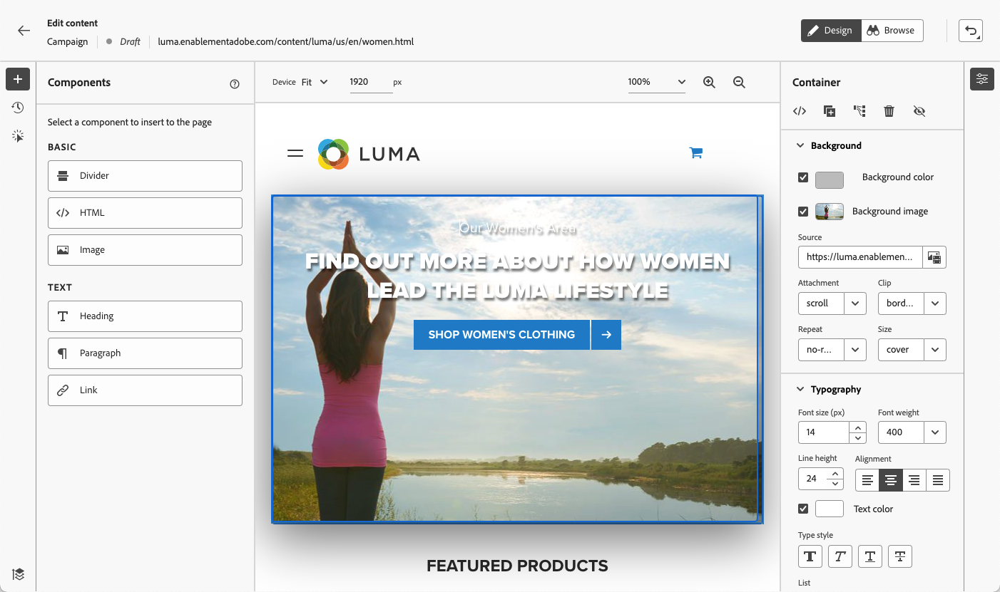

# Páginas da Web de autor {#author-web}

Uma vez [adição de uma ação da web](create-web.md#create-web-campaign) para sua campanha, você pode editar o conteúdo de seu site usando o web designer.

Em [!DNL Journey Optimizer], a criação na Web é disponibilizada pelo **Adobe Experience Cloud Visual Helper** extensão do navegador chrome. [Saiba mais](web-prerequisites.md#visual-authoring-prerequisites)

>[!CAUTION]
>
>Para acessar e criar páginas da Web no [!DNL Journey Optimizer] na interface do usuário, certifique-se de seguir os pré-requisitos listados em [esta seção](web-prerequisites.md).

[Saiba como criar uma campanha da Web neste vídeo](#video)

## Editar conteúdo da página da Web {#edit-web-content}

>[!CONTEXTUALHELP]
>id="ajo_web_url_to_edit_surface"
>title="Confirmar o URL para editar"
>abstract="Confirme o URL da página da Web específica a ser usada para editar o conteúdo que será aplicado na superfície da Web definida acima. A página da Web deve ser implementada usando o SDK da Web da Adobe Experience Platform."
>additional-url="https://experienceleague.adobe.com/docs/platform-learn/implement-web-sdk/overview.html?lang=pt-BR" text="Saiba mais"

>[!CONTEXTUALHELP]
>id="ajo_web_url_to_edit_rule"
>title="Inserir o URL para editar"
>abstract="Insira o URL de uma página da Web específica a ser usada para editar o conteúdo que será aplicado a todas as páginas que correspondem à regra. A página da Web deve ser implementada usando o SDK da Web da Adobe Experience Platform."
>additional-url="https://experienceleague.adobe.com/docs/platform-learn/implement-web-sdk/overview.html?lang=pt-BR" text="Saiba mais"

Para começar a criar sua campanha da Web, siga as etapas abaixo.

1. No **[!UICONTROL Ação]** da guia [campanha](create-web.md#create-web-campaign), selecione **[!UICONTROL Editar conteúdo]**.<!--change screen with rule-->

   

1. Se você criou uma regra de correspondência de páginas, deve inserir qualquer URL que corresponda a esta regra: as alterações serão aplicadas a todas as páginas correspondentes à regra. O conteúdo da página é exibido.

   >[!NOTE]
   >
   >Se você tiver inserido um único URL como a superfície da Web, o URL para personalizar já estará preenchido.

   

   >[!CAUTION]
   >
   >A página da Web deve incluir a variável [Adobe Experience Platform Web SDK](https://experienceleague.adobe.com/docs/platform-learn/implement-web-sdk/overview.html?lang=pt-BR){target="_blank"}. [Saiba mais](web-prerequisites.md#implementation-prerequisites)

1. Clique em **[!UICONTROL Editar página da Web]** para começar a criá-lo. O web designer é exibido.

   

   >[!NOTE]
   >
   >Se você tentar carregar um site que não seja carregado, uma mensagem será exibida sugerindo que você instale o [Extensão do navegador do Visual Editing Helper](#install-visual-editing-helper). Veja algumas dicas para solução de problemas em [esta seção](web-prerequisites.md#troubleshooting).

1. Selecione qualquer elemento da tela de desenho, como imagem, botão, parágrafo, texto, contêiner, cabeçalho, link etc. [Saiba mais](#content-components)

1. Use:

   * O menu contextual para editar seu conteúdo, layout, inserir links ou personalização, etc.

      

   * Os ícones na parte superior do painel direito para editar, duplicar, excluir ou ocultar cada elemento.

      

   * O painel direito que muda dinamicamente de acordo com o elemento selecionado. Por exemplo, você pode editar o plano de fundo, a tipografia, a borda, o tamanho, a posição, o espaçamento, os efeitos ou os estilos em linha de um elemento.

      

>[!NOTE]
>
>O web content designer é em sua maioria semelhante ao designer de email. Saiba mais sobre [criar conteúdo com [!DNL Journey Optimizer]](../email/get-started-email-design.md).

## Usar componentes {#content-components}

>[!CONTEXTUALHELP]
>id="ajo_web_designer_components"
>title="Adicionar componentes à página da Web"
>abstract="Você pode adicionar vários componentes à sua página da Web e editá-los conforme necessário."

1. No **[!UICONTROL Componentes]** à esquerda, selecione um item. Você pode adicionar os seguintes componentes à sua página da Web e editá-los conforme necessário:

   * [Divisor](../email/content-components.md#divider)
   * [HTML](../email/content-components.md#HTML)
   * [Imagem](../email/content-components.md#image)
   * Cabeçalho - O uso desse componente é semelhante ao uso da variável **[!UICONTROL Texto]** no designer de email. [Saiba mais](../email/content-components.md#text)
   * Parágrafo - O uso desse componente é semelhante ao uso da variável **[!UICONTROL Texto]** no designer de email. [Saiba mais](../email/content-components.md#text)
   * Link
   * [Decisão da oferta](../email/add-offers-email.md)

   

1. Passe o mouse sobre a página e clique no botão **[!UICONTROL Inserir antes de]** ou **[!UICONTROL Inserir depois de]** para anexar o componente a um elemento existente na página.

   

   >[!NOTE]
   >
   >Para desmarcar um componente, clique no botão **[!UICONTROL ESC]** no banner azul contextual exibido na parte superior da tela.

1. Edite o componente conforme necessário diretamente no conteúdo da página.

   

1. Ajuste os estilos exibidos no painel contextual à direita, como plano de fundo, cor do texto, borda, tamanho, posição etc. - dependendo do componente selecionado.

   

## Adicionar personalização e ofertas

Para adicionar personalização, selecione um container e selecione o ícone de personalização na barra de menu contextual que é exibida. Adicione as alterações usando o editor de expressão. [Saiba mais](../personalization/personalization-build-expressions.md)

Use o **[!UICONTROL Decisão da oferta]** componente a ser inserido [ofertas](../offers/get-started/starting-offer-decisioning.md) nas páginas da Web. O processo é o mesmo de quando [adicionar uma oferta a um email](../email/add-offers-email.md). Ele usará o Gerenciamento de decisões para escolher a melhor oferta para oferecer aos clientes.

## Gerenciar modificações {#manage-modifications}

>[!CONTEXTUALHELP]
>id="ajo_web_designer_modifications"
>title="Gerenciar facilmente todas as alterações"
>abstract="Usando esse painel, você pode navegar e gerenciar todos os ajustes e estilos adicionados à sua página da Web."

Você pode gerenciar facilmente todos os componentes, ajustes e estilos adicionados à sua página da Web.

1. Selecione o **[!UICONTROL Modificações]** ícone para exibir o painel correspondente à esquerda.

   

1. Você pode revisar cada uma das alterações feitas na página.

1. Selecione uma modificação indesejada e clique no ícone excluir para removê-la.

   

   >[!CAUTION]
   >
   >Continue com cuidado ao excluir uma ação, pois ela pode afetar as ações subsequentes.

1. Use o **[!UICONTROL Mais ações]** na parte superior do **[!UICONTROL Modificações]** painel para excluir todas as modificações ao mesmo tempo.

   

1. No **[!UICONTROL Mais ações]** também é possível excluir somente as modificações inválidas, o que significa que as alterações foram substituídas por outras alterações. Por exemplo, se você modificar a cor de um texto e depois excluir esse texto, a modificação de cor se tornará inválida, pois o texto não existe mais.

1. Também é possível cancelar e refazer ações usando o **[!UICONTROL Desfazer/Refazer]** na parte superior direita da tela.

   

   Clique e mantenha pressionado o botão para alternar entre as **[!UICONTROL Desfazer]** e **[!UICONTROL Refazer]** opções. Em seguida, clique no botão para aplicar a ação desejada.

## Usar o rastreamento de cliques {#use-click-tracing}

Essa capacidade no web designer permite que você selecione qualquer elemento de seu site e rastreie os cliques nesse elemento.

Assim que sua campanha estiver ativa, você poderá verificar o número de cliques para cada elemento no relatório da Web da campanha. Essas informações podem ser úteis para melhorar a experiência dos usuários do site. Por exemplo, se a variável [relatórios da web](../reports/campaign-global-report.md#web-tab) mostrar que muitos usuários clicam em um elemento que não é clicável, talvez você queira adicionar um link a esse elemento.

1. Selecione um elemento na página e escolha **[!UICONTROL Clique no elemento de rastreamento]** no menu contextual.

   

   >[!NOTE]
   >
   >Qualquer item, clicável ou não, pode ser selecionado.

1. A ação rastreada correspondente é exibida automaticamente no **[!UICONTROL Rastreamento de cliques]** painel à esquerda.

   

1. Adicione um rótulo significativo para gerenciar todos os elementos rastreados e encontrá-los facilmente nos relatórios. O **[!UICONTROL Seletor de CSS]** mostra informações para localizar o elemento selecionado.

1. Repita as etapas acima para selecionar quantos outros elementos forem necessários para o rastreamento de cliques. As ações correspondentes são listadas no painel esquerdo.

   

1. Para remover o rastreamento de cliques em um elemento, selecione o ícone de exclusão correspondente.

Quando a campanha está ativa, você pode verificar o relatório da campanha **[!UICONTROL Web]** para comparar o número de impressões, a taxa de cliques e o número de cliques por elemento. [Saiba mais](../reports/campaign-global-report.md#web-tab)

## Navegar pelo web designer {#navigate-web-designer}

### Usar navegação estrutural {#breadcrumbs}

1. Selecione qualquer elemento da tela de desenho.

1. Clique no botão **[!UICONTROL Expandir/recolher navegações estruturais]** no lado inferior esquerdo da tela para exibir rapidamente as informações sobre o elemento selecionado.

   

1. Ao passar o mouse sobre a navegação estrutural, o elemento correspondente é realçado no editor.

1. Com ele, você pode navegar facilmente para qualquer elemento pai, irmão ou filho dentro do editor visual.

### Trocar para o modo de navegação {#browse-mode}

>[!CONTEXTUALHELP]
>id="ajo_web_designer_browse"
>title="Usar o modo de navegação"
>abstract="Nesse modo, você pode navegar até a página exata da superfície selecionada que deseja personalizar."

Você pode trocar a partir do padrão **[!UICONTROL Design]** para **[!UICONTROL Procurar]** usando o botão dedicado.

No **[!UICONTROL Procurar]** , você pode navegar até a página exata da superfície selecionada que deseja personalizar.

É especialmente útil ao lidar com páginas que estão por trás da autenticação ou que não estão disponíveis desde o início em um determinado URL. Por exemplo, você poderá autenticar, navegar até a página da sua conta ou até a página do carrinho e, em seguida, alternar de volta para **[!UICONTROL Design]** para executar as alterações na página desejada.

### Alterar tamanho do dispositivo {#change-device-size}

Você pode alterar o tamanho do dispositivo da exibição do web designer para um tamanho predefinido, como **[!UICONTROL Comprimido]** ou **[!UICONTROL Paisagem móvel]** ou defina um tamanho personalizado inserindo o número desejado de pixels.

Também é possível alterar o foco do zoom - de 25% para 400%.

A capacidade de alterar o tamanho do dispositivo é projetada para sites responsivos que são renderizados em vários dispositivos, janelas e tamanhos de tela. Sites responsivos ajustam-se e se adaptam automaticamente a qualquer tamanho de tela, incluindo desktops, laptops, tablets ou telefones celulares.

>[!CAUTION]
>
>Você pode editar uma experiência da Web com um tamanho de dispositivo específico. No entanto, desde que os seletores sejam os mesmos, essas alterações se aplicam a todos os tamanhos e dispositivos, não apenas ao tamanho do dispositivo em que você está trabalhando. Da mesma forma, editar uma experiência na exibição de desktop normal aplica as alterações a todos os tamanhos de tela, não apenas à exibição de desktop.
>
>Atualmente, [!DNL Journey Optimizer] não suporta alterações de página específicas de tamanho de dispositivo. Isso significa que, por exemplo, se você tiver um site móvel separado com uma estrutura de site separada, você deve fazer as alterações específicas para seu site móvel em uma campanha diferente.

## Testar a campanha da Web {#test-web-campaign}

>[!CONTEXTUALHELP]
>id="ajo_web_designer_preview"
>title="Visualizar a experiência da Web"
>abstract="Acesse uma simulação de como sua experiência da Web será."

Para exibir uma pré-visualização da experiência da Web modificada, siga as etapas abaixo.

>[!CAUTION]
>
>Você deve ter perfis de teste disponíveis para simular quais ofertas serão entregues a eles. Saiba como [criar perfis de teste](../segment/creating-test-profiles.md).

1. Na tela de conteúdo de edição de campanha da Web, selecione **[!UICONTROL Simular conteúdo]**.

   <!---->

   

1. Clique em **[!UICONTROL Gerenciar perfis de teste]** para selecionar um ou mais perfis de teste.
1. Uma pré-visualização da página da Web modificada é exibida.

   

1. Você também pode abri-lo no navegador padrão ou copiar o URL de teste para colá-lo em qualquer navegador. Isso permite que você compartilhe o link com sua equipe e com as partes interessadas, que poderão visualizar a nova experiência da Web em qualquer navegador antes que a campanha seja ativada.

   >[!NOTE]
   >
   >Ao copiar o URL de teste, o conteúdo exibido é o personalizado para o perfil de teste usado quando a simulação de conteúdo foi gerada em [!DNL Journey Optimizer].

## Vídeo explicativo{#video}

O vídeo abaixo mostra como criar uma experiência da Web usando o web designer em [!DNL Journey Optimizer] campanhas.

>[!VIDEO](https://video.tv.adobe.com/v/3418803/?quality=12&learn=on)
