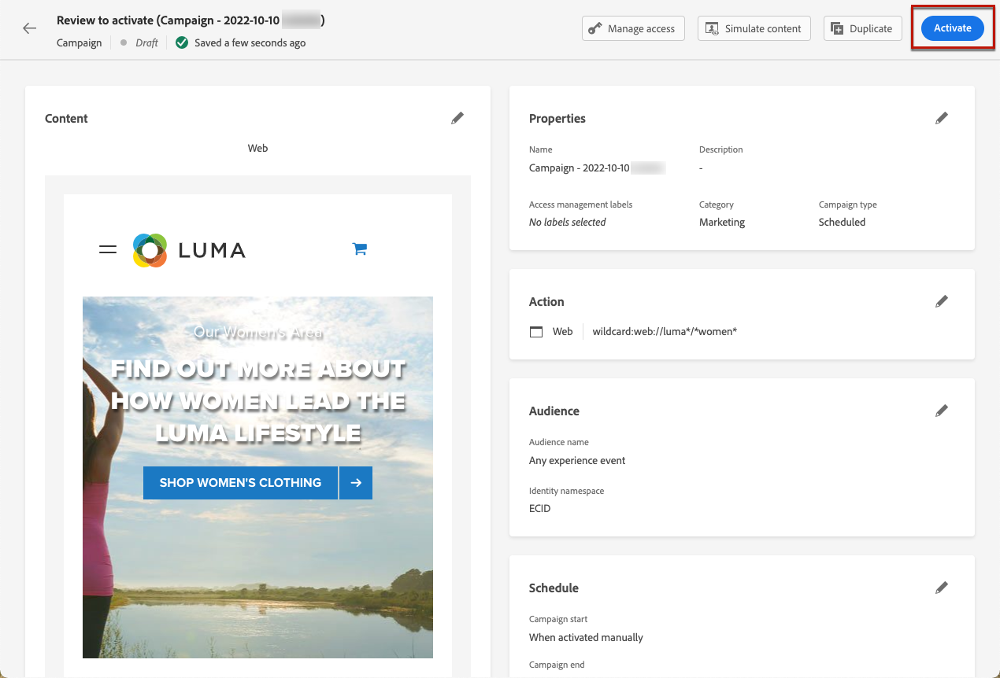

# Criar experiências da Web {#create-web}

>[!AVAILABILITY]
>
>O recurso de canal da Web está disponível no momento como um beta somente para usuários selecionados.

[!DNL Journey Optimizer] O permite personalizar a experiência da Web que você oferece para seus clientes por meio de campanhas da Web de entrada.

>[!CAUTION]
>
>Atualmente em [!DNL Journey Optimizer] você só pode criar experiências da web usando **campanhas**.

## Pré-requisitos {#prerequesites}

Para acessar e criar páginas da Web no [!DNL Journey Optimizer] na interface do usuário, siga os pré-requisitos abaixo:

* Para adicionar modificações ao seu site, é necessário implementar a variável [Adobe Experience Platform Web SDK](https://experienceleague.adobe.com/docs/platform-learn/implement-web-sdk/overview.html?lang=pt-BR){target=&quot;_blank&quot;} em seu site.

* Para acessar o [!DNL Journey Optimizer] web designer, você deve baixar o [Adobe Experience Cloud Visual Editing Helper](https://chrome.google.com/webstore/detail/adobe-experience-cloud-vi/kgmjjkfjacffaebgpkpcllakjifppnca)Extensão do navegador {target=&quot;_blank&quot;} no Chrome. [Saiba mais](visual-editing-helper.md)

>[!CAUTION]
>
>O Google Chrome é atualmente o único navegador compatível com a criação de páginas da Web no [!DNL Journey Optimizer].

Para que a experiência da Web seja entregue corretamente, as seguintes configurações devem ser definidas:

* No [Coleta de dados do Adobe Experience Platform](https://experienceleague.adobe.com/docs/experience-platform/edge/datastreams/overview.html?lang=pt-BR){target=&quot;_blank&quot;}, verifique se você tem um conjunto de dados definido como no **[!UICONTROL Adobe Experience Platform]** você tem o **[!UICONTROL Segmentação de borda]** e **[!UICONTROL Adobe Journey Optimizer]** opções ativadas.

   Isso garante que os eventos de entrada do Journey Optimizer sejam manipulados corretamente pelo Adobe Experience Platform Edge. [Saiba mais](https://experienceleague.adobe.com/docs/experience-platform/edge/datastreams/configure.html){target=&quot;_blank&quot;}

   

   >[!NOTE]
   >
   >O **[!UICONTROL Adobe Journey Optimizer]** pode ser ativada somente quando a variável **[!UICONTROL Segmentação de borda]** já está ativada.

* Em [Adobe Experience Platform](https://experienceleague.adobe.com/docs/experience-platform/profile/home.html?lang=pt-BR){target=&quot;_blank&quot;}, verifique se você tem uma política de mesclagem com o **[!UICONTROL Política de Mesclagem Ativa On-Edge]** opção habilitada. Para fazer isso, selecione uma política no campo **[!UICONTROL Cliente]** > **[!UICONTROL Perfis]** > **[!UICONTROL Políticas de Mesclagem]** Experience Platform. [Saiba mais](https://experienceleague.adobe.com/docs/experience-platform/profile/merge-policies/ui-guide.html#configure){target=&quot;_blank&quot;}

   Essa política de mesclagem é usada por [!DNL Journey Optimizer] canais de entrada para ativar e publicar corretamente campanhas de entrada na borda. [Saiba mais](https://experienceleague.adobe.com/docs/experience-platform/profile/merge-policies/ui-guide.html){target=&quot;_blank&quot;}

   

## Criar uma campanha da Web {#create-web-campaign}

Para começar a criar sua experiência da Web por meio de uma campanha, siga as etapas abaixo.

1. Criar uma campanha. [Saiba mais](../campaigns/create-campaign.md)

1. Selecione o **[!UICONTROL Web]** ação.

   

1. Defina uma superfície da Web.

   >[!NOTE]
   >
   >Uma superfície da Web é uma propriedade da Web identificada por um URL onde o conteúdo será entregue. Ele pode corresponder a um URL de página única ou várias páginas, permitindo que você entregue modificações em uma ou várias páginas da Web.

   Você pode inserir um **[!UICONTROL URL da página]** se desejar aplicar as alterações somente a uma única página.

   

1. Ou você pode criar uma **[!UICONTROL Regras de correspondência de páginas]** para direcionar vários URLs que correspondem à mesma regra - por exemplo, se você deseja aplicar as alterações a um banner principal em um site inteiro ou adicionar uma imagem principal que é exibida em todas as páginas de produto de um site.

   Para fazer isso, selecione **[!UICONTROL Regras de correspondência de páginas]** e clique em **[!UICONTROL Criar regra]**.

   

1. Defina seus critérios para a **[!UICONTROL Domínio]** e **[!UICONTROL Página]** campos.

   Por exemplo, se você deseja editar elementos que são exibidos em todas as páginas de produtos para mulheres do seu site Luma, selecione **[!UICONTROL Domínio]** > **[!UICONTROL Começa com]** > `luma` e **[!UICONTROL Página]** > **[!UICONTROL Contém]** > `women`.

   

1. Salve as alterações. A regra é exibida no **[!UICONTROL Criar campanha]** tela.

   

1. Depois de definir a superfície da Web, selecione **[!UICONTROL Criar]**. Agora é possível definir as propriedades e configurações da campanha.

## Configurar a campanha da Web {#configure-web-campaign}

1. No **[!UICONTROL Propriedades]** , edite o nome da campanha e adicione uma descrição, se necessário.

   

1. Para atribuir rótulos de uso de dados personalizados ou principais à campanha da Web, selecione o **[!UICONTROL Gerenciar acesso]** na parte superior da tela. [Saiba mais sobre o Controle de Acesso no Nível do Objeto (OLAC)](../administration/object-based-access.md)

1. Você pode selecionar **[!UICONTROL Experiência de conteúdo]** para testar os tratamentos de conteúdo com partes do público-alvo, a fim de determinar qual tratamento tem melhor desempenho em relação a uma métrica específica. [Saiba mais](../campaigns/content-experiment.md)

   >[!AVAILABILITY]
   >
   >O **Experiência de conteúdo** No momento, o recurso está disponível somente para um conjunto de organizações (Disponibilidade limitada). Para obter mais informações, entre em contato com o seu representante da Adobe.

1. No **[!UICONTROL Ação]** da campanha, selecione **[!UICONTROL Editar conteúdo]** para começar a criar sua campanha da Web. [Saiba mais](author-web.md)

   

1. No **[!UICONTROL Público]** , defina quem poderá ver sua campanha da Web. Por padrão, a campanha da Web estará visível para todos os visitantes.

   

   Você também pode selecionar um público-alvo específico. Use o **[!UICONTROL Seleção do público-alvo]** para exibir a lista de segmentos disponíveis do Adobe Experience Platform. [Saiba mais sobre segmentos](../segment/about-segments.md)

   >[!NOTE]
   >
   >Para campanhas acionadas por API, o público-alvo precisa ser definido por meio de uma chamada de API. [Saiba mais](../campaigns/api-triggered-campaigns.md)

   

1. No **[!UICONTROL Namespace de identidade]** , escolha o namespace a ser usado para identificar os indivíduos do segmento selecionado. [Saiba mais sobre namespaces](../event/about-creating.md#select-the-namespace)

1. Defina um **[!UICONTROL Agendar]** para sua campanha da Web. [Saiba mais](../campaigns/create-campaign.md#schedule)

   

   Por padrão, ele é iniciado quando ativado manualmente e termina quando parado manualmente, mas você também pode definir datas e horários específicos para que suas modificações fiquem visíveis.

   

## Ativar a campanha da Web {#activate-web-campaign}

Depois de definir o [configurações da campanha da Web](#configure-web-campaign) e você editou seu conteúdo conforme desejado usando o [web designer](author-web.md), você pode revisar e ativar sua campanha da Web. Siga as etapas abaixo.

>[!NOTE]
>
>Você também pode visualizar o conteúdo da campanha da Web antes de ativá-lo. [Saiba mais](author-web.md#test-web-campaign)

1. Em sua campanha da Web, selecione **[!UICONTROL Revisar para ativar]**.

   

1. Revise e edite, se necessário, o conteúdo, as propriedades, a superfície, o público-alvo e o agendamento.

1. Selecionar **[!UICONTROL Ativar]**.

   

   >[!NOTE]
   >
   >Depois de clicar em **[!UICONTROL Ativar]**, pode levar até 15 minutos para que as alterações nas campanhas da Web estejam disponíveis no site.

Sua campanha da Web utiliza o **[!UICONTROL Ao vivo]** e agora está visível para o público selecionado. Cada recipient da campanha pode ver as modificações adicionadas ao site usando o [!DNL Journey Optimizer] web designer.

>[!NOTE]
>
>Se você definiu um agendamento para sua campanha da Web, ele tem a variável **[!UICONTROL Programado]** status até que a data e a hora de início sejam atingidas.
>
>Se você ativar uma campanha da Web que afete as mesmas páginas de outra campanha que já esteja ativa, todas as alterações serão aplicadas às suas páginas da Web.

Saiba mais sobre como ativar campanhas em [esta seção](../campaigns/review-activate-campaign.md).

## Parar uma campanha da Web {#stop-web-campaign}

Quando uma campanha da Web está ativa, você pode interrompê-la para impedir que seu público-alvo veja as modificações. Siga as etapas abaixo.

1. Selecione uma campanha ao vivo na lista.

1. No menu superior, selecione **[!UICONTROL Parar campanha]**.

   

1. As modificações adicionadas não estarão mais visíveis para o público-alvo definido.

>[!NOTE]
>
>Quando uma campanha da Web é interrompida, não é possível editá-la ou ativá-la novamente. Você só pode duplicá-la e ativar a campanha duplicada.