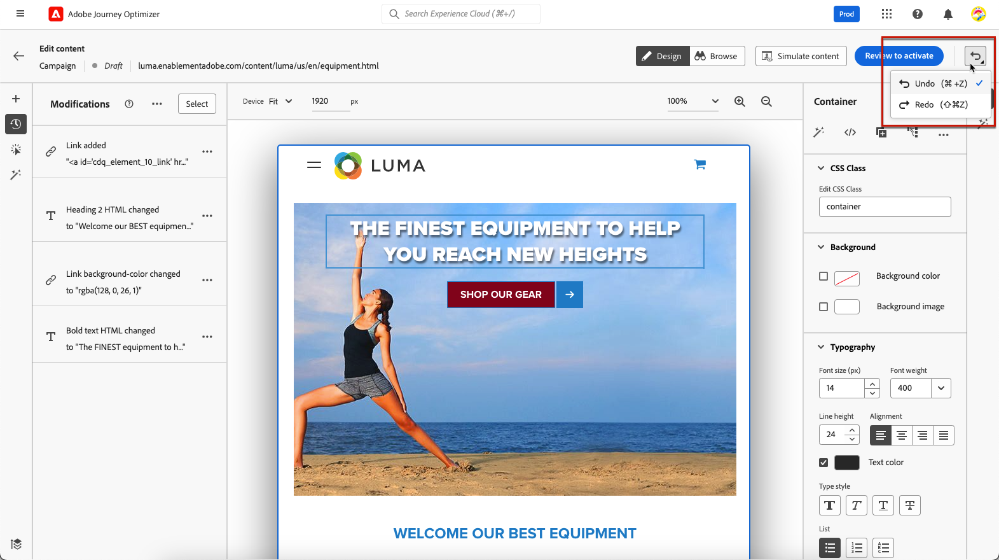

# Gerenciar modificações na Web {#manage-web-modifications}

>[!CONTEXTUALHELP]
>id="ajo_web_designer_modifications"
>title="Gerenciar facilmente todas as alterações"
>abstract="Usando esse painel, você pode navegar e gerenciar todos os ajustes e estilos adicionados à sua página da Web."

É possível gerenciar facilmente todos os componentes, ajustes e estilos adicionados à página da Web. Você também pode adicionar modificações diretamente no painel dedicado.

## Trabalhar com o painel Modificações {#use-modifications-pane}

1. Selecione o ícone **[!UICONTROL Modificações]** para exibir o painel correspondente à esquerda.

   

1. Você pode revisar cada uma das alterações feitas na página.

1. Selecione uma modificação indesejada e clique na opção **[!UICONTROL Excluir modificação]** do botão **[!UICONTROL Mais ações]** para removê-la.

   

   >[!CAUTION]
   >
   >Continue com cuidado ao excluir uma ação, pois ela pode afetar as ações subsequentes.

1. Para excluir várias modificações ao mesmo tempo, clique no botão **[!UICONTROL Selecionar]** na parte superior do painel **[!UICONTROL Modificações]**, verifique as modificações de sua escolha e clique no ícone **[!UICONTROL Excluir]**.

   

1. Use o botão **[!UICONTROL Mais ações]** na parte superior do painel **[!UICONTROL Modificações]** para excluir todas as modificações de uma só vez.

   

1. Você também pode excluir somente as modificações inválidas, o que significa que as alterações foram substituídas por outras alterações. Por exemplo, se você modificar a cor de um texto e, em seguida, excluir esse texto, a modificação de cor se tornará inválida, pois o texto não existe mais.

1. Você pode cancelar e refazer ações usando o botão **[!UICONTROL Desfazer/Refazer]** na parte superior direita da tela.

   

   Clique e mantenha pressionado o botão para alternar entre as opções **[!UICONTROL Desfazer]** e **[!UICONTROL Refazer]**. Em seguida, clique no próprio botão para aplicar a ação desejada.

## Adicionar modificações do painel dedicado {#add-modifications}

Ao editar uma página usando o web designer, você pode adicionar novas alterações ao seu conteúdo diretamente do painel **[!UICONTROL Modificações]** - sem a necessidade de selecionar um componente e editá-lo na interface do web designer. Siga as etapas abaixo.

1. No painel **[!UICONTROL Modificações]**, clique no botão **[!UICONTROL Mais ações]**.

1. Selecione **[!UICONTROL Adicionar uma modificação]**.

   

1. Selecione o tipo de modificação:

   * **[!UICONTROL Seletor de CSS]** - [Saiba mais](#css-selector)
   * **[!UICONTROL Página`<Head>`]** - [Saiba mais](#page-head)

1. Insira seu conteúdo e **[!UICONTROL Salve]** suas alterações.

1. Clique no botão **[!UICONTROL Mais ações]** ao lado da sua modificação e selecione **[!UICONTROL Informações]** para exibir seus detalhes.

   

### Seletor de CSS {#css-selector}

Para adicionar uma modificação de tipo do **Seletor de CSS**, siga as etapas abaixo.

1. Selecione **[!UICONTROL Seletor de CSS]** como o tipo de modificação.

1. O campo **[!UICONTROL Seletor de Elemento CSS]** ajuda a localizar e selecionar os elementos de HTML (ou nós na árvore DOM) aos quais você deseja aplicar as alterações. <!--specify the desired CSS element that you want to modify.-->

   

1. Selecione um tipo de ação (**[!UICONTROL Definir Conteúdo]** ou **[!UICONTROL Definir Atributo]**) e preencha as informações/o conteúdo necessários.

   * **[!UICONTROL Definir conteúdo]**: especifique o conteúdo que entra no elemento identificado pelo campo **[!UICONTROL Seletor de Elemento CSS]**.

   * **[!UICONTROL Definir Atributo]**: especifique um atributo a ser associado ao seletor de CSS atual para que esse seletor possa ser identificado também por esse atributo. Para fazer isso, insira um nome no campo **[!UICONTROL Nome do atributo]** e um valor no campo **[!UICONTROL Conteúdo]**. Se o atributo já existir, o valor será atualizado; caso contrário, um novo atributo será adicionado com o nome e o valor especificados.

     

### Página `<head>` {#page-head}

>[!CONTEXTUALHELP]
>id="ajo_web_designer_head"
>title="Adicionar código personalizado"
>abstract="O elemento HEAD é um container de metadados que é inserido entre a tag HTML e a tag BODY. Adicionar apenas elementos SCRIPT e STYLE. Adicionar tags DIV e outros elementos pode fazer com que os elementos HEAD restantes sejam exibidos em BODY."

Você pode adicionar um código personalizado usando o tipo de modificação **[!UICONTROL Página`<head>`]**.

O elemento `<head>` é um contêiner de metadados (dados sobre dados) e é colocado entre a marca `<html>` e a marca `<body>`. Nesse caso, o código não aguarda os eventos body ou page-load; ele é executado no início do carregamento da página.

O elemento `<head>` é usado com frequência para adicionar código JavaScript ou CSS à parte superior da página. Os seletores para ações visuais subsequentes dependem dos elementos de HTML adicionados nessa guia.

Para adicionar uma modificação de tipo de **Página`<head>`**, siga as etapas abaixo.

1. Selecione **[!UICONTROL Página`<head>`]** como o tipo de modificação.

   

1. Adicione seu código personalizado na caixa **[!UICONTROL Conteúdo]**.

   >[!CAUTION]
   >
   >Você só pode adicionar elementos `<script>` e `<style>` à seção `<head>`. Adicionar `<div>` marcas e outros elementos pode fazer com que os `<head>` elementos restantes apareçam em `<body>`.

1. Clique no botão **[!UICONTROL Opções de edição avançadas]**. O editor de personalização é aberto.

   

   Você pode aproveitar o editor de personalização do [!DNL Journey Optimizer] com todos os seus recursos de personalização e criação. [Saiba mais](../personalization/personalization-build-expressions.md)

#### Exemplos de código personalizado {#custom-code-examples}

Você pode usar o tipo de modificação **[!UICONTROL Página`<head>`]** para:

* Use o JavaScript em linha ou vincule a um arquivo externo do JavaScript.

  Por exemplo, para alterar a cor de um elemento:

  ```
  <script type="text/javascript">
  document.getElementById("element_id").style.color = "blue";
  </script>
  ```

* Configure um estilo em linha ou um link para uma folha de estilos externa.

  Por exemplo, para definir uma classe para um elemento de sobreposição:

  ```
  <style>
  .overlay
  { position: absolute; top:0; left: 0; right: 0; bottom: 0; background: red; }
  </style>
  ```

#### Práticas recomendadas do código personalizado {#custom-code-best-practices}

+++ **Sempre envolver o código personalizado em um elemento.**

Por exemplo:

```
<script>
// Code goes here
</script>
```

Caso alguma modificação seja necessária, faça alterações dentro desse contêiner.

Se você não precisar mais do código personalizado, basta deixar este container vazio, mas não o remova. Isso garante que outras modificações na experiência não sejam afetadas.

+++

+++ **Não executar ações document.write em scripts de código personalizados.**

Os scripts são executados de forma assíncrona. Isso frequentemente faz com que as ações document.write apareçam no lugar errado na página. Não é recomendado usar document.write em scripts criados no código personalizado.

+++

+++ **Se você criar um elemento e depois modificá-lo, não exclua o elemento original.**

Cada alteração cria um novo elemento no painel **[!UICONTROL Modificações]**. Como a segunda ação modifica o Elemento 1, se você o excluir, essa ação não terá mais nada para modificar, e a alteração não funcionará mais.

+++

+++ **Tenha cuidado ao usar o tipo de modificação**[!UICONTROL  Página `<head>`]**para duas campanhas que afetam a mesma URL.**

Se você usar o tipo de modificação **[!UICONTROL Página`<head>`]** para duas campanhas que afetam a mesma URL, a JavaScript será inserida na página pelas duas campanhas. [!DNL Journey Optimizer] determina automaticamente a ordem do conteúdo entregue. Certifique-se de que o código não dependa da disposição. Cabe a você garantir que não haja conflitos no código.

+++
