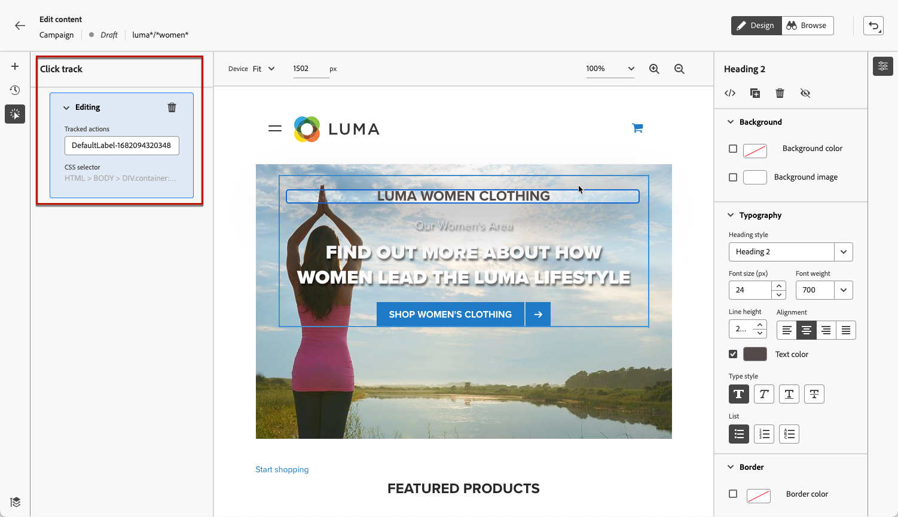

# Monitorar suas campanhas da Web {#monitor-web-experiences}

>[!BEGINSHADEBOX]

**Nesta página:** saiba como monitorar suas experiências da Web ao vivo no Adobe Journey Optimizer verificando os relatórios da Web e configurando o rastreamento de cliques em elementos específicos da página.

>[!ENDSHADEBOX]

## Verifique os relatórios da Web {#check-web-reports}

Assim que sua experiência online estiver online, você poderá verificar a guia **[!UICONTROL Web]** do [relatório de Jornada](../reports/journey-global-report-cja-web.md) e do [relatório de Campanha](../reports/campaign-global-report-cja-web.md) para comparar elementos, como o número de impressões, a taxa de cliques e o número de compromissos, com sua página da Web.

<!--You can check the **[!UICONTROL Web]** tab of the campaign reports. Learn more about the campaign web [live report](../reports/campaign-live-report.md#web-tab) and [global report](../reports/campaign-global-report-cja.md#web).-->

Para melhorar ainda mais o monitoramento da experiência online, você também pode rastrear os cliques em qualquer elemento específico do site. Isso permite exibir o número de cliques nesse elemento nos relatórios da Web. [Saiba como](#use-click-tracing)

## Usar o rastreamento de cliques {#use-click-tracking}

O web designer permite selecionar qualquer elemento do site e rastrear os cliques nesse elemento.

Essas informações podem ser úteis para melhorar a experiência dos usuários do site. Por exemplo, se os [relatórios da Web](../reports/campaign-global-report-cja-web.md) mostrarem que muitos usuários clicam em um elemento que não é realmente clicável, talvez você queira adicionar um link a esse elemento.

1. Selecione um elemento na página e escolha **[!UICONTROL Clique em rastrear elemento]** no menu contextual.

   

   >[!NOTE]
   >
   >Qualquer item, clicável ou não, pode ser selecionado.

1. A ação rastreada correspondente é exibida automaticamente no painel **[!UICONTROL Clique em rastrear]**, à esquerda.

   

1. Adicione um rótulo significativo para gerenciar todos os elementos rastreados e encontrá-los facilmente nos relatórios. O campo **[!UICONTROL Seletor de CSS]** mostra informações para localizar o elemento selecionado.

1. Repita as etapas acima para selecionar quantos outros elementos forem necessários para o rastreamento de cliques. As ações correspondentes são todas listadas no painel esquerdo.

   

1. Para remover o rastreamento de cliques em um elemento, selecione o ícone excluir correspondente.

Assim que a campanha estiver online, você poderá verificar o número de cliques para cada elemento no [relatório online](../reports/campaign-live-report.md#web-tab) e no [relatório do Customer Journey Analytics](../reports/campaign-global-report-cja-web.md) da Web de campanhas.
