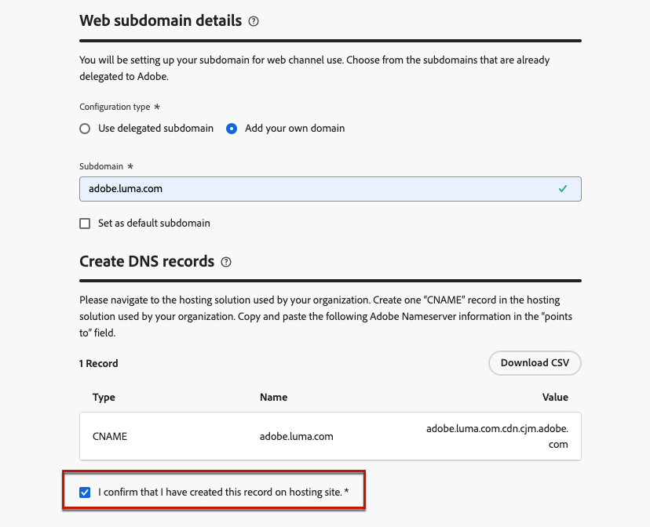

# Configurar subdomínios da Web {#web-subdomains}

>[!CONTEXTUALHELP]
>id="ajo_admin_subdomain_web_header"
>title="Delegar um subdomínio da web"
>abstract="Você configurará o subdomínio para uso do canal web. Você pode usar um subdomínio que já tenha sido delegado à Adobe ou configurar outro subdomínio."

>[!CONTEXTUALHELP]
>id="ajo_admin_subdomain_web"
>title="Delegar um subdomínio da web"
>abstract="Se adicionar conteúdo proveniente do Adobe Experience Manager Assets às suas experiências da web, será necessário configurar o subdomínio que será usado para publicar esse conteúdo. Selecione entre os subdomínios já delegados à Adobe ou configure um novo subdomínio."

>[!CONTEXTUALHELP]
>id="ajo_admin_subdomain_web_default"
>title="Definir um subdomínio da web"
>abstract="Selecione um subdomínio da lista de subdomínios delegados à Adobe. É possível definir esse subdomínio da web como o padrão, mas apenas um subdomínio padrão pode ser definido de cada vez."

Ao criar experiências na Web, se você adicionar conteúdo proveniente da biblioteca do [Adobe Experience Manager Assets](../content-management/assets.md), será necessário configurar o subdomínio que será usado para publicar esse conteúdo.

Você pode usar um subdomínio que já foi delegado ao Adobe ou configurar outro subdomínio. Saiba mais sobre como delegar subdomínios ao Adobe em [esta seção](../configuration/delegate-subdomain.md).

>[!CAUTION]
>
>A configuração do subdomínio da Web é comum a todos os ambientes. Portanto:
>
>* Para acessar e editar subdomínios da Web, você deve ter a permissão **[!UICONTROL Gerenciar Subdomínios da Web]** na sandbox de produção.
>
> * Qualquer modificação em um subdomínio da Web também afetará as sandboxes de produção.

Você pode criar vários subdomínios da Web, mas somente o subdomínio **padrão** será usado. Você pode alterar o subdomínio padrão da Web, mas somente um pode ser usado de cada vez.

## Acessar e gerenciar subdomínios da Web {#access-web-subdomains}

1. Vá para o menu **[!UICONTROL Administração]** > **[!UICONTROL Canais]** e selecione **[!UICONTROL Configurações da Web]** > **[!UICONTROL Subdomínios da Web]**. Todos os subdomínios configurados com a sandbox atual são exibidos.

   

1. Você pode filtrar pelo usuário que delegou cada subdomínio ou um dos status de delegação (**[!UICONTROL Rascunho]**, **[!UICONTROL Processamento]**, **[!UICONTROL Sucesso]** ou **[!UICONTROL Falha]**).

   

1. O selo **[!UICONTROL Padrão]** é exibido ao lado do subdomínio que está sendo usado como padrão no momento. Para alterar o subdomínio padrão, selecione **[!UICONTROL Definir como padrão]** no botão **[!UICONTROL Mais ações]** ao lado do subdomínio desejado.

   

   >[!NOTE]
   >
   >Você pode alterar o subdomínio padrão da Web, mas somente um pode ser usado de cada vez.

## Usar um subdomínio existente {#web-use-existing-subdomain}

Para usar um subdomínio que já está delegado ao Adobe, siga as etapas abaixo.

1. Acesse o menu **[!UICONTROL Administração]** > **[!UICONTROL Canais]** e selecione **[!UICONTROL Configurações da Web]** > **[!UICONTROL Subdomínios da Web]**.

1. Clique em **[!UICONTROL Configurar subdomínio]**.

1. Selecione a opção **[!UICONTROL Usar subdomínio delegado]** da seção **[!UICONTROL Tipo de configuração]** e escolha um subdomínio delegado na lista.

   

   >[!NOTE]
   >
   >Não é possível selecionar um subdomínio que já esteja sendo usado como subdomínio da Web.

1. O prefixo que será exibido no URL da Web é adicionado automaticamente. Você não pode alterá-la.

1. Para definir esse subdomínio como padrão, selecione a opção correspondente.

   

   >[!NOTE]
   >
   >Somente o subdomínio **padrão** será usado.

1. Clique em **[!UICONTROL Enviar]**. O subdomínio obtém o status de **[!UICONTROL Sucesso]**. Ele está pronto para ser usado nas experiências da Web.

   >[!NOTE]
   >
   >Em ocasiões muito raras, uma configuração de subdomínio pode falhar. Nesse caso, você pode excluir o subdomínio **[!UICONTROL Com Falha]** para limpar a lista usando o botão **[!UICONTROL Excluir]** do ícone **[!UICONTROL Mais ações]**.

## Configurar um novo subdomínio {#web-configure-new-subdomain}

>[!CONTEXTUALHELP]
>id="ajo_admin_web_subdomain_dns"
>title="Gerar o registro DNS correspondente"
>abstract="Para configurar um novo subdomínio da web, é necessário copiar as informações do servidor de nomes da Adobe exibidas na interface do Journey Optimizer e colá-las em sua solução de hospedagem de domínio, a fim de gerar o registro DNS correspondente. Depois que as verificações forem bem-sucedidas, o subdomínio estará pronto para publicar o conteúdo proveniente da biblioteca do Adobe Experience Manager Assets."

Para configurar um novo subdomínio, siga as etapas abaixo.

>[!NOTE]
>
>Por padrão, o [!DNL Journey Optimizer] permite delegar até 10 subdomínios no total (abrangendo canais de email e da Web). No entanto, dependendo do contrato de licença, talvez você possa delegar até 100 subdomínios. Fale com seu contato na Adobe para saber mais sobre o número de subdomínios aos quais você tem direito.

1. Acesse o menu **[!UICONTROL Administração]** > **[!UICONTROL Canais]** e selecione **[!UICONTROL Configurações da Web]** > **[!UICONTROL Subdomínios da Web]**.

1. Clique em **[!UICONTROL Configurar subdomínio]**.

1. Selecione **[!UICONTROL Adicionar seu próprio domínio]** na seção **[!UICONTROL Tipo de configuração]**.

1. Especifique o subdomínio que será delegado.

   >[!CAUTION]
   >
   >Não é possível usar um subdomínio da Web existente.
   >
   >Letras maiúsculas não são permitidas em subdomínios.

   

   Não é permitido delegar um subdomínio inválido a Adobe. Insira um subdomínio válido de propriedade de sua organização, como marketing.yourcompany.com.

   >[!NOTE]
   >
   >Subdomínios de vários níveis (do mesmo domínio pai) são suportados. Por exemplo, você pode usar &quot;web.marketing.yourcompany.com&quot;.

1. Para definir esse subdomínio como padrão, selecione a opção correspondente.

   >[!NOTE]
   >
   >Somente o subdomínio **padrão** será usado.

1. O registro a ser colocado em seus servidores DNS é exibido. Copie esse registro ou baixe um arquivo CSV e navegue até a solução de hospedagem de domínio para gerar o registro DNS correspondente.

1. Verifique se o registro DNS foi gerado na solução de hospedagem de domínio. Se tudo estiver configurado corretamente, marque a caixa &quot;Eu confirmo...&quot; e clique em **[!UICONTROL Enviar]**.

   

   >[!NOTE]
   >
   >Ao configurar um novo subdomínio da Web, ele sempre apontará para um registro CNAME.

1. Depois que a delegação de subdomínio for enviada, o subdomínio será exibido na lista com o status **[!UICONTROL Processando]**. Para obter mais informações sobre os status dos subdomínios, consulte [esta seção](../configuration/about-subdomain-delegation.md#access-delegated-subdomains).<!--Same statuses?-->

   >[!NOTE]
   >
   >Antes de poder usar esse subdomínio para enviar mensagens da Web, você deve aguardar até que o Adobe execute as verificações necessárias, que podem levar até 4 horas.

1. Depois que as verificações forem bem-sucedidas, o subdomínio obterá o status **[!UICONTROL Success]**. Ele está pronto para ser usado para criar configurações de canal da Web.

   Observe que o subdomínio será marcado como **[!UICONTROL Falha]** se você não criar o registro de validação na solução de hospedagem.

<!--
Only a subdomain with the **[!UICONTROL Success]** status can be set as default.
You cannot delete a subdomain with the **[!UICONTROL Processing]** status.
-->
