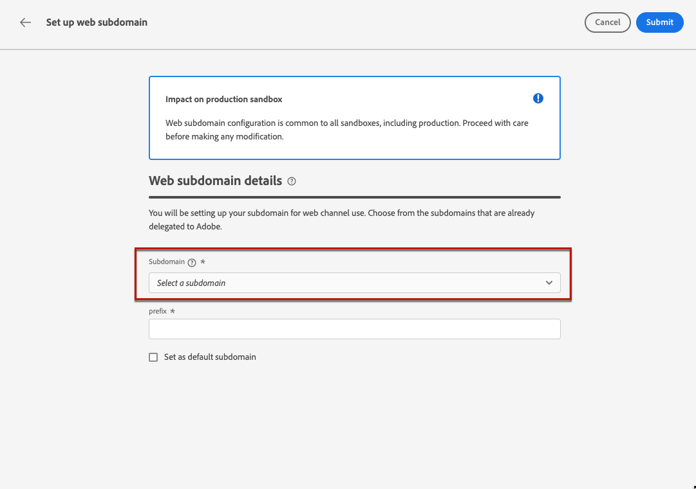

# Configurar subdomínios da Web {#web-subdomains}

>[!CONTEXTUALHELP]
>id="ajo_admin_subdomain_web_header"
>title="Delegar um subdomínio da web"
>abstract="Você configurará o subdomínio para uso do canal web. Escolha entre os subdomínios que já foram delegados à Adobe."

>[!CONTEXTUALHELP]
>id="ajo_admin_subdomain_web"
>title="Delegar um subdomínio da web"
>abstract="Se adicionar conteúdo proveniente do Adobe Experience Manager Assets Essentials às suas experiências da web, será necessário configurar o subdomínio que será usado para publicar esse conteúdo. Selecione entre os subdomínios já delegados à Adobe."

>[!CONTEXTUALHELP]
>id="ajo_admin_subdomain_web_default"
>title="Definir um subdomínio da web"
>abstract="Selecione um subdomínio da lista de subdomínios delegados à Adobe. É possível definir esse subdomínio da web como o padrão, mas apenas um subdomínio padrão pode ser definido de cada vez."

Ao criar experiências na Web, se você adicionar conteúdo proveniente da [Adobe Experience Manager Assets Essentials](../email/assets-essentials.md) , você deve configurar o subdomínio que será usado para publicar esse conteúdo.

Para fazer isso, você deve escolher na lista de subdomínios já delegados ao Adobe. Saiba mais sobre como delegar subdomínios para o Adobe em [nesta seção](../configuration/delegate-subdomain.md).

>[!CAUTION]
>
>A configuração do subdomínio da Web é comum a todos os ambientes. Portanto:
>
>* Para acessar e editar subdomínios da Web, você deve ter o **[!UICONTROL Gerenciar subdomínios da Web]** permissão na sandbox de produção.
>
> * Qualquer modificação em um subdomínio da Web também afetará as sandboxes de produção.

Você pode criar vários subdomínios da Web, mas somente o **padrão** subdomínio será usado. Você pode alterar o subdomínio padrão da Web, mas somente um pode ser usado de cada vez.

1. Acesse o **[!UICONTROL Administração]** > **[!UICONTROL Canais]** e selecione **[!UICONTROL Configuração da Web]** > **[!UICONTROL Subdomínios da Web]**.

   

1. Clique em **[!UICONTROL Configurar subdomínio]**.

1. Selecione um subdomínio delegado na lista.

   

   >[!NOTE]
   >
   >Não é possível selecionar um subdomínio que já esteja sendo usado como subdomínio da Web.

1. O prefixo que será exibido no URL da Web é adicionado automaticamente. Você não pode alterá-la.

1. Para definir esse subdomínio como padrão, selecione a opção correspondente.

   

   >[!NOTE]
   >
   >Somente o **padrão** subdomínio será usado.

1. Clique em **[!UICONTROL Enviar]**. O subdomínio obtém o **[!UICONTROL Sucesso]** status. Ele está pronto para ser usado nas experiências da Web.

   >[!NOTE]
   >
   >Em ocasiões muito raras, uma configuração de subdomínio pode falhar. Nesse caso, você pode excluir o **[!UICONTROL Failed]** subdomínio para limpar a lista usando o **[!UICONTROL Excluir]** botão no **[!UICONTROL Mais ações]** ícone.

1. A variável **[!UICONTROL Padrão]** O selo é exibido ao lado do subdomínio usado atualmente como padrão. Para alterar o subdomínio padrão, selecione **[!UICONTROL Definir como padrão]** do **[!UICONTROL Mais ações]** botão ao lado do subdomínio desejado.

   

   >[!NOTE]
   >
   >Você pode alterar o subdomínio padrão da Web, mas somente um pode ser usado de cada vez.

   <!--Only a subdomain with the **[!UICONTROL Success]** status can be set as default.

    You cannot delete a subdomain with the **[!UICONTROL Processing]** status.-->
