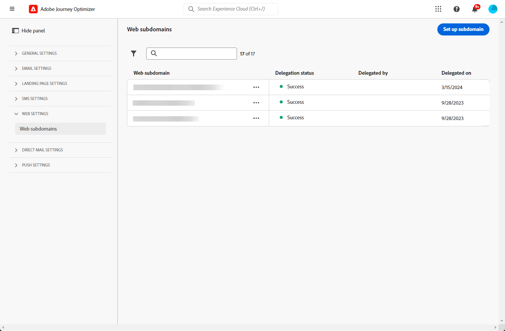
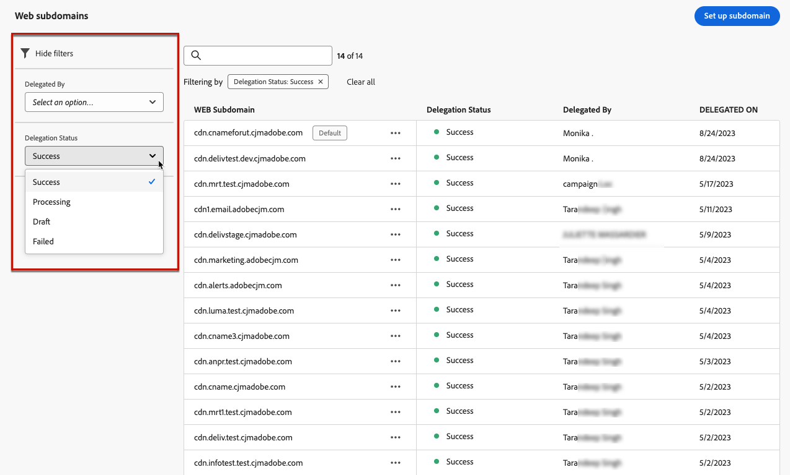
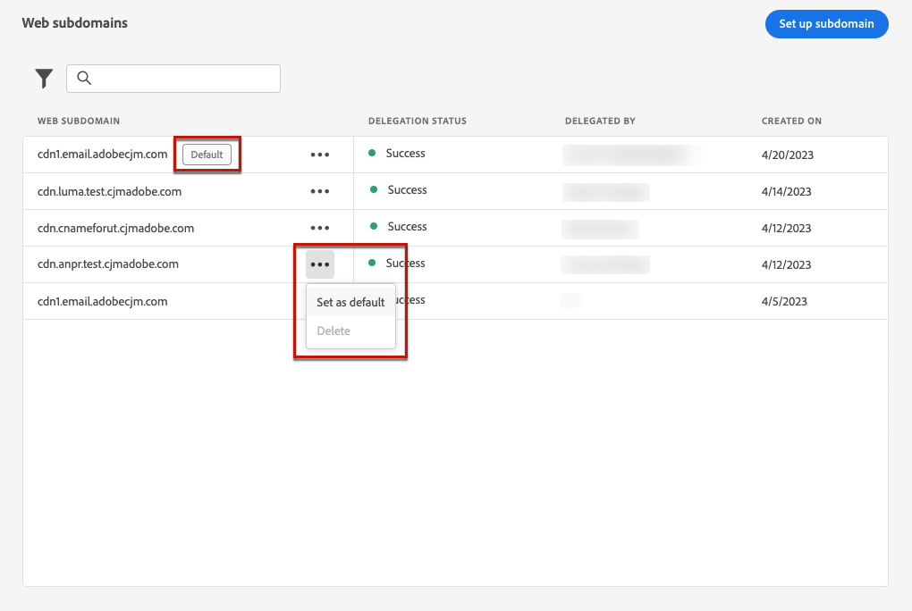
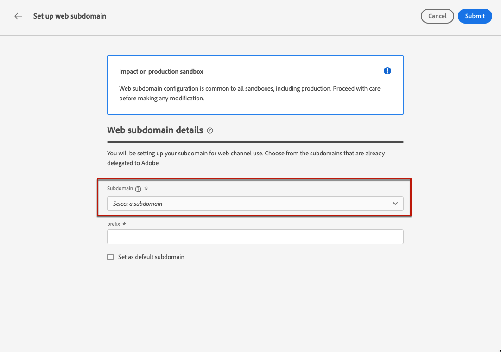
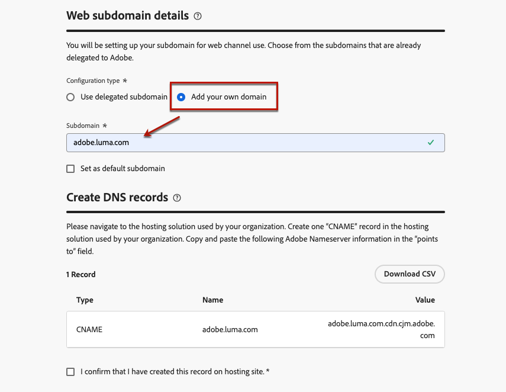

# Configurar subdomínios da Web {#web-subdomains}

>[!CONTEXTUALHELP]
>id="ajo_admin_subdomain_web_header"
>title="Delegar um subdomínio da Web"
>abstract="Você configurará o subdomínio para uso do canal Web. Você pode usar um subdomínio que já foi delegado à Adobe ou configurar outro subdomínio."

>[!CONTEXTUALHELP]
>id="ajo_admin_subdomain_web"
>title="Delegar um subdomínio da Web"
>abstract="Se você adicionar conteúdo proveniente da Adobe Experience Manager Assets às suas experiências da Web, é necessário configurar o subdomínio que será usado para publicar esse conteúdo. Selecione entre os subdomínios já delegados à Adobe ou configure um novo subdomínio."

>[!CONTEXTUALHELP]
>id="ajo_admin_subdomain_web_default"
>title="Definir um subdomínio da Web"
>abstract="Selecione um subdomínio na lista de subdomínios delegados à Adobe. Você pode definir esse subdomínio da Web como padrão, mas somente um subdomínio padrão pode ser usado de cada vez."

## Introdução a subdomínios da Web {#gs-web-subdomains}

Ao criar experiências na Web, se você adicionar conteúdo proveniente da biblioteca do [Adobe Experience Manager Assets](../integrations/assets.md), será necessário configurar o subdomínio que será usado para publicar esse conteúdo.

Você pode usar um subdomínio que já foi delegado à Adobe ou configurar outro subdomínio. Saiba mais sobre como delegar subdomínios à Adobe em [esta seção](../configuration/delegate-subdomain.md).

A configuração do subdomínio da Web é **comum a todos os ambientes**. Portanto:

* Para acessar e editar subdomínios da Web, você deve ter a permissão **[!UICONTROL Gerenciar Subdomínios da Web]** na sandbox de produção.

* Qualquer modificação em um subdomínio da Web também afetará as sandboxes de produção.

Você pode criar vários subdomínios da Web, mas somente o subdomínio **padrão** será usado. Você pode alterar o subdomínio padrão da Web, mas somente um pode ser usado de cada vez.

## Acessar e gerenciar subdomínios da Web {#access-web-subdomains}

Para acessar subdomínios para experiências da Web, siga estas etapas:

1. Navegue até o menu **[!UICONTROL Administração]** > **[!UICONTROL Canais]** e selecione **[!UICONTROL Configurações da Web]** > **[!UICONTROL Subdomínios da Web]**. Todos os subdomínios configurados com a sandbox atual são exibidos.

   

1. Você pode filtrar pelo usuário que delegou cada subdomínio ou um dos status de delegação (**[!UICONTROL Rascunho]**, **[!UICONTROL Processamento]**, **[!UICONTROL Sucesso]** ou **[!UICONTROL Falha]**).

   

1. O selo **[!UICONTROL Padrão]** é exibido ao lado do subdomínio que está sendo usado como padrão no momento. Para alterar o subdomínio padrão, selecione **[!UICONTROL Definir como padrão]** no botão **[!UICONTROL Mais ações]** ao lado do subdomínio desejado.

   

   Você pode alterar o subdomínio padrão da Web, mas somente um pode ser usado de cada vez.

## Usar um subdomínio existente {#web-use-existing-subdomain}

Para usar um subdomínio que já está delegado à Adobe, siga as etapas abaixo:

1. Acesse o menu **[!UICONTROL Administração]** > **[!UICONTROL Canais]** e selecione **[!UICONTROL Configurações da Web]** > **[!UICONTROL Subdomínios da Web]**.

1. Clique em **[!UICONTROL Configurar subdomínio]**.

1. Selecione a opção **[!UICONTROL Usar subdomínio delegado]** da seção **[!UICONTROL Tipo de configuração]** e escolha um subdomínio delegado na lista.

   

   >[!NOTE]
   >
   >Não é possível selecionar um subdomínio que já esteja sendo usado como subdomínio da Web.

1. O prefixo que será exibido no URL da Web é adicionado automaticamente. Você não pode alterá-la.

1. Para definir esse subdomínio como padrão, selecione a opção correspondente.

   

   Somente o subdomínio **padrão** será usado.

1. Clique em **[!UICONTROL Enviar]**. O subdomínio obtém o status de **[!UICONTROL Sucesso]**. Ele está pronto para ser usado nas experiências da Web.

   Em ocasiões muito raras, uma configuração de subdomínio pode falhar. Nesse caso, você pode excluir o subdomínio **[!UICONTROL Com Falha]** para limpar a lista usando o botão **[!UICONTROL Excluir]** do ícone **[!UICONTROL Mais ações]**.

## Configurar um novo subdomínio {#web-configure-new-subdomain}

>[!CONTEXTUALHELP]
>id="ajo_admin_web_subdomain_dns"
>title="Gerar o registro DNS correspondente"
>abstract="Para configurar um novo subdomínio da Web, você precisa copiar as informações do servidor de nomes do Adobe exibidas na interface do Journey Optimizer e colá-las na solução de hospedagem de domínio para gerar o registro DNS correspondente. Depois que as verificações forem bem-sucedidas, o subdomínio estará pronto para ser usado para publicar o conteúdo proveniente da biblioteca do Adobe Experience Manager Assets."

Por padrão, o [!DNL Journey Optimizer] permite delegar **até 10 subdomínios** no total (abrangendo canais de email e da Web). No entanto, dependendo do contrato de licença, talvez você possa delegar até 100 subdomínios. Entre em contato com o contato do Adobe para saber mais sobre o número de subdomínios aos quais você tem direito.

Para configurar um novo subdomínio, siga as etapas abaixo:

1. Acesse o menu **[!UICONTROL Administração]** > **[!UICONTROL Canais]** e selecione **[!UICONTROL Configurações da Web]** > **[!UICONTROL Subdomínios da Web]**.

1. Clique em **[!UICONTROL Configurar subdomínio]**.

1. Selecione **[!UICONTROL Adicionar seu próprio domínio]** na seção **[!UICONTROL Tipo de configuração]**.

1. Especifique o subdomínio que será delegado.

   >[!CAUTION]
   >
   >* Não é possível usar um subdomínio da Web existente.
   >
   >* Letras maiúsculas não são permitidas em subdomínios.

   

   Não é permitido delegar um subdomínio inválido à Adobe. Insira um subdomínio válido de propriedade de sua organização, como marketing.yourcompany.com.

   Subdomínios de vários níveis (do mesmo domínio pai) são suportados. Por exemplo, você pode usar &quot;web.marketing.yourcompany.com&quot;.

1. Para definir esse subdomínio como padrão, selecione a opção correspondente.

   >[!NOTE]
   >
   >Somente o subdomínio **padrão** será usado.

1. O registro a ser colocado em seus servidores DNS é exibido. Copie esse registro ou baixe um arquivo CSV e navegue até a solução de hospedagem de domínio para gerar o registro DNS correspondente.

1. Verifique se o registro DNS foi gerado na solução de hospedagem de domínio. Se tudo estiver configurado corretamente, marque a caixa &quot;Eu confirmo...&quot; e clique em **[!UICONTROL Enviar]**.

   

   Ao configurar um novo subdomínio da Web, ele sempre aponta para um registro CNAME.

1. Depois que a delegação de subdomínio for enviada, o subdomínio será exibido na lista com o status **[!UICONTROL Processando]**. Para obter mais informações sobre os status dos subdomínios, consulte [esta seção](../configuration/delegate-subdomain.md#access-delegated-subdomains).<!--Same statuses?-->

   Antes de poder usar esse subdomínio para enviar mensagens da Web, você deve aguardar até que o Adobe execute as verificações necessárias, que podem levar **até 4 horas**.

1. Depois que as verificações forem bem-sucedidas, o subdomínio obterá o status **[!UICONTROL Success]**. Ele está pronto para ser usado para criar configurações de canal da Web.

   Observe que o subdomínio será marcado como **[!UICONTROL Falha]** se você não criar o registro de validação na solução de hospedagem.

<!--
Only a subdomain with the **[!UICONTROL Success]** status can be set as default.
You cannot delete a subdomain with the **[!UICONTROL Processing]** status.
-->

## Cancelar delegação de um subdomínio {#undelegate-subdomain}

Se quiser desdelegar um subdomínio da Web, entre em contato com o representante da Adobe com o subdomínio que deseja desdelegar.

<!--
1. Deactivate all the channel configurations associated with the subdomain. [Learn how](../configuration/channel-surfaces.md#deactivate-a-surface)

1. Stop the active campaigns associated with the subdomains. [Learn how](../campaigns/manage-campaigns.md#stop)

1. Stop the active journeys associated with the subdomains. [Learn how](../building-journeys/end-journey.md#stop-journey)
-->

Se o subdomínio da Web era um [novo subdomínio delegado](#web-configure-new-subdomain), você pode excluir o registro DNS CNAME que criou para o subdomínio da Web da solução de hospedagem (mas não exclua o subdomínio de email original, se houver).

Depois que a solicitação for tratada pela Adobe, o domínio não delegado não será mais exibido na página de inventário do subdomínio.
