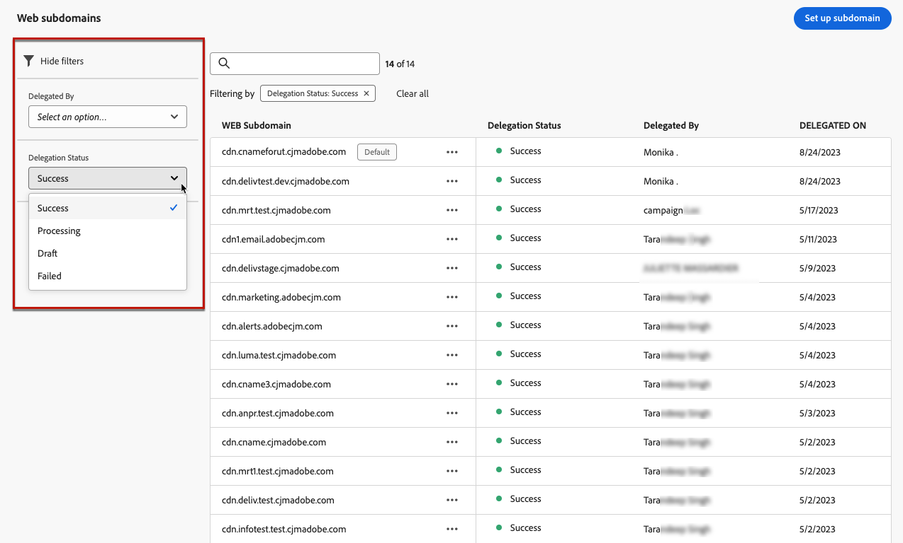

# Configurar subdomínios da Web {#web-subdomains}

>[!CONTEXTUALHELP]
>id="ajo_admin_subdomain_web_header"
>title="Delegar um subdomínio da web"
>abstract="Você configurará o subdomínio para uso do canal web. Você pode usar um subdomínio que já tenha sido delegado à Adobe ou configurar outro subdomínio."

>[!CONTEXTUALHELP]
>id="ajo_admin_subdomain_web"
>title="Delegar um subdomínio da web"
>abstract="Se adicionar conteúdo proveniente do Adobe Experience Manager Assets às suas experiências da web, será necessário configurar o subdomínio que será usado para publicar esse conteúdo. Selecione entre os subdomínios já delegados à Adobe ou configure um novo subdomínio."

>[!CONTEXTUALHELP]
>id="ajo_admin_subdomain_web_default"
>title="Definir um subdomínio da web"
>abstract="Selecione um subdomínio da lista de subdomínios delegados à Adobe. É possível definir esse subdomínio da web como o padrão, mas apenas um subdomínio padrão pode ser definido de cada vez."

## Introdução aos subdomínios da Web {#gs-web-subdomains}

Ao criar experiências na Web, se você adicionar conteúdo provenientes da [Adobe Experience Manager Assets](../integrations/assets.md) biblioteca, configure o subdomínio que será usado para publicar esse conteúdo.

Você pode usar um subdomínio já delegado a Adobe Systems ou configurar outro subdomínio. Saiba mais sobre como delegar subdomínios a Adobe Systems [nesta seção](../configuration/delegate-subdomain.md).

A configuração do subdomínio da Web é **comum a todos os ambientes**. Portanto:

* Para acessar e editar subdomínios da Web, você deve ter a permissão **[!UICONTROL Gerenciar Subdomínios da Web]** na sandbox de produção.

* Qualquer modificação em um subdomínio da Web também afetará as sandboxes de produção.

Você pode criar vários subdomínios da Web, mas somente o subdomínio **padrão** será usado. Você pode alterar o subdomínio padrão da Web, mas somente um pode ser usado de cada vez.

## Acesso e gerenciar subdomínios da Web {#access-web-subdomains}

Para acessar subdomínios para experiências da Web, siga estas etapas:

1. Navegue até o menu **[!UICONTROL Administração]** > **[!UICONTROL Canais]** e selecione **[!UICONTROL Configurações da Web]** > **[!UICONTROL Subdomínios da Web]**. Todos os subdomínios configurados com a sandbox atual são exibidos.

   

1. Você pode filtrar pelo usuário que delegou cada subdomínio ou um dos status de delegação (**[!UICONTROL Rascunho]**, **[!UICONTROL Processamento]**, **[!UICONTROL Sucesso]** ou **[!UICONTROL Falha]**).

   

1. O selo **[!UICONTROL Padrão]** é exibido ao lado do subdomínio que está sendo usado como padrão no momento. Para alterar o subdomínio padrão, selecione **[!UICONTROL Definir como padrão]** no botão **[!UICONTROL Mais ações]** ao lado do subdomínio desejado.

   

   Você pode alterar o subdomínio padrão da Web, mas somente um pode ser usado de cada vez.

## Usar um subdomínio existente {#web-use-existing-subdomain}

Para usar um subdomínio que já está delegado à Adobe, siga as etapas abaixo:

1. Acesse o menu **[!UICONTROL Administração]** > **[!UICONTROL Canais]** e selecione **[!UICONTROL Configurações da Web]** > **[!UICONTROL Subdomínios da Web]**.

1. Clique em **[!UICONTROL Configurar subdomínio]**.

1. Selecione a opção **[!UICONTROL Usar subdomínio delegado]** da seção **[!UICONTROL Tipo de configuração]** e escolha um subdomínio delegado na lista.

   

   >[!NOTE]
   >
   >Não é possível selecionar um subdomínio que já seja usado como subdomínio da Web.

1. O prefixo que será exibido na sua URL da Web é adicionado automaticamente. Não é possível alterá-lo.

1. Para definir esse subdomínio como padrão, selecione a opção correspondente.

   

   Somente o **subdomínio padrão** será usado.

1. Clique **[!UICONTROL em Enviar]**. O subdomínio obtém o **[!UICONTROL status de Sucesso]** . Ele está pronto para ser usado nas experiências da Web.

   Em ocasiões muito raras, uma configuração de subdomínio pode falhar. Nesse caso, você pode excluir o subdomínio **[!UICONTROL Com Falha]** para limpar a lista usando o botão **[!UICONTROL Excluir]** do ícone **[!UICONTROL Mais ações]**.

## Configurar um novo subdomínio {#web-configure-new-subdomain}

>[!CONTEXTUALHELP]
>id="ajo_admin_web_subdomain_dns"
>title="Gerar o registro DNS correspondente"
>abstract="Para configurar um novo subdomínio da web, é necessário copiar as informações do servidor de nomes da Adobe exibidas na interface do Journey Optimizer e colá-las em sua solução de hospedagem de domínio, a fim de gerar o registro DNS correspondente. Depois que as verificações forem bem-sucedidas, o subdomínio estará pronto para publicar o conteúdo proveniente da biblioteca do Adobe Experience Manager Assets."

Por padrão, o [!DNL Journey Optimizer] permite delegar **até 10 subdomínios** no total (abrangendo canais de email e da Web). No entanto, dependendo do contrato de licença, talvez você possa delegar até 100 subdomínios. Fale com seu contato na Adobe para saber mais sobre o número de subdomínios aos quais você tem direito.

Para configurar um novo subdomínio, siga as etapas abaixo:

1. Acesse o menu **[!UICONTROL Administração]** > **[!UICONTROL Canais]** e selecione **[!UICONTROL Configurações da Web]** > **[!UICONTROL Subdomínios da Web]**.

1. Clique em **[!UICONTROL Configurar subdomínio]**.

1. Selecione **[!UICONTROL Adicionar seu próprio domínio]** na seção **[!UICONTROL Tipo de configuração]**.

1. Especifique o subdomínio a ser delegado.

   >[!CAUTION]
   >
   >* Não é possível usar um subdomínio da Web existente.
   >
   >* Letras maiúsculas não são permitidas em subdomínios.

   

   Não é permitido delegar um subdomínio inválido para Adobe Systems. Certifique-se de inserir um subdomínio válido de sua organização, como o marketing.yourcompany.com.

   Subdomínios de vários níveis (do mesmo domínio pai) são suportados. Por exemplo, você pode usar &quot;web.marketing.yourcompany.com&quot;.

1. Para definir esse subdomínio como padrão, selecione a opção correspondente.

   >[!NOTE]
   >
   >Somente o subdomínio **padrão** será usado.

1. O registro a ser colocado em seus servidores DNS é exibido. Copie esse registro ou baixe um arquivo CSV e navegue até a solução de hospedagem de domínio para gerar o registro DNS correspondente.

1. Certifique-se de que o registro DNS tenha sido gerado em sua solução de hospedagem de domínio. Se tudo estiver configurado corretamente, marque a caixa &quot;Eu confirmo...&quot; e clique em **[!UICONTROL Enviar]**.

   

   Ao configurar um novo subdomínio da Web, ele sempre aponta para um registro CNAME.

1. Depois que a delegação de subdomínio for enviada, o subdomínio será exibido na lista com o status **[!UICONTROL Processando]**. Para obter mais informações sobre os status dos subdomínios, consulte [esta seção](../configuration/about-subdomain-delegation.md#access-delegated-subdomains).<!--Same statuses?-->

   Antes de poder usar esse subdomínio para enviar mensagens da Web, você deve aguardar até que o Adobe execute as verificações necessárias, que podem levar **até 4 horas**.

1. Depois que as verificações forem bem-sucedidas, o subdomínio obterá o status **[!UICONTROL Success]**. Ele está pronto para ser usado para criar configurações de canal da Web.

   Observe que o subdomínio será marcado como **[!UICONTROL Falha]** se você não criar o registro de validação na solução de hospedagem.

<!--
Only a subdomain with the **[!UICONTROL Success]** status can be set as default.
You cannot delete a subdomain with the **[!UICONTROL Processing]** status.
-->

## Cancelar delegação de um subdomínio {#undelegate-subdomain}

Se quiser cancelar a delegação de um subdomínio da Web, entre em contato com o representante da Adobe.

No entanto, é necessário executar várias etapas na interface do usuário antes de acessar o Adobe.

>[!NOTE]
>
>Você só pode desdelegar subdomínios com o status **[!UICONTROL Sucesso]**. Subdomínios com os status **[!UICONTROL Rascunho]** e **[!UICONTROL Falha]** podem simplesmente ser excluídos da interface do usuário.

Primeiro, execute as seguintes etapas em [!DNL Journey Optimizer]:

1. Desative todas as configurações canal associadas ao subdomínio. [Saiba como](../configuration/channel-surfaces.md#deactivate-a-surface)

<!--
1. If the web subdomain is using an email subdomain that was [already delegated](#lp-use-existing-subdomain) to Adobe, undelegate the email subdomain. [Learn how](../configuration/delegate-subdomain.md#undelegate-subdomain)-->

1. Interrupção as campanhas ativas associadas aos subdomínios. [Saiba como](../campaigns/modify-stop-campaign.md#stop)

1. Interrupção as jornadas ativas associadas aos subdomínios. [Saiba como](../building-journeys/end-journey.md#stop-journey)

1. Se o subdomínio da Web era um [novo subdomínio delegado](#web-configure-new-subdomain), remova as entradas DNS associadas a esse subdomínio.

Depois de concluir, entre em contato com o representante da Adobe com o subdomínio que você deseja cancelar a delegação.

Depois que a solicitação for tratada pela Adobe, o domínio não delegado não será mais exibido na página de inventário do subdomínio.

>[!CAUTION]
>
>Depois que um subdomínio é desdelegado:
>
>   * Não é possível reativar as configurações do canal que estavam usando esse subdomínio.
>
>   * Não é possível delegar o subdomínio exato novamente por meio da interface. Caso deseje, entre em contato com o representante da Adobe.