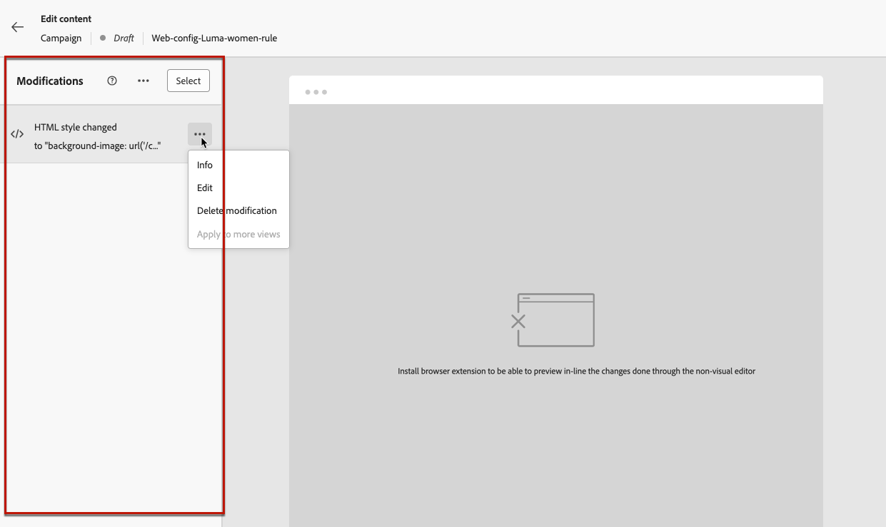

# Usar o editor não visual da Web {#web-non-visual-editor}

Além do [!DNL Journey Optimizer] visual [web designer](web-visual-editor.md), você também pode adicionar modificações às suas páginas da Web usando um **editor não visual**.

Isso pode ser útil se você não puder, ou não tiver permissão, instalar extensões de navegador, como o [Adobe Experience Cloud Visual Helper](web-prerequisites.md#visual-authoring-prerequisites), que é necessário para carregar suas páginas no web designer.

Em certos casos, também é possível usar um editor não visual para aplicar modificações em um seletor de CSS específico, sem o risco de modificar outros elementos em uma página da Web ou alterar a estrutura da página.

Para criar suas experiências da Web com o editor não visual, siga as etapas abaixo.

1. Na tela **[!UICONTROL Editar conteúdo]** da jornada ou campanha, desmarque a opção **[!UICONTROL Editor visual]**.

1. Clique em **[!UICONTROL Adicionar uma modificação]** para começar a editar o conteúdo da Web.

   

1. O editor não visual é exibido. É possível adicionar a primeira modificação usando o painel esquerdo.

   

1. Na lista suspensa, selecione o tipo de modificação.

   Dois tipos estão disponíveis. Eles vêm com opções diferentes. Consulte os links abaixo para obter mais detalhes:

   * **[!UICONTROL Seletor de CSS]** - [Saiba mais](manage-web-modifications.md#css-selector)
   * **[!UICONTROL Página`<head>`]** - [Saiba mais](manage-web-modifications.md#page-head)

1. Clique no botão **[!UICONTROL Adicionar personalização]**. O editor de personalização é aberto.

   Você pode aproveitar o editor de personalização do [!DNL Journey Optimizer] com todos os seus recursos de personalização e criação. [Saiba mais](../personalization/personalization-build-expressions.md)

1. Insira seu conteúdo e **[!UICONTROL Salve]** suas alterações.

   

1. Sua primeira modificação é exibida na parte superior do painel **[!UICONTROL Modificações]**.

   Clique no botão **[!UICONTROL Mais ações]** ao lado da sua modificação e selecione **[!UICONTROL Informações]** para exibir seus detalhes. Você também pode **[!UICONTROL Excluir a modificação]**, se necessário.

   

   >[!NOTE]
   >
   >O painel **[!UICONTROL Modificações]** é igual ao usado com o [web designer](web-visual-editor.md). Todas as ações que você pode executar com ele estão detalhadas em [esta seção](manage-web-modifications.md#use-modifications-pane).

1. Clique no botão **[!UICONTROL Adicionar]** na parte superior do painel **[!UICONTROL Modificações]** para adicionar outra modificação e repita as etapas acima.

1. Além disso, você pode selecionar qualquer elemento do site e rastrear os cliques nesse elemento. Para ativar o rastreamento de cliques e definir as ações a serem rastreadas, clique no segundo ícone no painel à esquerda, conforme mostrado abaixo:

   

   Use o botão **Adicionar Componente** para selecionar uma nova ação a ser monitorada. Saiba mais sobre o uso do rastreamento de cliques em [esta seção](monitor-web-experiences.md#use-click-tracking).

1. Clique na seta na parte superior esquerda da tela para navegar de volta para a tela de edição de jornada ou campanha. Você pode ver o número atual de alterações e adicionar mais modificações.

   

   Você também pode alternar para o web designer, se desejar. Todas as modificações serão preservadas.
