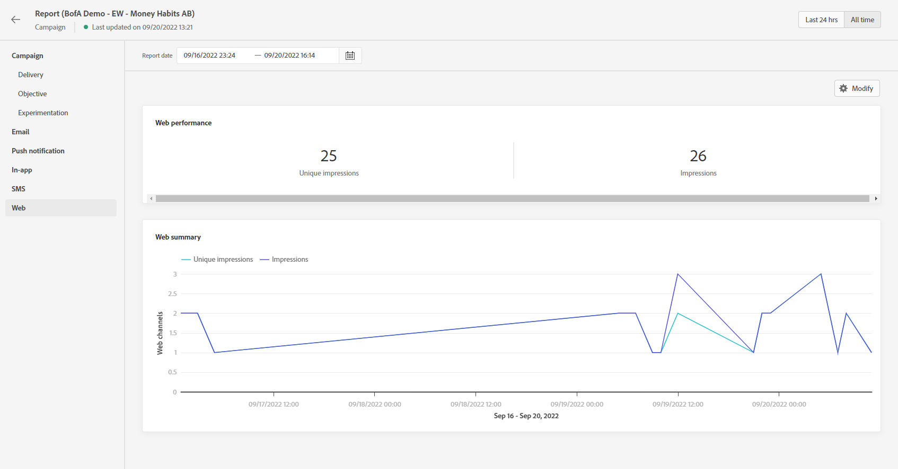

# Relatório da Web {#web-report}

O relatório da Web está disponível no relatório de Campanha.

>[!NOTE]
>
>O recurso de canal da Web está disponível no momento como um beta somente para usuários selecionados.

A página Relatório da campanha será exibida com as seguintes guias:

* [Campaign](../reports/campaign-global-report.md#campaign-live)
* [Email](../reports/campaign-global-report.md#email-live)
* [Push](../reports/campaign-global-report.md#push-live)
* [SMS](../reports/campaign-global-report.md#sms-live)
* [Web](#web-tab)

A campanha **[!UICONTROL Relatório global]** O é dividido em diferentes widgets detalhando o sucesso e os erros da campanha. Cada widget pode ser redimensionado e excluído, se necessário. Para obter mais informações sobre isso, consulte esta seção [seção](../reports/global-report.md#modify-dashboard).

Para obter uma lista detalhada de todas as métricas disponíveis no Adobe Journey Optimizer, consulte [esta página](../reports/global-report.md#list-of-components-global.md)

## Guia Web {#web-tab}

O **[!UICONTROL Desempenho da Web]** Os KPIs detalham as principais informações relativas ao envolvimento de seus visitantes com suas experiências da Web, como:

* **[!UICONTROL Impressões únicas]**: número de usuários únicos para os quais a experiência da Web foi entregue.

* **[!UICONTROL Impressões]**: número total de experiências da Web entregues a todos os usuários.

O **[!UICONTROL Resumo da Web]** gráfico mostra a evolução de suas experiências da Web (impressões e impressões exclusivas) para o período em questão.
