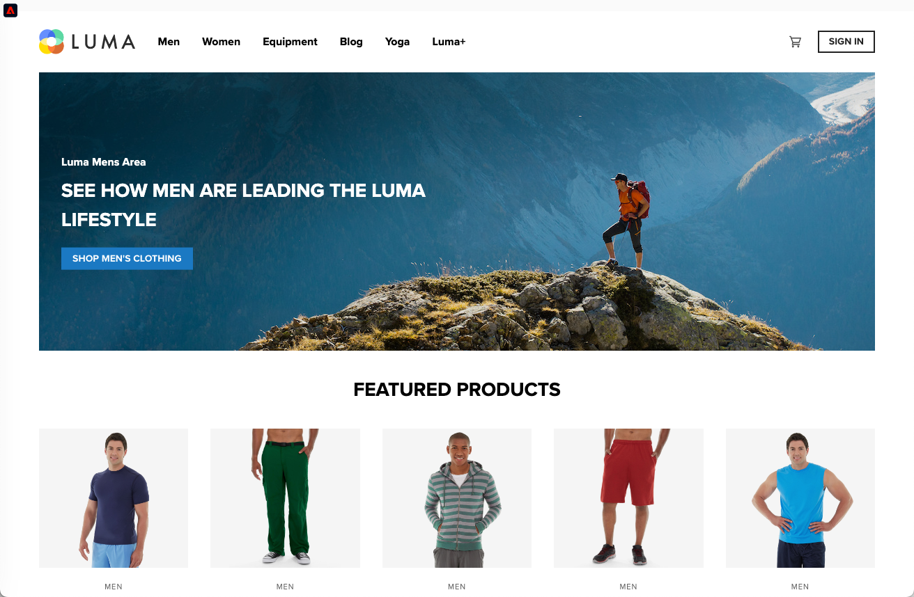

# Implementar aplicativos de página única (SPAs) {#web-spa-implementation}

O Adobe Experience Platform Web SDK fornece recursos avançados para sua empresa personalizar tecnologias de próxima geração no lado do cliente, como aplicativos de página única (SPAs).

Os sites tradicionais funcionam em modelos de navegação de &quot;página para página&quot;, conhecidos como aplicativos de várias páginas, em que os designs de site são totalmente combinados com URLs e as transições de uma página da Web para outra exigem um carregamento de página.

Aplicativos da Web modernos, como aplicativos de página única (SPAs), adotaram um modelo que impulsiona o uso rápido da renderização da interface do usuário do navegador, que geralmente é independente dos recarregamentos de página. Essas experiências podem ser acionadas por interações do cliente, como rolagens, cliques e movimentos de cursor. Conforme os paradigmas da Web moderna evoluíam, a relevância dos eventos genéricos tradicionais, como um carregamento de página, para implantar a personalização e a experimentação não funciona mais.


## Benefícios do uso do Web SDK para SPAs {#web-spa-benefits}

Estes são alguns benefícios de usar o Web SDK para seus aplicativos de página única:

* Capacidade de armazenar em cache todas as ofertas no carregamento da página para reduzir várias chamadas do servidor a uma única chamada de servidor.
* Melhore bastante a experiência do usuário no site, pois as ofertas são exibidas imediatamente pelo cache, sem o tempo de atraso introduzido pelas chamadas do servidor tradicional.
* A configuração de desenvolvedor única permite que os profissionais de marketing criem e executem atividades de personalização e experimentação por meio do editor visual da Web do Adobe Journey Optimizer em seu SPA.

## Exibições XDM e aplicativos de página única {#web-spa-xdm}

O editor da Web do Journey Optimizer aproveita um conceito chamado _visualizações_.

As exibições são um grupo lógico de elementos visuais que, juntos, constituem uma experiência de SPA. Um aplicativo de página única pode, portanto, ser considerado como uma transição entre exibições, em vez de URLs, com base nas interações do usuário. Normalmente, uma exibição pode representar um site inteiro, uma única página ou elementos visuais agrupados em uma página.

Para explicar melhor quais são as exibições, o exemplo a seguir usa um site de comércio eletrônico online hipotético.

* Depois de navegar para o site inicial, uma imagem principal promove coleções sazonais, bem como os diferentes catálogos de produtos disponíveis no site. Nesse caso, uma visualização pode ser definida para toda a tela inicial. Essa visão pode simplesmente ser chamada de &quot;inicial&quot;.

  

* À medida que o cliente se torna mais interessado nos produtos que a empresa está vendendo, ele decide clicar no link **Homens**. Assim como a página inicial, a página **Homens** inteira pode ser definida como uma exibição. Essa exibição pode se chamar &quot;homens&quot;.

  

* Como uma exibição pode ser definida como um site inteiro ou um grupo de elementos visuais em um site, os quatro produtos mostrados no site de produtos podem ser agrupados e considerados como uma exibição. Essa exibição pode se chamar &quot;produtos&quot;.

  

* Quando o cliente decide clicar no botão **TODOS OS PRODUTOS MASCULINOS** para explorar mais produtos no site, a URL do site não muda nesse caso, mas uma exibição pode ser criada aqui para representar apenas a segunda linha de produtos mostrados. O nome da exibição pode ser &quot;products-page-2&quot;.

* O cliente decide comprar alguns produtos do site e prossegue para a tela de finalização. A própria tela do carrinho pode ser associada a uma visualização chamada &quot;carrinho&quot;. Ou você pode ter uma visualização diferente na tela de check-out para lidar com os produtos recomendados abaixo.

  

O conceito de visões pode ser estendido muito além disso. Estes são apenas alguns exemplos de exibições que podem ser definidas em um site.

## Implementação de exibições XDM {#implement-xdm-views}

As exibições XDM podem ser aproveitadas no Adobe Journey Optimizer para capacitar os profissionais de marketing a executar campanhas de personalização e experimentação na Web em SPAs, por meio do editor visual da Web do Journey Optimizer.

Isso requer a execução das seguintes etapas para concluir uma configuração de desenvolvedor única:

1. Instale o [Adobe Experience Platform Web SDK](https://experienceleague.adobe.com/docs/experience-platform/edge/fundamentals/installing-the-sdk.html?lang=pt-BR){target="_blank"} e verifique a página [pré-requisitos do canal da Web](web-prerequisites.md).

2. Determine todas as exibições XDM no aplicativo de página única que deseja personalizar.

3. Após definir os modos de exibição XDM, para fornecer conteúdo a esses modos de exibição, você precisa implementar a função `sendEvent()` com `renderDecisions` definida como `true` e o modo de exibição XDM correspondente em seu aplicativo de página única. A exibição XDM deve ser passada em `xdm.web.webPageDetails.viewName`. Essa etapa permite que os profissionais de marketing descubram essas exibições no editor da Web do Journey Optimizer e apliquem modificações de conteúdo a elas:

```js
 alloy("sendEvent", {
  "renderDecisions": true,
  "xdm": {
   "web": {
    "webPageDetails": {
    "viewName":"home"
   }
  }
 }
});
```

>[!NOTE]
>
>Na primeira chamada `sendEvent()`, todas as exibições XDM que devem ser renderizadas para o usuário final serão buscadas e armazenadas em cache. As chamadas `sendEvent()` subsequentes com exibições XDM passadas serão lidas do cache e renderizadas sem uma chamada de servidor.

## Exemplos de função `sendEvent()`

Esta seção descreve dois exemplos que mostram como invocar a função `sendEvent()` no React para um SPA hipotético de comércio eletrônico.

### Exemplo 1: página inicial de teste A/B {#web-spa-sample-1}

A equipe de marketing deseja executar testes A/B em toda a página inicial.


Para executar testes A/B em todo o site inicial, `sendEvent()` deve ser chamado com o XDM `viewName` definido como `home`:

```js
function onViewChange() {

  var viewName = window.location.hash; // or use window.location.pathName if router works on path and not hash

  viewName = viewName || 'home'; // view name cannot be empty

  // Sanitize viewName to get rid of any trailing symbols derived from URL

  if (viewName.startsWith('#') || viewName.startsWith('/')) {
    viewName = viewName.substr(1);
  }

  alloy("sendEvent", {
    "renderDecisions": true,

    "xdm": {
      "web": {
        "webPageDetails": {
          "viewName":"home"
        }
      }
    }
  });
}

// react router v4

const history = syncHistoryWithStore(createBrowserHistory(), store);

history.listen(onViewChange);

// react router v3

<Router history={hashHistory} onUpdate={onViewChange} >
```

### Exemplo 2: produtos personalizados {#web-spa-sample-2}

A equipe de marketing deseja personalizar a segunda linha de produtos alterando a cor do rótulo de preço para vermelho depois que um usuário clica para ver todos os produtos masculinos.


```js
function onViewChange(viewName) {

    alloy("sendEvent", {
        "renderDecisions": true,
        "xdm": {
            "web": {
                "webPageDetails": {
                    "viewName": viewName
                }
            }
        }
    });
}

class Products extends Component {

    render() {
        return (

            <
            button type = "button"
            onClick = {
                this.handleLoadMoreClicked
            } > All Men 's Products</button>
        );
    }

    handleLoadMoreClicked() {
        var page = this.state.page + 1; // assuming page number is derived from component's state
        this.setState({
            page: page
        });
        onViewChange('PRODUCTS-PAGE-' + page);
    }
}
```
