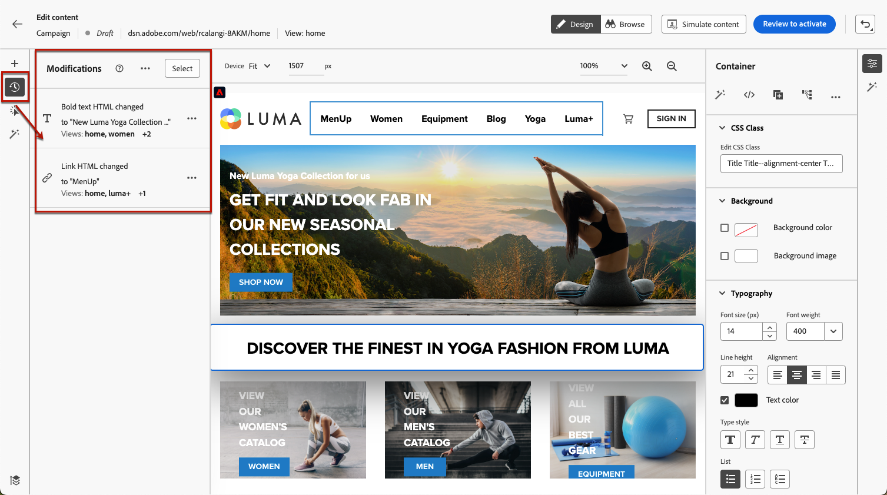

# Criar aplicativos de página única {#web-author-spas}

## Sobre visualizações {#about-views}

>[!CONTEXTUALHELP]
>id="ajo_web_designer_modifications_views"
>title="Aplicar alterações às exibições selecionadas"
>abstract="As alterações serão aplicadas somente às exibições selecionadas. As exibições podem ser descobertas usando o modo **Procurar**. Não consegue localizar uma exibição específica?"
>additional-url="https://experienceleague.adobe.com/docs/platform-learn/implement-web-sdk/overview.html?lang=pt-BR" text="Saiba mais"

**Aplicativos de página única** (SPA) agora podem ser criados no editor visual do designer da Web. Isso permite selecionar a quais **exibições** específicas você deseja aplicar as modificações da página da Web.

[Saiba como criar aplicativos de página única neste vídeo](#video)

Uma exibição pode ser definida como um site inteiro ou um grupo de elementos visuais em um site, como a página inicial, o site de produtos inteiro ou o quadro de preferências de entrega em todas as páginas de check-out.

É necessária uma configuração de desenvolvedor única para definir as exibições na implementação do SDK da Web da Adobe Experience Platform. Isso permite criar e executar campanhas da Web do Adobe Journey Optimizer no SPA.

## Definir exibições na implementação do SDK da Web {#define-views}

As exibições XDM podem ser usadas no Adobe [!DNL Journey Optimizer] para capacitar os profissionais de marketing a executar campanhas de personalização e experimentação da Web no SPA por meio do editor visual da Web. [Saiba mais](https://experienceleague.adobe.com/docs/experience-platform/edge/personalization/ajo/web-spa-implementation.html?lang=pt-BR){target="_blank"}

Para acessar e criar exibições na interface do usuário do [!DNL Journey Optimizer], siga as etapas listadas em [esta seção](https://experienceleague.adobe.com/docs/experience-platform/edge/personalization/ajo/web-spa-implementation.html#implement-xdm-views){target="_blank"}.

## Descobrir exibições no web designer {#discover-views}

Depois que a configuração do SPA for concluída na implementação do SDK da Web da Adobe Experience Platform, será necessário navegar por todas as exibições do site às quais deseja aplicar modificações. Siga as etapas abaixo.

1. [Crie uma campanha da Web](create-web.md) e acesse o [web designer](edit-web-content.md).

   A visualização em que você está no momento é exibida no canto superior esquerdo.

   

1. Mudar para o modo **[!UICONTROL Procurar]**. [Saiba mais](../web/edit-web-content.md#browse-mode)

   

1. Navegue entre as diferentes páginas do site para descobrir todas elas. O nome da exibição exibido na parte superior muda quando você passa por outra página.

   

## Aplicar modificações a outras exibições {#apply-modifications-views}

Após adicionar uma modificação enquanto estiver em uma exibição específica, você pode aplicá-la a outras exibições selecionadas. Siga as etapas abaixo.

>[!CAUTION]
>
>Se você não descobriu modos de exibição usando o modo de **[!UICONTROL Navegação]**, não poderá selecioná-los para aplicar suas modificações. [Saiba mais](#discover-views)

1. Selecione o ícone **[!UICONTROL Modificações]** para exibir o painel correspondente à esquerda.

   

1. Selecione qualquer modificação e clique no botão **[!UICONTROL Mais ações]** ao lado dela. Selecione **[!UICONTROL Aplicar a mais exibições]**.

   

1. Selecione as exibições às quais deseja aplicar as alterações.

   

1. Clique em **[!UICONTROL Aplicar]**.

1. Mude para o modo **[!UICONTROL Procurar]** para verificar se as modificações foram aplicadas nas páginas desejadas.

   

## Vídeo tutorial{#video}

Este vídeo explica como:

* Descobrir exibições do SPA usando o modo **[!UICONTROL Procurar]**
* Criar na visualização atual
* Aplicar modificações de site em várias exibições ou em todas as que foram descobertas
* Realizar ações em massa em modificações

>[!VIDEO](https://video.tv.adobe.com/v/3424536/?quality=12&learn=on)
