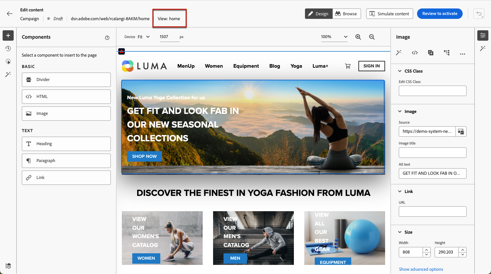

# Criar aplicativos de página única {#web-author-spas}

## Sobre visualizações {#about-views}

>[!CONTEXTUALHELP]
>id="ajo_web_designer_modifications_views"
>title="Aplicar alterações às exibições selecionadas"
>abstract="As alterações serão aplicadas somente às exibições selecionadas. As exibições podem ser descobertas usando o modo **Procurar**. Não consegue localizar uma exibição específica?"
>additional-url="https://experienceleague.adobe.com/docs/platform-learn/implement-web-sdk/overview.html?lang=pt-BR" text="Saiba mais"

**Aplicativos de página única** (SPA) agora pode ser criado no editor visual do web designer. Isso permite selecionar quais opções **visualizações** você deseja aplicar as modificações da página da Web a.

[Saiba como criar aplicativos de página única neste vídeo](#video)

Uma exibição pode ser definida como um site inteiro ou um grupo de elementos visuais de um site, como a página inicial, a totalidade do site de produtos ou o quadro de preferências de entrega em todas as páginas de check-out.

É necessária uma configuração de desenvolvedor única para definir as exibições na implementação do SDK da Web da Adobe Experience Platform. Isso permite criar e executar campanhas da Web do Adobe Journey Optimizer no SPA.

## Definir exibições na implementação do SDK da Web {#define-views}

As visualizações XDM podem ser aproveitadas no Adobe [!DNL Journey Optimizer] para capacitar profissionais de marketing a executar campanhas de personalização e experimentação na web sobre SPA por meio do editor visual da web. [Saiba mais](https://experienceleague.adobe.com/docs/experience-platform/edge/personalization/ajo/web-spa-implementation.html){target="_blank"}

Para acessar e criar exibições na variável [!DNL Journey Optimizer] de usuário, siga as etapas listadas em [nesta seção](https://experienceleague.adobe.com/docs/experience-platform/edge/personalization/ajo/web-spa-implementation.html#implement-xdm-views){target="_blank"}.

## Descobrir exibições no web designer {#discover-views}

Depois que a configuração do SPA for concluída na implementação do SDK da Web da Adobe Experience Platform, será necessário navegar por todas as exibições do site às quais deseja aplicar modificações. Siga as etapas abaixo.

1. [Criar uma campanha da Web](create-web.md) e acesse o [web designer](edit-web-content.md).

   A visualização em que você está no momento é exibida no canto superior esquerdo.

   

1. Trocar para **[!UICONTROL Procurar]** modo. [Saiba mais](../web/edit-web-content.md#browse-mode)

   

1. Navegue entre as diferentes páginas do site para descobrir todas elas. O nome da exibição exibido na parte superior muda quando você passa por outra página.

   

## Aplicar modificações a outras exibições {#apply-modifications-views}

Após adicionar uma modificação enquanto estiver em uma exibição específica, você pode aplicá-la a outras exibições selecionadas. Siga as etapas abaixo.

>[!CAUTION]
>
>Se você não tiver descoberto as exibições usando o **[!UICONTROL Procurar]** você não poderá selecioná-las para aplicar suas modificações. [Saiba mais](#discover-views)

1. Selecione o **[!UICONTROL Modificações]** ícone para exibir o painel correspondente à esquerda.

   

1. Selecione qualquer modificação e clique no botão **[!UICONTROL Mais ações]** botão ao lado dele. Selecionar **[!UICONTROL Aplicar a mais visualizações]**.

   

1. Selecione as exibições às quais deseja aplicar as alterações.

   

1. Clique em **[!UICONTROL Aplicar]**.

1. Trocar para **[!UICONTROL Procurar]** para verificar se as modificações são aplicadas nas páginas desejadas.

   

## Vídeo explicativo{#video}

Este vídeo explica como:

* Descubra visualizações do SPA usando **[!UICONTROL Procurar]** modo
* Criar na visualização atual
* Aplicar modificações de site em várias exibições ou em todas as que foram descobertas
* Realizar ações em massa em modificações

>[!VIDEO](https://video.tv.adobe.com/v/3424536/?quality=12&learn=on)
