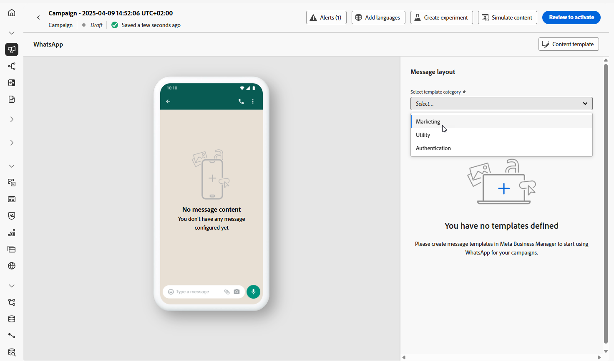
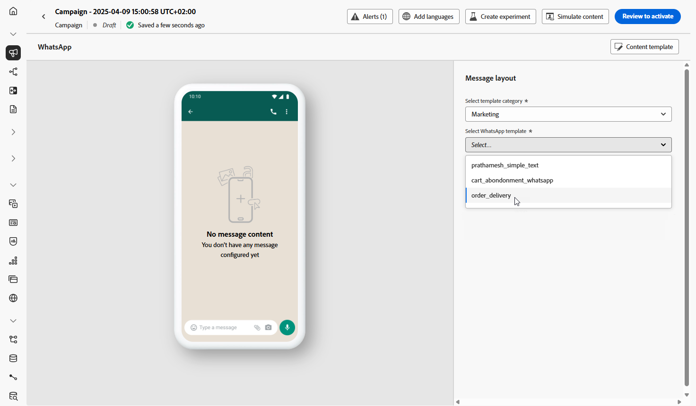

# Criar uma mensagem de WhatsApp {#create-whatsapp}

Com o Adobe Journey Optimizer, você pode criar e enviar mensagens envolventes no WhatsApp. Basta adicionar uma ação do WhatsApp à sua jornada ou campanha e criar o conteúdo da sua mensagem conforme detalhado abaixo. O Adobe Journey Optimizer também permite que você teste suas mensagens do WhatsApp antes de enviá-las, garantindo uma renderização perfeita, uma personalização precisa e a configuração adequada de todas as configurações.

Observe que somente os elementos de Mensagens de saída são compatíveis com o Journey Optimizer.

+++ Saiba mais sobre elementos de mensagem compatíveis e botões interativos

Os seguintes tipos de mensagem são suportados no WhatsApp:

| Recurso de mensagem | Descrição |
|-|-|
| Cabeçalhos | Texto opcional que aparece acima do corpo da mensagem. |
| Texto | Aceita conteúdo dinâmico por meio de parâmetros. |
| Imagens (JPEG, PNG) | Deve estar no formato RGB de 8 bits ou RGBA e abaixo de 5 MB no tamanho. |
| Vídeos | Deve ser 3GPP ou MP4, com menos de 16 MB, e hospedado via URL. |
| Áudio | Disponível somente para mensagens de resposta. Deve ser o formato AAC, AMR, MP3, MP4 audio ou OGG, hospedado em um URL e menos de 16 MB. |
| Documentos | Deve ter menos de 100 MB, hospedado em um URL e em um dos seguintes formatos: .txt, .xls/.xlsx, .doc/.docx, .ppt/.pptx ou .pdf. |
| Corpo de texto | Aceita conteúdo dinâmico por meio de parâmetros. |
| Texto do rodapé | Aceita conteúdo dinâmico por meio de parâmetros. |

As seguintes opções do call-to-action estão disponíveis para suas mensagens no WhatsApp:

| Chamada para ação | Descrição |
|-|-|
| Resposta rápida | Respostas curtas predefinidas que o usuário pode tocar para responder à mensagem. |
| Visitar site | Somente um botão é permitido, com parâmetros variáveis incluídos. |
| Chamar no WhatsApp | Fornece um botão que abre um bate-papo do WhatsApp com o número de telefone especificado diretamente da mensagem. |
| Telefonar para número | Fornece um botão que inicia uma chamada telefônica para o número especificado quando tocado pelo usuário. |
| CALL TO ACTION - URL | Abre uma URL (**Visitar site**). Somente um botão URL é permitido, com parâmetros variáveis incluídos. |
| Call to action - telefone | Usa o número de telefone do modelo, por exemplo **Chamar número de telefone** (faz uma chamada) ou **Chamar no WhatsApp** (abre um chat com esse número no WhatsApp). |

Observe que os botões interativos **Copiar código** não são compatíveis.

+++

## Adicionar uma mensagem de WhatsApp {#create-whatsapp-journey-campaign}

Navegue pelas guias abaixo para saber como adicionar uma mensagem do WhatsApp em uma campanha ou jornada.

>[!BEGINTABS]

>[!TAB Adicionar uma mensagem do WhatsApp a uma Jornada]

1. Abra a jornada e arraste e solte uma **atividade do WhatsApp** da seção **Ações** da paleta.

   

1. Forneça informações básicas sobre a mensagem (rótulo, descrição, categoria) e escolha a configuração de mensagem a ser usada.

   Para obter mais informações sobre como configurar uma jornada, consulte [esta página](../building-journeys/journey-gs.md)

   O campo **[!UICONTROL configuração]** é preenchido previamente, por padrão, com a última configuração usada para esse canal pelo usuário.

1. Na seção **[!UICONTROL Regras de negócio]**, você pode aplicar um conjunto de regras para controlar a pressão de comunicação em mensagens do WhatsApp.

   Saiba mais sobre [conjuntos de regras](../conflict-prioritization/rule-sets.md), [limite de frequência de canal](../conflict-prioritization/channel-capping.md) e [horas de silêncio](../conflict-prioritization/quiet-hours.md).

Agora você pode começar a projetar o conteúdo de sua mensagem do WhatsApp usando o botão **[!UICONTROL Editar conteúdo]**, conforme detalhado abaixo.

>[!TAB Adicionar uma mensagem do WhatsApp a uma campanha]

1. Acesse o menu **[!UICONTROL Campanhas]** e clique em **[!UICONTROL Criar campanha]**.

1. Selecione o tipo de campanha **Agendado - Marketing**.

1. Na seção **[!UICONTROL Propriedades]**, edite o **[!UICONTROL Título]** e a **[!UICONTROL Descrição]** da sua campanha.

1. Clique no botão **[!UICONTROL Selecionar público-alvo]** para definir o público-alvo a ser direcionado na lista de públicos-alvo disponíveis do Adobe Experience Platform. [Saiba mais](../audience/about-audiences.md).

1. No campo **[!UICONTROL Namespace de identidade]**, escolha o namespace a ser usado para identificar os indivíduos do público selecionado. [Saiba mais](../event/about-creating.md#select-the-namespace).

1. Na seção **[!UICONTROL Actions]**, escolha **[!UICONTROL WhatsApp]** e selecione ou crie uma nova configuração.

   Saiba mais sobre a configuração do WhatsApp em [esta página](whatsapp-configuration.md).

   

1. Clique em **[!UICONTROL Criar experimento]** para começar a configurar seu experimento de conteúdo e criar tratamentos para medir seu desempenho e identificar a melhor opção para seu público-alvo. [Saiba mais](../content-management/content-experiment.md)

1. Na seção **[!UICONTROL Rastreamento de ações]**, especifique se deseja rastrear cliques nos links da mensagem do WhatsApp.

   O Journey Optimizer também rastreia interações nos botões de modelo do WhatsApp com suporte, **Resposta rápida**, **Call to action - URL** e **Call to action - phone**, junto com seus outros relatórios de canal. Não há suporte para botões **Copiar código** e suas interações não são rastreadas.

1. As campanhas são projetadas para serem executadas em uma data específica ou em uma frequência recorrente. Saiba como configurar o **[!UICONTROL Cronograma]** da sua campanha no [nesta seção](../campaigns/create-campaign.md#schedule).

1. No menu **[!UICONTROL Acionadores de ação]**, escolha a **[!UICONTROL Frequência]** da sua mensagem no WhatsApp:

   * Uma vez
   * Diariamente
   * Semanal
   * Month

Agora você pode começar a projetar o conteúdo de sua mensagem do WhatsApp usando o botão **[!UICONTROL Editar conteúdo]**, conforme detalhado abaixo.

>[!ENDTABS]

## Definir o conteúdo do WhatsApp{#whatsapp-content}

>[!BEGINSHADEBOX]

Antes de criar sua mensagem de WhatsApp no Journey Optimizer, primeiro é necessário criar e projetar seu modelo no Meta. [Saiba mais](https://www.facebook.com/business/help/2055875911147364?id=2129163877102343)

Observe que seu modelo do WhatsApp deve ser aprovado primeiro pelo Meta antes de usá-lo no Journey Optimizer. Esse processo geralmente leva algumas horas, mas pode levar até 24 horas. [Saiba mais](https://developers.facebook.com/docs/whatsapp/message-templates/guidelines/#approval-process)

>[!ENDSHADEBOX]

1. Na tela de configuração da jornada ou campanha, clique no botão **[!UICONTROL Editar conteúdo]** para configurar o conteúdo da mensagem do WhatsApp.

<!--
1. Select **[!UICONTROL Template message]**.
-->

1. Escolha sua **Categoria do modelo**:

   * Marketing
   * Utilitário
   * Autenticação

   [Saiba mais sobre Categorias de modelo](https://developers.facebook.com/docs/whatsapp/updates-to-pricing/new-template-guidelines/#template-category-guidelines)

   

1. No menu suspenso **Modelo do WhatsApp**, selecione o modelo criado anteriormente no Meta.

   [Saiba mais sobre como criar seus modelos do Whatsapp](https://www.facebook.com/business/help/2055875911147364?id=2129163877102343)

   

1. No campo **[!UICONTROL URL da imagem]**, adicione URLs de mídia para substituir quaisquer espaços reservados no modelo. As mídias de modelo do Meta são apenas espaços reservados. Para exibir imagens, áudio ou vídeo corretamente, você deve usar URLs externos do Adobe Experience Manager ou de outras fontes.

   

1. Use o editor de personalização para adicionar personalização ao seu template. Você pode usar qualquer atributo, como o nome do perfil ou a cidade, por exemplo.

   Navegue pela página a seguir para saber mais sobre a [personalização](../personalization/personalize.md).

   

1. Use o botão **[!UICONTROL Simular conteúdo]** para pré-visualizar o conteúdo da mensagem do WhatsApp, URLs encurtadas e conteúdo personalizado. [Saiba mais](send-whatsapp.md)

Depois de executar os testes e validar o conteúdo, você pode [enviar a mensagem do WhatsApp](send-whatsapp.md) para o seu público-alvo e monitorar o desempenho por meio dos [relatórios](../reports/campaign-global-report-cja.md). Para obter dados de interação do WhatsApp armazenados no Experience Platform, consulte [Analisar interações do WhatsApp](send-whatsapp.md#whatsapp-channel-context).

<!--
* **[!UICONTROL Template message]**: Predefined message imported from Meta into Journey Optimizer. These are intended for sending notifications, alerts, or updates to your customers.

* **[!UICONTROL Response message]**: Message created in Journey Optimizer and sent in reply to customer queries or interactions.

>[!BEGINTABS]

>[!TAB Template message]

1. From the journey or campaign configuration screen, click the **[!UICONTROL Edit content]** button to configure the WhatsApp message content.

1. Select **[!UICONTROL Template message]**.

1. Choose your Template category. [Learn more](https://developers.facebook.com/docs/WhatsApp/updates-to-pricing/new-template-guidelines/)

1. From the **WhatsApp template** drop-down, select your previously created template designed in Meta.

1. Use the personalization editor to define content, add personalization and dynamic content. You can use any attribute, such as the profile name or city for example. You can also define conditional rules. Browse to the following pages to learn more about [personalization](../personalization/personalize.md) and [dynamic content](../personalization/get-started-dynamic-content.md) in the personalization editor.

1. Use the **[!UICONTROL Simulate content]** button to preview your WhatsApp message content, shortened URLs, and personalized content. [Learn more](send-whatsapp.md)

Once you have performed your tests and validated the content, you can send your WhatsApp message to your audience. These steps are detailed on [this page](send-whatsapp.md)

>[!TAB Response message]

1. From the journey or campaign configuration screen, click the **[!UICONTROL Edit content]** button to configure the WhatsApp message content.

1. Select **[!UICONTROL Response message]**.

1. Enter your text in the **[!UICONTROL Body]** field.

1. Use the personalization editor to define content, add personalization and dynamic content. You can use any attribute, such as the profile name or city for example. You can also define conditional rules. Browse to the following pages to learn more about [personalization](../personalization/personalize.md) and [dynamic content](../personalization/get-started-dynamic-content.md) in the personalization editor.

1. Use the **[!UICONTROL Simulate content]** button to preview your WhatsApp message content, shortened URLs, and personalized content. [Learn more](send-whatsapp.md)

Once you have performed your tests and validated the content, you can send your WhatsApp message to your audience. These steps are detailed on [this page](send-whatsapp.md)

>[!ENDTABS]
-->

## Vídeo tutorial {#video}

O vídeo abaixo mostra como criar uma jornada do WhatsApp em várias etapas usando o Adobe Journey Optimizer.

+++ Ver vídeo

>[!VIDEO](https://video.tv.adobe.com/v/3470282/?learn=on")

+++
