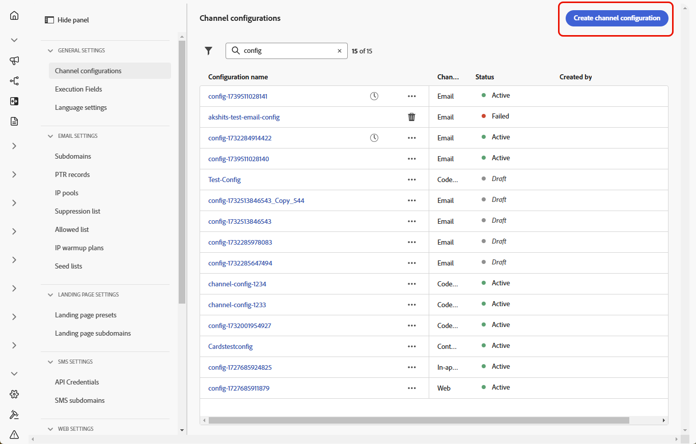
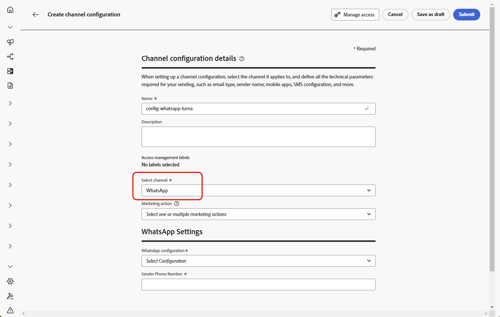

# Introdução à configuração do WhatsApp {#whatsapp-config}

>[!BEGINSHADEBOX]

**Índice**

* [Introdução às mensagens do WhatsApp](get-started-whatsapp.md)
* **[Introdução à configuração do WhatsApp](whatsapp-configuration.md)**
* [Criar uma mensagem de WhatsApp](create-whatsapp.md)
* [Verificar e enviar mensagens do WhatsApp](send-whatsapp.md)

>[!ENDSHADEBOX]

Antes de enviar a mensagem do WhatsApp, você deve configurar o ambiente do Adobe Journey Optimizer e associar-se à conta do WhatsApp. Para fazer isso:

1. [Criar suas credenciais da API do WhatsApp](#WhatsApp-credentials)
1. [Criar seus webhooks do WhatsApp](#WhatsApp-webhook)
1. [Criar sua configuração do WhatsApp](#WhatsApp-configuration)

Estas etapas devem ser executadas por um [Administrador do Sistema](../start/path/administrator.md) do Adobe Journey Optimizer.

## Criar credenciais da API do WhatsApp {#whatsapp-credentials}

1. No painel à esquerda, vá para **[!UICONTROL Administração]** `>` **[!UICONTROL Canais]** e selecione o menu **[!UICONTROL Credenciais de API]**. Clique no botão **[!UICONTROL Criar novas credenciais de API]**.

1. Configure suas credenciais de API, conforme detalhado abaixo:

   * **Token de API**: insira seu token de API. Saiba mais em [Metadocumentação](https://developers.facebook.com/docs/facebook-login/guides/access-tokens/)
   * **ID da Conta Comercial**: insira o número exclusivo relacionado ao seu portfólio comercial. Saiba mais em [Metadocumentação](https://www.facebook.com/business/help/1181250022022158?id=180505742745347).

   

1. Clique em **[!UICONTROL Continuar]**.

1. Escolha a **Conta Comercial** que deseja conectar às credenciais da API do WhatsApp.

   

1. Selecione o **Nome do remetente** usado para enviar suas mensagens do Whatsapp.

1. As configurações de número de telefone são preenchidas automaticamente:

   * **Classificação de qualidade**: reflete o feedback do cliente sobre as mensagens enviadas nas últimas 24 horas.
      * Verde: alta qualidade
      * Amarelo: qualidade do Medium
      * Vermelho: baixa qualidade

     Saiba mais sobre [Classificação de qualidade](https://www.facebook.com/business/help/766346674749731#)

   * **Taxa de transferência**: indica a taxa à qual seu número de telefone pode enviar mensagens.

1. Clique em **[!UICONTROL Enviar]** quando terminar de configurar suas credenciais de API.

Depois de criar e configurar a credencial da API, agora é necessário criar uma configuração de canal para mensagens do WhatsApp. [Saiba mais](#whatsapp-configuration)

## Criar Webhook {#WhatsApp-webhook}

>[!CONTEXTUALHELP]
>id="ajo_admin_whatsapp_webhook_inbound_keyword_category"
>title="Categoria de palavra-chave de entrada"
>abstract="<b>Aceitar</b>: envia sua resposta automática definida quando um usuário se inscreve.  <b>Opt-Out</b>: envia sua resposta automática definida quando um usuário cancela a assinatura.  <b>Ajuda</b>: envia sua resposta automática definida quando um usuário solicita ajuda ou suporte.  <b>Padrão</b>: envia sua resposta automática de fallback quando nenhuma palavra-chave é correspondente."

>[!CONTEXTUALHELP]
>id="ajo_admin_whatsapp_webhook_inbound_keyword"
>title="Insira suas palavras-chave"
>abstract= "You can define keywords to trigger specific auto-responses, such as for Opt-In, Opt-Out, Help, or Default, based on what users text. Keywords are not case-sensitive, e.g., stop and STOP are treated the same."

>[!CONTEXTUALHELP]
>id="ajo_admin_whatsapp_webhook_webhook_url"
>title=" URL de retorno"
>abstract="A solicitação de validação e as notificações do webhook para este objeto são enviadas para a URL especificada."

>[!CONTEXTUALHELP]
>id="ajo_admin_whatsapp_webhook_verify_token"
>title="Verificar token"
>abstract="O token que o Meta ecoa para confirmar e verificar o URL de retorno de chamada durante o processo de verificação."

>[!NOTE]
>
>Sem palavras-chave de aceitação ou recusa especificadas, as mensagens de consentimento padrão não são ativadas.

Depois que suas credenciais da API do WhatsApp e seus [Meta Webhooks](https://developers.facebook.com/docs/whatsapp/webhooks/) forem criados com êxito, a próxima etapa é criar um webhook e definir as configurações de entrada.

1. No painel à esquerda, navegue até **[!UICONTROL Administração]** `>` **[!UICONTROL Canais]**, selecione o menu **[!UICONTROL Webhooks do WhatsApp]** em **[!UICONTROL Configurações do WhatsApp]** e clique no botão **[!UICONTROL Criar Webhook]**.

1. Digite um [!UICONTROL Nome] para seu webhook.

1. Na lista suspensa, selecione as [Credenciais da API](#whatsapp-credentials) criadas anteriormente.

1. Clique em  para começar a configurar uma **[!UICONTROL categoria de palavra-chave de entrada]**, como:

   * **[!UICONTROL Palavras-chave de aceitação]**
   * **[!UICONTROL Palavras-chave de recusa]**
   * **[!UICONTROL Palavras-chave da Ajuda]**

1. Insira sua **[!UICONTROL Palavra-chave]**.

   Para adicionar várias palavras-chave, clique em .

1. Especifique a **[!UICONTROL Mensagem de Resposta]** a ser enviada quando uma palavra-chave configurada for recebida.

<!--
1. Click **[!UICONTROL View payload editor]** to validate and customize your request payloads. 
    
    You can dynamically personalize your payload using profile attributes, and ensure accurate data is sent for processing and response generation with the help of built-in helper functions.
-->

1. Clique em **[!UICONTROL Enviar]** quando terminar de configurar o Webhook do WhatsApp.

1. No menu **[!UICONTROL Webhooks]**, clique no  para excluir seu Webhook do WhatsApp.

1. Para modificar a configuração existente, localize o Webhook desejado e clique na opção **[!UICONTROL Editar]** para fazer as alterações necessárias.

1. Acesse e copie o novo **[!UICONTROL URL do Webhook]** do **[!UICONTROL Webhook do WhatsApp]** enviado anteriormente.

Agora que seu Webhook está configurado, você pode criar sua configuração do WhatsApp.

## Criar configuração do WhatsApp {#whatsapp-configuration}

1. No painel à esquerda, vá para **[!UICONTROL Administração]** > **[!UICONTROL Canais]** e selecione **[!UICONTROL Configurações gerais]** > **[!UICONTROL Configurações de canal]**. Clique no botão **[!UICONTROL Criar configuração de canal]**.

   

1. Digite um nome e uma descrição (opcional) para a configuração e selecione o canal do WhatsApp.

   >[!NOTE]
   >
   > Os nomes devem começar com uma letra (A-Z). Ele só pode conter caracteres alfanuméricos. Também é possível usar os caracteres de sublinhado `_`, ponto `.` e hífen `-`.

1. Selecione **[!DNL WhatsApp]** como seu canal.

   

1. Selecione **[!UICONTROL Ação(ões) de marketing]** para associar políticas de consentimento às mensagens que usam essa configuração. Todas as políticas de consentimento associadas à ação de marketing são utilizadas para respeitar as preferências dos clientes. Saiba mais

1. Selecione a **[!UICONTROL configuração da API do WhatsApp]** criada anteriormente.

   

1. Digite o **[!UICONTROL Número do remetente]** &#x200B;que você deseja usar para suas comunicações.

1. Depois que todos os parâmetros tiverem sido configurados, clique em **[!UICONTROL Enviar]** para confirmar. Você também pode salvar a configuração do canal como rascunho e retomar a configuração posteriormente.

1. Depois que a configuração do canal é criada, ela é exibida na lista com o status **[!UICONTROL Processando]**.

   >[!NOTE]
   >
   >Se as verificações não forem bem-sucedidas, saiba mais sobre os possíveis motivos de falha em [esta seção](../configuration/channel-surfaces.md).

1. Depois que as verificações forem bem-sucedidas, a configuração do canal obterá o status **[!UICONTROL Ativo]**. Ele está pronto para ser usado para enviar mensagens.

Depois de configurado, você pode aproveitar todos os recursos de canal prontos para uso, como criação de mensagens, personalização, rastreamento de links e relatórios.

Agora você está pronto para enviar mensagens do WhatsApp com o Journey Optimizer.