# Introdução à configuração do WhatsApp {#whatsapp-config}

>[!BEGINSHADEBOX]

**Nesta página:** configure as credenciais da API do WhatsApp, os webhooks e uma configuração de canal para conectar sua conta do WhatsApp Business, para que seu ambiente esteja pronto para enviar mensagens do WhatsApp com o Journey Optimizer.

>[!ENDSHADEBOX]

Antes de enviar a mensagem do WhatsApp, você deve configurar o ambiente do Adobe Journey Optimizer e associar-se à conta do WhatsApp. Para fazer isso:

1. [Criar suas credenciais da API do WhatsApp](#WhatsApp-credentials)
1. [Criar seus webhooks do WhatsApp](#WhatsApp-webhook)
1. [Criar sua configuração do WhatsApp](#WhatsApp-configuration)

Estas etapas devem ser executadas por um [Administrador do Sistema](../start/path/administrator.md) do Adobe Journey Optimizer.

## Criar credenciais da API do WhatsApp {#whatsapp-credentials}

>[!CONTEXTUALHELP]
>id="ajo_admin_whatsapp_config_name"
>title="Nome"
>abstract="Insira um nome exclusivo para este conjunto de credenciais de API. Você o selecionará ao configurar os webhooks do WhatsApp e as configurações do canal."

>[!CONTEXTUALHELP]
>id="ajo_admin_whatsapp_config_api_token"
>title="Token de API"
>abstract="Use um token de acesso da Meta de um usuário do sistema no mesmo Business Manager que seus ativos do WhatsApp. Este usuário precisa de permissões whatsapp_business_management, whatsapp_business_messaging e business_management, além de acesso no nível do ativo à sua conta WhatsApp Business. Os tokens da Meta expiram após cerca de 60 dias. Renove o token antes que ele expire."

>[!CONTEXTUALHELP]
>id="ajo_admin_whatsapp_config_business_account_id"
>title="ID da conta de negócios"
>abstract="Insira a ID do portfólio de negócios da Meta, também chamada de ID do Business Manager. Não insira sua ID da conta de negócios do WhatsApp neste campo."

1. No painel à esquerda, vá para **[!UICONTROL Administração]** `>` **[!UICONTROL Canais]** e selecione o menu **[!UICONTROL Credenciais de API]**. Clique no botão **[!UICONTROL Criar novas credenciais de API]**.

1. Configure suas credenciais de API, conforme detalhado abaixo:

   * **Token de API**: insira seu token de API. Saiba mais em [Documentação do Meta](https://developers.facebook.com/blog/post/2022/12/05/auth-tokens/)
   * **ID da Conta Comercial**: insira o número exclusivo relacionado ao seu portfólio comercial. Saiba mais em [Documentação do Meta](https://www.facebook.com/business/help/1181250022022158?id=180505742745347).

   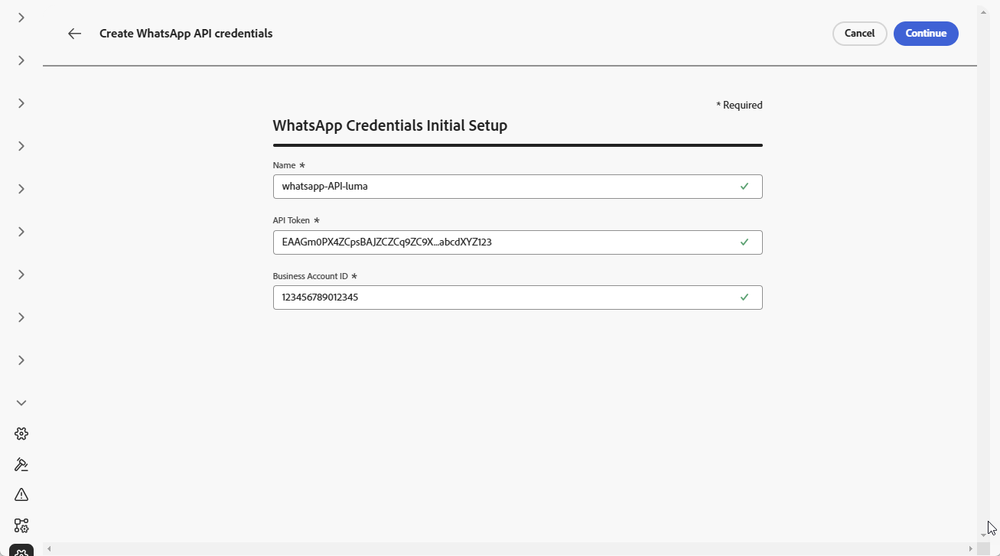

1. Clique em **[!UICONTROL Continuar]**.

1. Escolha a **Conta Comercial do WhatsApp** que deseja conectar às suas credenciais da API do WhatsApp.

   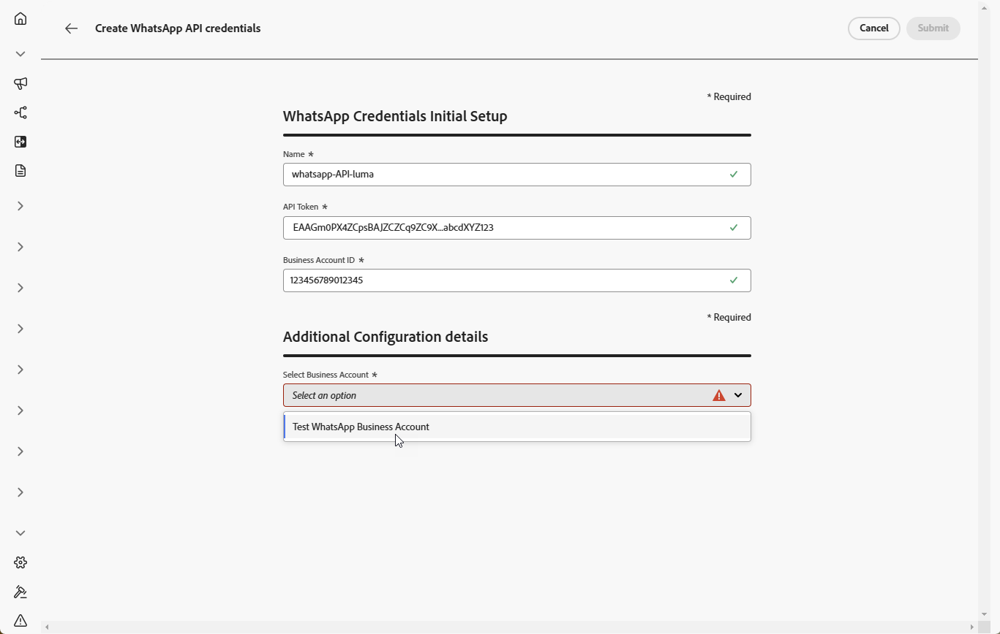

1. Selecione o **Nome do remetente** usado para enviar mensagens do WhatsApp.

1. As configurações de número de telefone são preenchidas automaticamente:

   * **Classificação de qualidade**: reflete o feedback do cliente sobre as mensagens enviadas nas últimas 24 horas.
      * Verde: alta qualidade
      * Amarelo: qualidade do Medium
      * Vermelho: baixa qualidade

     Saiba mais sobre [Classificação de qualidade](https://www.facebook.com/business/help/766346674749731#)

   * **Taxa de transferência**: indica a taxa à qual seu número de telefone pode enviar mensagens.

1. Clique em **[!UICONTROL Enviar]** quando terminar de configurar suas credenciais de API.

Depois de criar e configurar sua credencial de API, agora é necessário criar seu Webhook para mensagens do WhatsApp. [Saiba mais](#whatsapp-webhook)

## Criar webhook {#WhatsApp-webhook}

>[!CONTEXTUALHELP]
>id="ajo_admin_whatsapp_webhook_inbound_keyword_category"
>title="Categoria de palavra-chave de entrada"
>abstract="<b>Aceitar</b>: envia a resposta automática definida quando um usuário assina.  <b>Recusar</b>: envia a resposta automática definida quando um usuário cancela a assinatura.  <b>Ajuda</b>: envia a resposta automática definida quando um usuário solicita ajuda ou suporte.  <b>Padrão</b>: envia a resposta automática substituta quando nenhuma palavra-chave é correspondente."

>[!CONTEXTUALHELP]
>id="ajo_admin_whatsapp_webhook_inbound_keyword"
>title="Insira as palavras-chave"
>abstract="É possível definir palavras-chave para acionar respostas automáticas específicas com base no texto dos usuários. As palavras-chave não diferenciam maiúsculas de minúsculas. Por exemplo, parar e PARAR são tratadas da mesma forma."

>[!CONTEXTUALHELP]
>id="ajo_admin_whatsapp_webhook_webhook_url"
>title="URL de retorno de chamada"
>abstract="A solicitação de validação e as notificações do webhook para este objeto são enviadas para o URL especificado."

>[!CONTEXTUALHELP]
>id="ajo_admin_whatsapp_webhook_verify_token"
>title="Verificar token"
>abstract="O token que a Meta retorna para confirmar e verificar o URL de retorno de chamada durante o processo de verificação."

>[!NOTE]
>
>Sem palavras-chave de aceitação ou recusa especificadas, as mensagens de consentimento padrão não são ativadas.

Depois que suas credenciais da API do WhatsApp forem criadas com êxito, você poderá configurar Webhooks para:

* **Capturar respostas de entrada** para gerenciar o consentimento de aceitação e recusa
* **Receber relatórios de entrega**, como confirmações de leitura (quando disponíveis) e status de entrega de mensagens
* **Habilitar o rastreamento de eventos** para análise e relatórios em conjuntos de dados do Adobe Experience Platform

>[!NOTE]
>
>Mensagens de entrada do WhatsApp são capturadas no _conjunto de dados do sistema do AJO Email Tracking_. Um perfil deve ter pelo menos uma mensagem enviada de [!DNL Journey Optimizer] antes que as mensagens de entrada sejam capturadas neste conjunto de dados. [Saiba mais](../data/get-started-datasets.md#system-datasets)

Os webhooks atuam como a ponte de comunicação entre a Plataforma de negócios WhatsApp da Meta e o Adobe Journey Optimizer, permitindo que você receba notificações em tempo real sobre eventos de mensagem e interações do usuário.

1. No painel à esquerda, navegue até **[!UICONTROL Administração]** `>` **[!UICONTROL Canais]**, selecione o menu **[!UICONTROL Webhooks do WhatsApp]** em **[!UICONTROL Configurações do WhatsApp]** e clique no botão **[!UICONTROL Criar Webhook]**.

   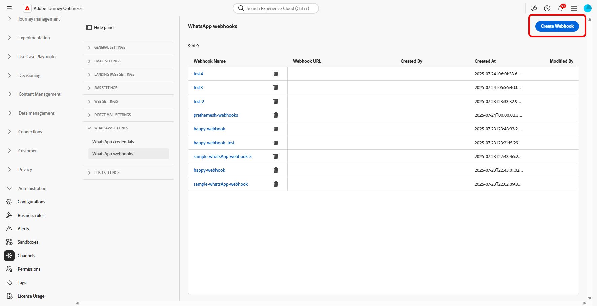

1. Digite um **[!UICONTROL Nome]** para seu webhook.

1. Na lista suspensa **[!UICONTROL Selecionar configuração]**, selecione as [Credenciais de API](#whatsapp-credentials) criadas anteriormente.

   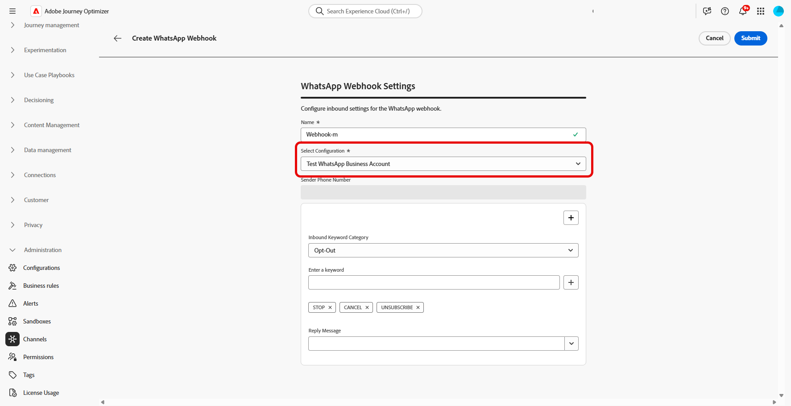

1. Escolha sua **[!UICONTROL categoria de palavra-chave de entrada]**, como:

   * **[!UICONTROL Palavras-chave de aceitação]**
   * **[!UICONTROL Palavras-chave de recusa]**
   * **[!UICONTROL Palavras-chave da Ajuda]**
   * **[!UICONTROL Padrão]** - Categoria de fallback para todas as mensagens de entrada que não correspondem a outras palavras-chave. Use esta categoria para ativar o rastreamento de eventos (aberturas, relatórios de delivery) em conjuntos de dados do Adobe Experience Platform.

1. Insira suas **[!UICONTROL Palavras-chave]** e clique em .

   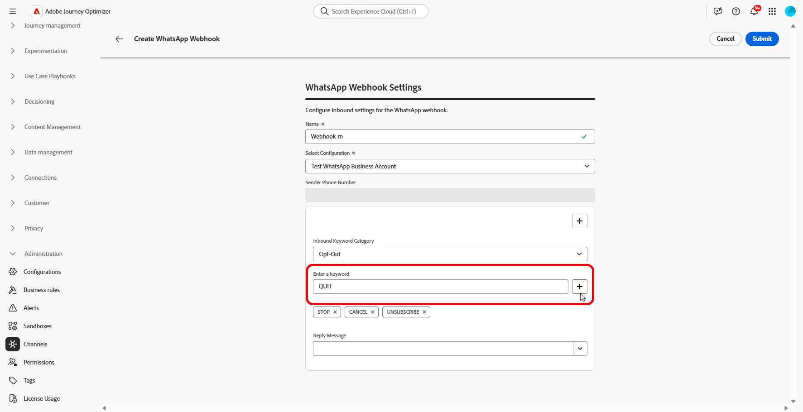

1. No campo **[!UICONTROL Responder Mensagem]**, insira a mensagem enviada quando uma palavra-chave configurada for recebida ou selecione uma opção predefinida no menu suspenso.

   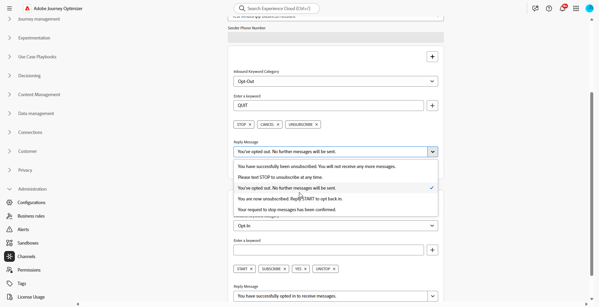

<!--
1. Click **[!UICONTROL View payload editor]** to validate and customize your request payloads. 
    
    You can dynamically personalize your payload using profile attributes, and ensure accurate data is sent for processing and response generation with the help of built-in helper functions.
-->
1. Clique em  para adicionar mais **[!UICONTROL palavra-chave de entrada]**.

1. Clique em **[!UICONTROL Enviar]** quando terminar de configurar o Webhook do WhatsApp.

1. No menu **[!UICONTROL Webhooks]**, clique no  para excluir seu Webhook do WhatsApp.

   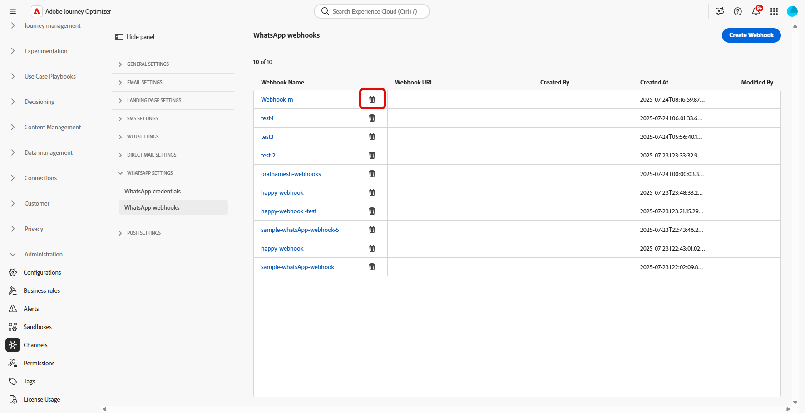

1. Para modificar a configuração existente e acessar a **[!UICONTROL URL do Webhook]** ou o **[!UICONTROL toker de verificação do Webhook]**, localize o Webhook desejado e clique na opção **[!UICONTROL Editar]** para fazer as alterações necessárias.

1. Copie o **[!UICONTROL toker de verificação do Webhook]** gerado aqui e cole-o na interface do Meta como parte da configuração do Webhook.

   Para obter instruções detalhadas sobre como e onde adicionar este token de verificação, consulte a [documentação do Meta](https://developers.facebook.com/docs/graph-api/webhooks/getting-started#configure-webhooks-product).

1. Acesse e copie o novo **[!UICONTROL URL do Webhook]** do **[!UICONTROL Webhook do WhatsApp]** enviado anteriormente.

   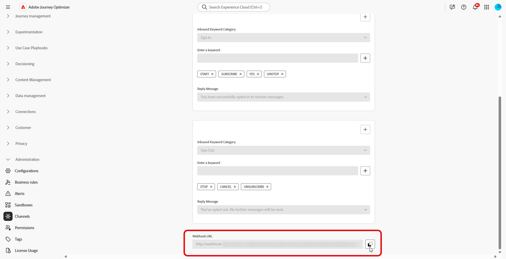

Agora que seu Webhook está configurado, você pode criar sua configuração do WhatsApp.

## Criar configuração do WhatsApp {#whatsapp-configuration}

1. No painel à esquerda, vá para **[!UICONTROL Administração]** > **[!UICONTROL Canais]** e selecione **[!UICONTROL Configurações gerais]** > **[!UICONTROL Configurações de canal]**. Clique no botão **[!UICONTROL Criar configuração de canal]**.

   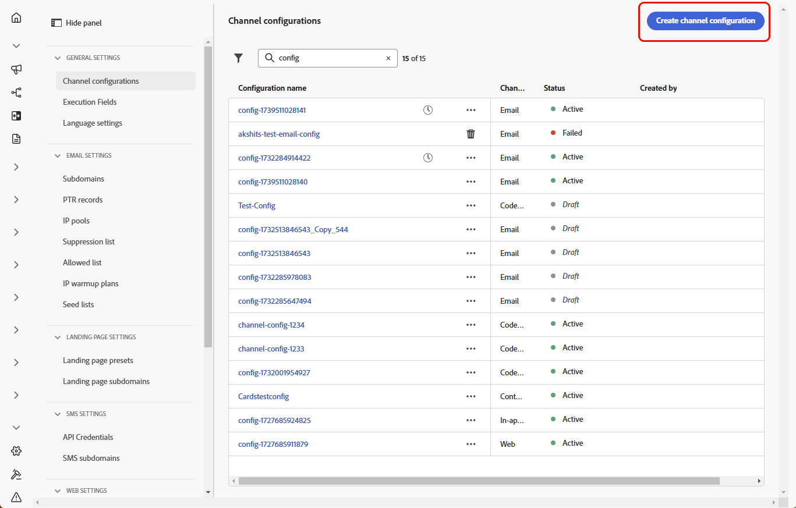

1. Digite um nome e uma descrição (opcional) para a configuração e selecione o canal do WhatsApp.

   >[!NOTE]
   >
   > Os nomes devem começar com uma letra (A-Z). Ele só pode conter caracteres alfanuméricos. Também é possível usar os caracteres de sublinhado `_`, ponto `.` e hífen `-`.

1. Selecione **[!DNL WhatsApp]** como seu canal.

   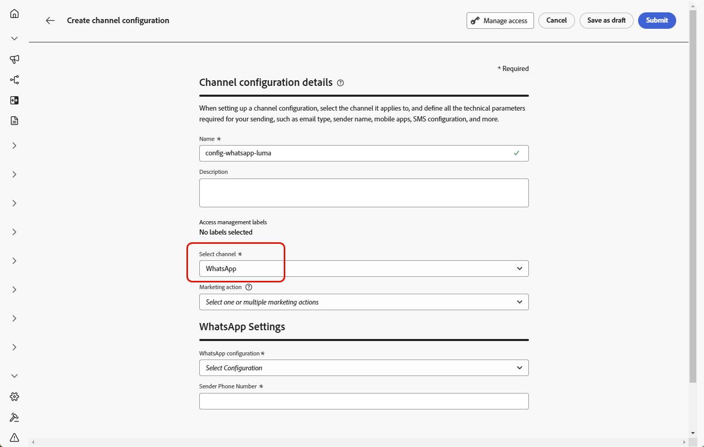{width=80%}

1. Selecione **[!UICONTROL Ação(ões) de marketing]** para associar políticas de consentimento às mensagens que usam essa configuração. Todas as políticas de consentimento associadas à ação de marketing são utilizadas para respeitar as preferências dos clientes. [Saiba mais](../action/consent.md#surface-marketing-actions)

1. Na seção **[!UICONTROL Configurações do WhatsApp]**, selecione a **[!UICONTROL configuração do WhatsApp]** criada anteriormente.

   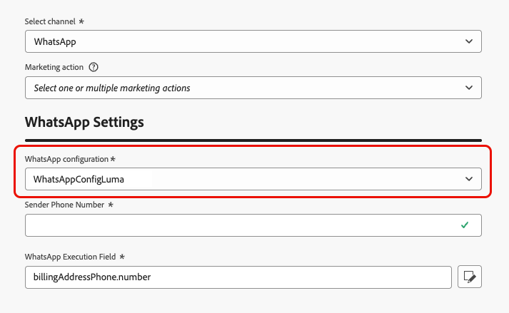{width=80%}

1. Digite o **[!UICONTROL Número de Telefone do Remetente]** &#x200B;que você deseja usar para suas comunicações. Não inclua um sinal &quot;+&quot; antes do número, pois isso pode impedir que o fluxo de recusa funcione corretamente.

1. Use o **[!UICONTROL Campo de Execução do WhatsApp]** para selecionar entre os atributos do perfil o número de telefone que você deseja usar com prioridade, se vários números estiverem disponíveis no banco de dados. [Saiba mais](../configuration/primary-email-addresses.md#override-execution-address-channel-config)

   >[!NOTE]
   >
   >Por padrão, [!DNL Journey Optimizer] usa o número de telefone especificado nas [configurações gerais](../configuration/primary-email-addresses.md) no nível da sandbox. Atualizar esse campo substitui o valor padrão para as jornadas e campanhas que usam essa configuração.

1. Depois que todos os parâmetros tiverem sido configurados, clique em **[!UICONTROL Enviar]** para confirmar. Você também pode salvar a configuração do canal como rascunho e retomar a configuração posteriormente.

1. Depois que a configuração do canal é criada, ela é exibida na lista com o status **[!UICONTROL Processando]**.

   >[!NOTE]
   >
   >Se as verificações não forem bem-sucedidas, saiba mais sobre os possíveis motivos de falha em [esta seção](../configuration/channel-surfaces.md).

1. Depois que as verificações forem bem-sucedidas, a configuração do canal obterá o status **[!UICONTROL Ativo]**. Ele está pronto para ser usado para enviar mensagens.

Depois de configurado, você pode aproveitar todos os recursos de canal prontos para uso, como criação de mensagens, personalização, rastreamento de links e relatórios.

Agora você está pronto para enviar mensagens do WhatsApp com o Journey Optimizer.

## Solução de problemas de configuração de canal do WhatsApp {#troubleshooting}

### Erros HTTP 500 durante a configuração da credencial da API

Se você encontrar um erro HTTP 500 ao configurar as credenciais da API do WhatsApp, siga estas etapas de solução de problemas:

1. **Verificar direitos**: confirme se sua organização tem o direito `cjm_whatsapp` provisionado. Sem esse direito, o canal do WhatsApp não pode ser configurado.

1. **Validar campos de conta comercial**: verifique se todos os campos obrigatórios estão corretamente preenchidos:
   * **Token de API**: deve ser um token de acesso Meta válido com permissões apropriadas. [Saiba mais](https://developers.facebook.com/blog/post/2022/12/05/auth-tokens/)
   * **ID da Conta Comercial**: deve corresponder exatamente à sua ID da Conta Comercial do Meta. [Saiba mais](https://www.facebook.com/business/help/1181250022022158?id=180505742745347)

1. **Testar credenciais externamente**: verifique suas credenciais diretamente com a API do Meta para confirmar se o problema está relacionado às credenciais ou à manipulação de credenciais do Journey Optimizer.

1. **Habilitar log avançado**: para identificar erros de configuração de servidor interno ou autenticação, habilite logs avançados no ambiente do Journey Optimizer para fornecer informações detalhadas sobre as falhas de chamada de API.

1. **Contate o suporte**: se o ambiente e os direitos forem confirmados válidos, mas o erro HTTP 500 persistir, contate o representante da Adobe.

## Vídeo tutorial {#video}

O vídeo abaixo mostra como configurar o canal do WhatsApp no Adobe Journey Optimizer.

+++ Ver vídeo

>[!VIDEO](https://video.tv.adobe.com/v/3470273/?captions=por_br&learn=on)

+++
